The following article shows how to use the Xtract BAPI component of {{ productName }} to create a new purchase requisition in SAP and how to load the data of the purchase requisition into Alteryx.

### About this Workflow

This article leads you through all necessary steps to set up the following workflow:
- Create a new purchase requisition in an SAP ERP system.  
This process uses a simple input table that contains the data for the purchase requisition.
- Use the new purchase requisition number to load the details of the purchase requisition into Alteryx.  
This process uses an input parameter and a batch macro to pass the input parameter to the Xtract BAPI component.

!!! note
    When using {{ productName }} version 1.18 and below tables can be passed to the Xtract BAPI component directly via an input anchor, while single values require the use of batch macros.
    As of {{ productName }} version 1.19 all input parameters can be passed to the Xtract BAPI component without batch macros.

[:material-download-circle: Download Workflow](../assets/files/xfa/BAPI-ERP-ReadAndWriteWithMacro.yxzp){ .md-button .md-button--primary }

| SAP System | SAP Objects | {{ productName }} Component |
| :------ |:--- | :--- |
| SAP ERP | *BAPI_REQUISITION_CREATE* (Create Purchase Requisition)  *BAPI_REQUISITION_GETDETAIL* (Display Purchase Requisition Details) | Xtract BAPI |

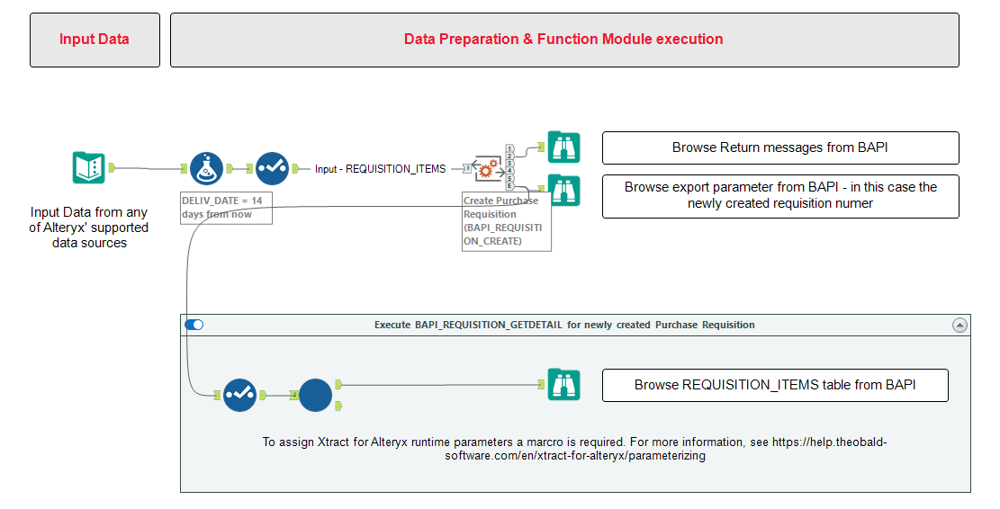{:class="img-responsive"}

### Prerequisites

To use the Xtract BAPI component, access to the designated authority objects (RFC) in SAP must be available.  
For more information, refer to the knowledge base article [SAP User Rights: BAPI](https://kb.theobald-software.com/sap/authority-objects-sap-user-rights#bapi).

### Create a new Purchase Requisition in SAP

Follow the steps below to create a new purchase requisition in SAP:
1. Drag & drop the Xtract BAPI component into your Alteryx workflow :number-1:. 
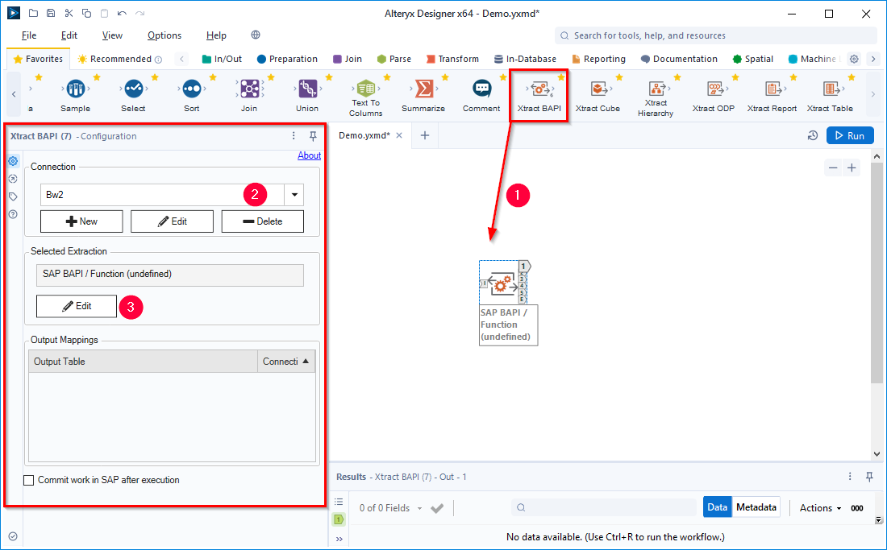{:class="img-responsive" width="900px"}
3. Select an SAP connection :number-2:. If no SAP connection is available, create a new connection, see [Documentation: SAP Connection](../documentation/sap-connection/index.md).
4. Click **[Edit]** :number-3: to open the main window of the Xtract BAPI component.
5. In the main window of the component click :magnifying-glass:. The window “Function Module Lookup” opens. 
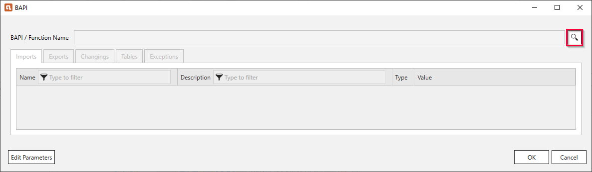{:class="img-responsive"}
6. In the field **Function Name** :number-4: enter the name of the BAPI *BAPI_REQUISITION_CREATE*. Use wildcards (*), if needed. 
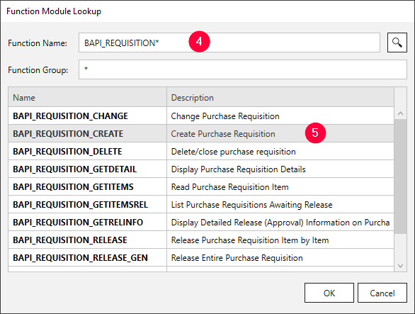{:class="img-responsive"}
7. Click :magnifying-glass: and select the BAPI *BAPI_REQUISITION_CREATE* from the displayed list :number-5:.
7. Click **[OK]**. The window "Function Module Lookup" closes.
8. In the tab *Tables* of the Xtract BAPI component click :glasses-button: to look up the names and data types of the table REQUISITION_ITEMS.
Use this information to prepare the input data of the purchase requisition: 
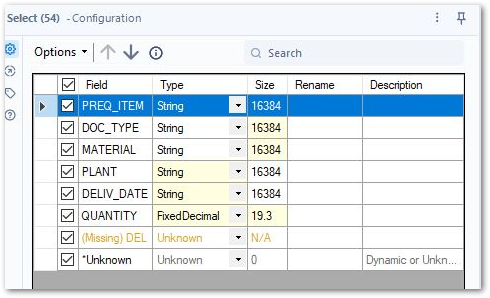{:class="img-responsive"}
9. Connect the input data to the Xtract BAPI component :number-6:. 
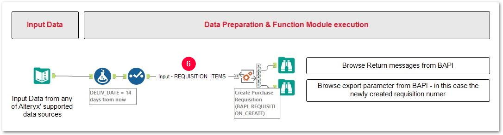{:class="img-responsive"} 
10. Open the Xtract BAPI component.
11. In the tab *Tables* assign the input data to the table REQUISITION_ITEMS. 
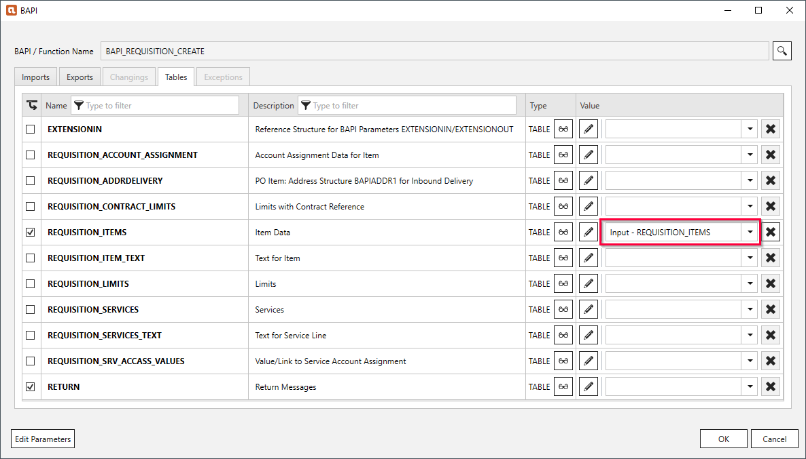{:class="img-responsive"}
11. Add the tables REQUISITION_ITEMS and RETURN to the output of the Xtract BAPI component.
12. In the tab *Exports* add the export parameter NUMBER for the output.
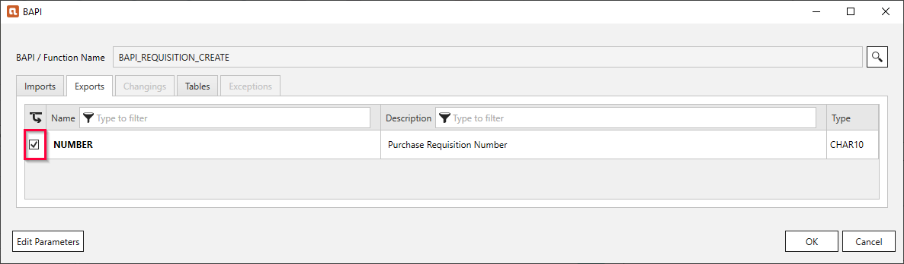{:class="img-responsive"}
13. Click **[OK]** to save the settings.
14. Select the Xtract BAPI component and activate the option **Commit work in SAP after execution**. 
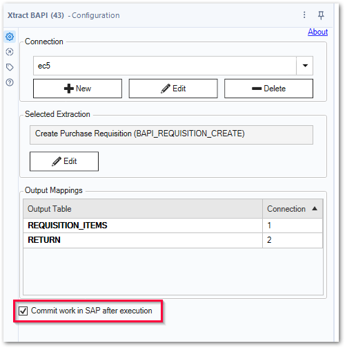{:class="img-responsive"}

The Xtract BAPI component can now be used to create purchase requisitions in SAP.

### Load Purchase Requisition Data from SAP

Follow the steps below to create a [batch macro](http://downloads.alteryx.com/betawh_xnext/BatchMacro.htm) that loads the SAP purchase requisition data of any given purchase requisition number:
1. Create a new workflow.
2. Drag & drop the Xtract BAPI component into your Alteryx workflow :number-1:. 
{:class="img-responsive" width="900px"}
3. Select an SAP connection :number-2:. If no SAP connection is available, create a new connection, see [Documentation: SAP Connection](../documentation/sap-connection/index.md).
4. Click **[Edit]** :number-3: to open the main window of the Xtract BAPI component.
5. In the main window of the component click :magnifying-glass:. The window “Function Module Lookup” opens. 
{:class="img-responsive"}
6. In the field **Function Name** enter the name of the BAPI *BAPI_REQUISITION_GETDETAILS*. Use wildcards (*), if needed. 
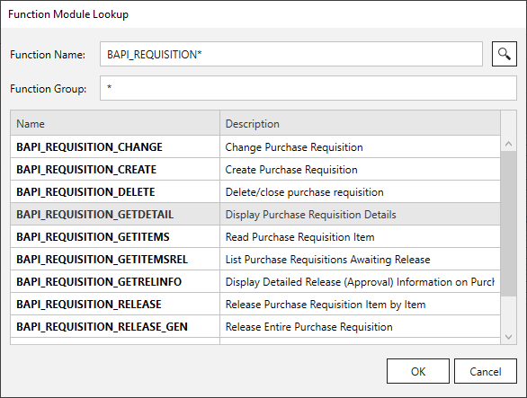{:class="img-responsive"}
7. Click :magnifying-glass: and select the BAPI *BAPI_REQUISITION_GETDETAILS* from the displayed list.
8. Click **[OK]**. The window "Function Module Lookup" closes.
9. In the main window of the component click **[Edit Parameters]**. The window "Edit Runtime Parameters" opens.
10. Click **[Add Scalar]** to define a new input parameter for the Xtract BAPI component.
The depicted example uses a string parameter *Req_Number* to represent the purchase requisition number. 
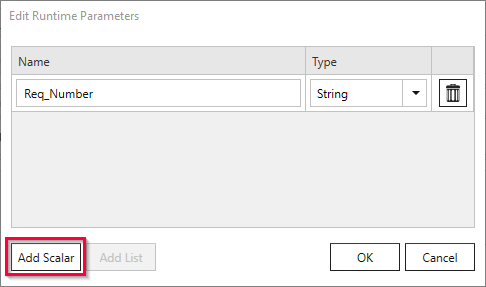{:class="img-responsive"}
11. Click **[OK]**. The window "Edit Runtime Parameters" closes.
12. In the *Imports* tab assign the parameter *Req_Number* to the import parameter NUMBER. 
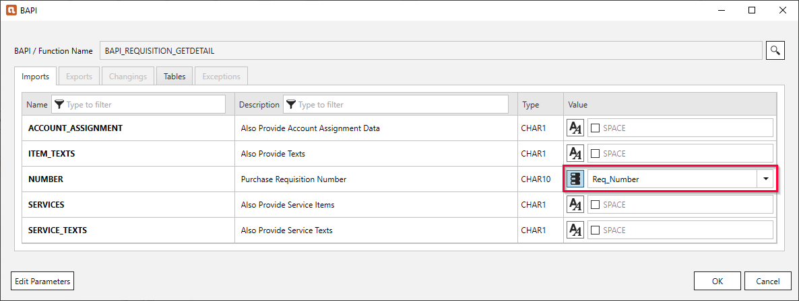{:class="img-responsive"}
13. In the *Tables* tab add the tables REQUISITION_ITEMS and RETURN to the output of the Xtract BAPI component.  
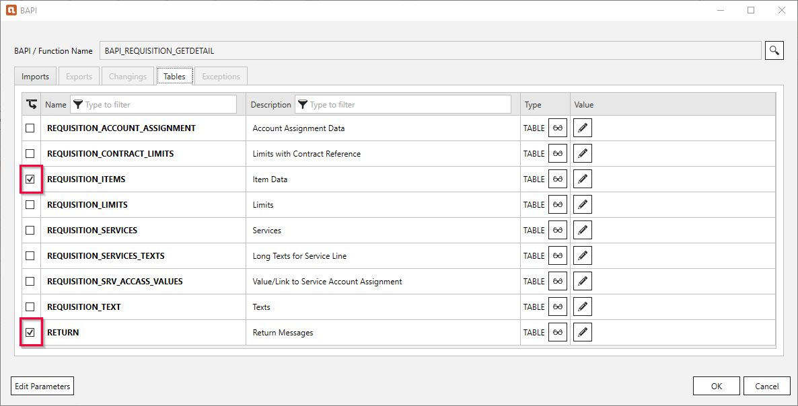{:class="img-responsive"}
14. Click **[OK]** to save the settings of the Xtract BAPI component.
15. Navigate to the Alteryx workflow configuration and set the workflow type to **Batch Macro*. 
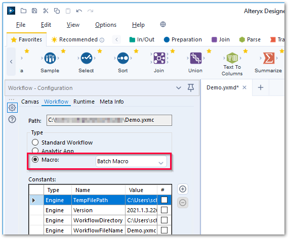{:class="img-responsive"}
16. Save the workflow.
17. Add a **Control Parameter** tool from the *Interface* toolbox. Label the parameter *Req Number Input*.
18. Connect the **Control Parameter** tool to the Xtract BAPI component. This creates the *Action* tool **Update Value**.
19. Select the **Update Value** tool and mark the Xtract BAPI parameter *Req_Number* in the tree menu *Value or Attribute to Update* to map the parameters. 
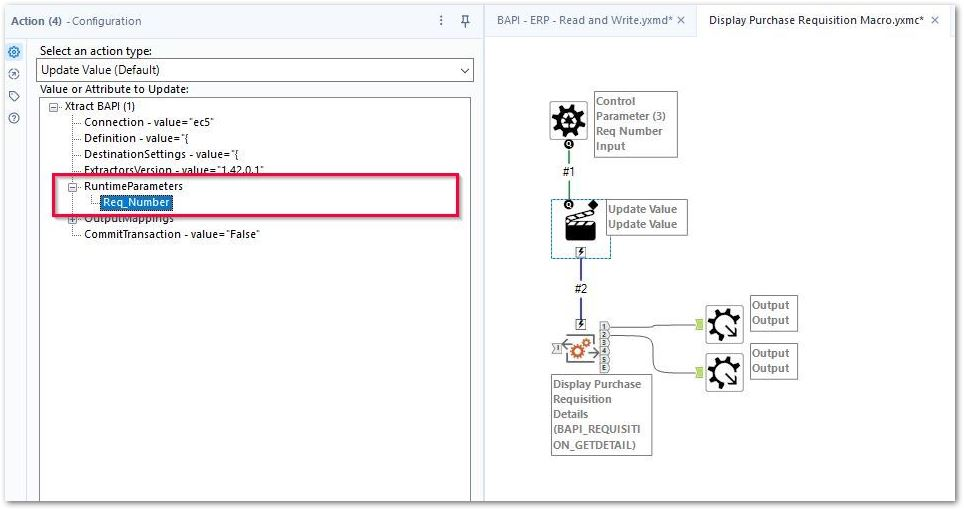{:class="img-responsive"}
14. Add two **Macro Output** tools from the *Interface* toolbox to create outputs for the batch macro.
15. Connect the output of the Xtract BAPI component to the **Macro Output** tools.
16. Save the macro.

The batch macro can now be used to load SAP purchase requisition data of any given purchase requisition number.

*****
#### Related Links
- [Documentation: {{ bapi }}](../documentation/bapi/index.md)
- [Documentation: Sample Workflows](../sample-workflows.md)
