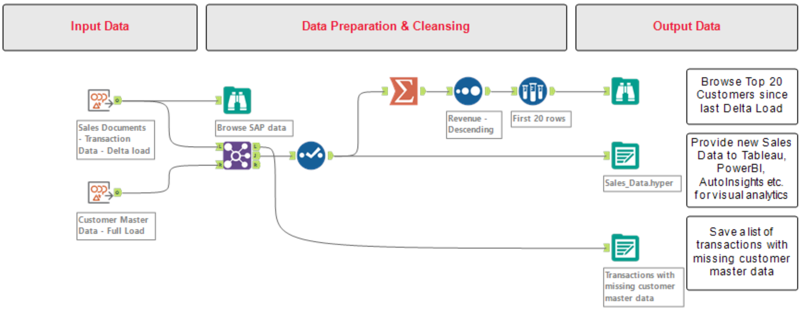
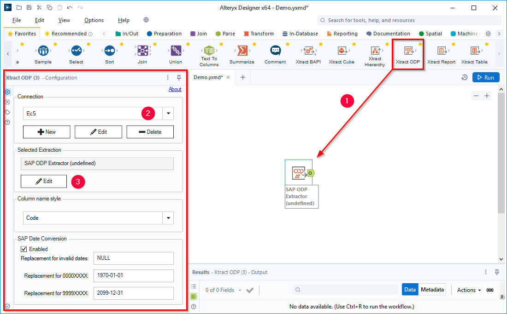
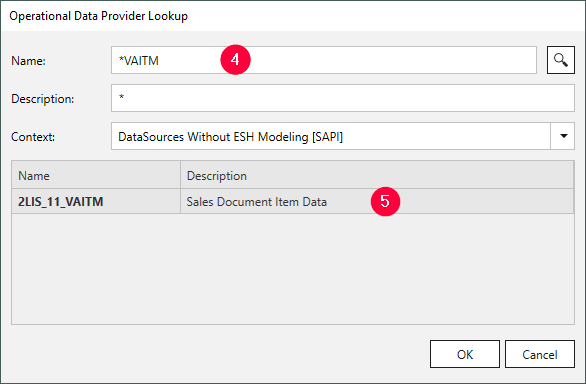
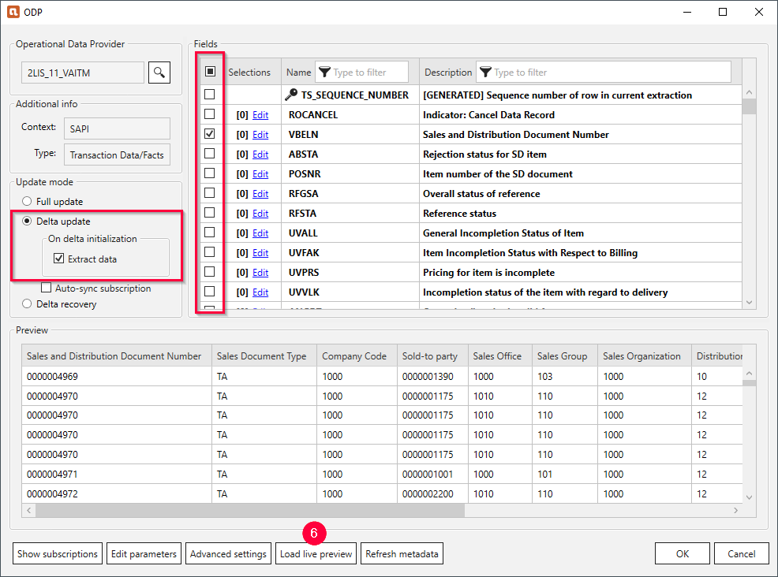
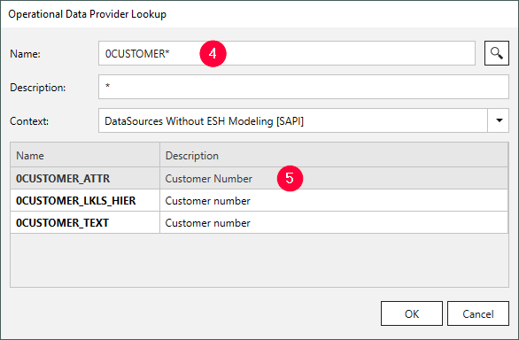
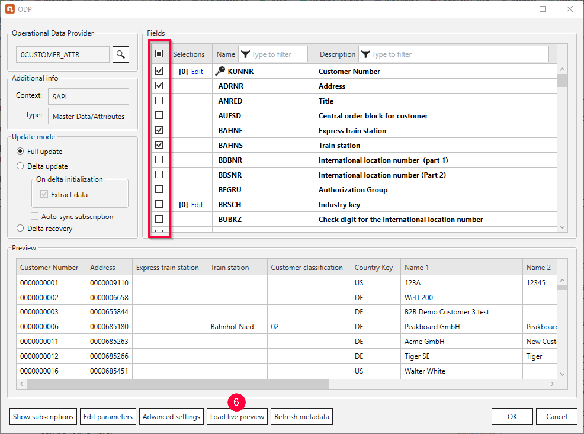

The following article shows how to use the {{ odp }} {{ component }} of {{ productName }} to load sales documents and customer master data from an SAP ERP system. 

### About this Workflow

This article leads you through all necessary steps to set up the following workflow:
- Load all customer master data from the SAP ERP system
- Process the extracted SAP data
- Load sales data using the delta mechanism of the {{ odp }} {{ component }}

The delta mechanism of the {{ odp }} {{ component }} allows loading only the added or changed data (since the last run) from an SAP ERP system.

[:material-download-circle: Download Workflow](../assets/files/xfa/ODP-ERP-Delta.yxmd){ .md-button .md-button--primary }

| SAP System | SAP Objects | {{ productName }} Component |
| :------ |:--- | :--- |
| SAP ERP | BW Extractors: *2LIS_11_VAITM* (Sales Document Item Data) & *0CUSTOMER_ATTR* (Customer Master Data) | {{ odp }} |

{:class="img-responsive" width="900px"}

### Prerequisites

Implement the following SAP notes to use the {{ odp }} {{ component }}:
- [1931427 - ODP Data Replication API 2.0](https://launchpad.support.sap.com/#/notes/1931427)
- [2232584 - Release of SAP extractors for ODP replication (ODP SAPI)](https://launchpad.support.sap.com/#/notes/2232584)
- [1560241 - Release of DataSources for ODP data replication API](https://launchpad.support.sap.com/#/notes/1560241)
- [2196500 - ODP Package size cannot be reduced below 50 MB](https://launchpad.support.sap.com/#/notes/2196500/D)
- [2191995 - ODQ Package Size cannot be reduced below 50 MByte](https://launchpad.support.sap.com/#/notes/2191995/D)

### Delta Extraction of Sales Documents

Follow the steps below to load sales data from your SAP ERP system:
1. Drag & drop the {{ odp }} {{ component }} into your Alteryx workflow :number-1:. 
{:class="img-responsive" width="900px"}
2. Select an SAP connection :number-2:. If no SAP connection is available, create a new connection, see [Documentation: SAP Connection](../documentation/sap-connection/index.md).
3. Click **[Edit]** :number-3: to open the main window of the {{ odp }} {{ component }}.
4. In the main window of the {{ component }} click :magnifying-glass:. The window “Operational Data Provider Lookup” opens.
5. In the field **Name** :number-4: enter the name of the sales data extractor: *2LIS_11_VAITM*. Use wildcards (*), if needed. 
{:class="img-responsive"}
6. Click :magnifying-glass: and select the *2LIS_11_VAITM* extractor from the displayed list :number-5:.
7. Click **[OK]**.
8. Select the fields you want to add to the output of the {{ odp }} {{ component }}.
For more information on selections and filters, see [Documentation: {{ odp }} - Selections](../documentation/odp/selections.md).
{:class="img-responsive"}
9. In the section *Update Mode* select the option **Delta Update** to only load data from the SAP system that was added or changed since the last run.
By default, the first run loads all data from the SAP system. Deactivate the *On delta initialization* option **Extract data** to prevent loading of any data on the first run. 
For more information on selections and filters, see [Documentation: {{ odp }} - Update Mode](../documentation/odp/update-mode.md).
10. Click **[Load live preview]** :number-6: to display a live preview of the data without running an extraction.
11. Click **[OK]** to save your input.

The {{ odp }} {{ component }} can now be used to access and process the extracted SAP sales data.

### Extraction of Customer Master Data

Follow the steps below to load customer master data from your SAP ERP system:
1. Drag & drop the {{ odp }} {{ component }} into your Alteryx workflow :number-1:. 
{:class="img-responsive" width="900px"}
2. Select an SAP connection :number-2:. If no SAP connection is available, create a new connection, see [Documentation: SAP Connection](../documentation/sap-connection/index.md).
3. Click **[Edit]** :number-3: to open the main window of the {{ odp }} {{ component }}.
4. In the main window of the {{ component }} click :magnifying-glass:. The window “Operational Data Provider Lookup” opens.
5. In the field **Name** :number-4: enter the name of the customer master data extractor: *0CUSTOMER_ATTR*. Use wildcards (*), if needed. 
{:class="img-responsive"}
6. Click :magnifying-glass: and select the *0CUSTOMER_ATTR* extractor from the displayed list :number-5:.
7. Click **[OK]**.
8. Select the fields you want to add to the output of the {{ odp }} {{ component }}. 
For more information on selections and filters, see [Documentation: {{ odp }} - Selections](../documentation/odp/selections.md).
{:class="img-responsive"}
9. Click **[Load live preview]** :number-6: to display a live preview of the data without executing an extraction.
10. Click **[OK]** to save your input.

The {{ odp }} {{ component }} can now be used to access and process the extracted SAP customer data.

*****
#### Related Links
- [Alteryx Community - ODP based Delta Extraction of Sales and Customer Data from SAP ERP with {{ productName }}](https://community.alteryx.com/t5/Community-Gallery/ODP-based-Delta-Extraction-of-Sales-and-Customer-Data-from-SAP/ta-p/1140120)
- [Documentation: {{ odp }} (Operational Data Provisioning)](../documentation/odp/index.md)
- [Sample Workflows](../sample-workflows.md)
