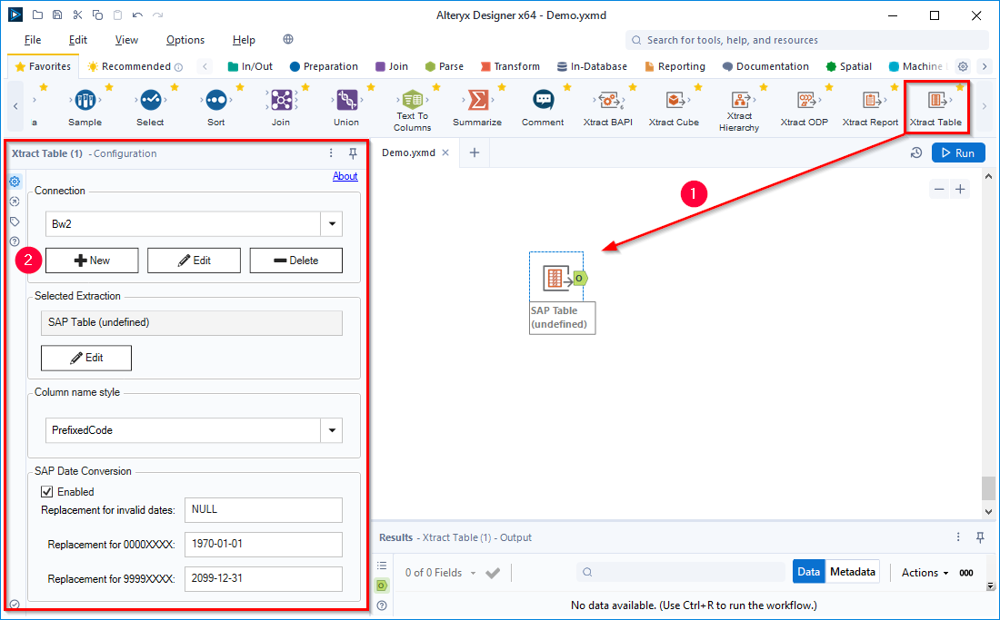
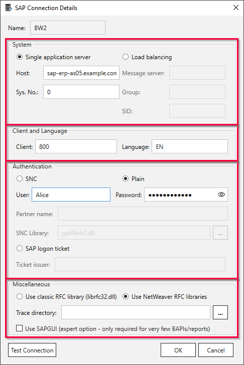
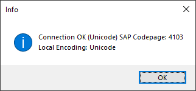
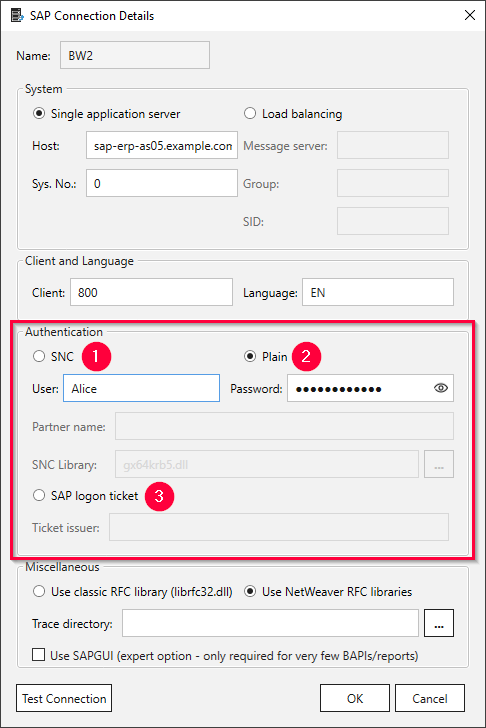

The following section shows how to create an SAP connection using the {{ productName }} UI. 
An SAP connection is required to use any {{ productName }} component.

!!! note
    Creating SAP connections using the {{ productName }} UI is deprecated. 
    The recommended method for creating SAP connections involves the use of Alteryx' Data Connection Manager and requires an Alteryx Designer version >= 2022.3.
    For more information, see [Online Help: SAP-Connection](https://help.theobald-software.com/en/xtract-for-alteryx/sap-connection).

### Create an SAP Connection

1. Drag&drop an {{ productName }} component from the Alteryx Designer tool box onto the canvas :number-1:. 
The configuration window of the component opens.  
{:class="img-responsive"}
2. Click **[New]** to create a new connection :number-2:. The window "SAP Connection Details" opens.
3. Fill out the connection details to establish an SAP connection.
The connection details consist of four subsections:  
{:class="img-responsive"}
	- [System](#system)
	- [Client and Language](#client-and-language)
	- [Authentication](#authentication) 
	- [Miscallaneous](#miscellaneous).
4. Click **[Test Connection]** to test the SAP connection. A confirmation window opens. 
{:class="img-responsive"}
5. Click **[OK]** to save the SAP connection.

The SAP connection is now available for selection in the configuration window :number-2:. 
To edit the SAP connection, select the SAP connection from the dropdown list :number-2: and click **[Edit]**.

!!! tip
    Values to fill out the connection details can be found in the SAP Logon Pad in the *Properties* or acquired from SAP Basis team.

!!! note
    The connection details of an SAP connection are stored in a JSON file in the following directory: 
    `C:\Users\<UserName>\AppData\Roaming\Theobald Software\{{ productName }}\Connections\<SAPSourceName>.json`

### System

There are two possibilities to connect to an SAP source system:

- Use a Single Application Server
- Use a Load Balancing Server (message server)

=== "Single Application Server"

	| Input Field | Description |
	|:------------|:-------------|
	| **Host** |  Host name or IP address of the application server (Property Host) |
	| **Sys. No.:**|  A two-digit number between 00 and 99 (Property SystemNumber) |

=== "Load Balancing Server"

	| Input Field | Description |
	|:------------|:-------------|
	|  **Message Server** |  Name or IP address of the message server (Property MessageServer) |
	| **Group** |  Property LogonGroup, usually *PUBLIC* |
	| **SID** |  Three-digit System ID (Property SID e.g.,  MSS) |
	
For more information, see [SAP Help: Load Balancing](https://help.sap.com/saphelp_nwpi711/helpdata/en/c4/3a644c505211d189550000e829fbbd/content.htm?no_cache=true).

#### Access via SAP router

If you access the SAP source system (Application server or Message server) via an SAP router, set the router string before the host name. 
Example: If the application server is "hamlet" and the router string is ``/H/lear.theobald-software.com/H/``, set the host property to ``/H/lear.theobald-software.com/H/hamlet``.|

For more information, see [SAP Help: SAP-Router](https://help.sap.com/viewer/6d9a59096c4b1014b507f15bed51571f/7.01.22/en-US/486b41efb74c07bee10000000a42189d.html).

### Client and Language

| Input Field | Description |
|:------------|:-------------|
| **Client** | A three-digit number of the SAP client between 000 and 999, e.g., 800. |
| **Language** | The logon language for the SAP system, e.g., *EN* for English or *DE* for German. |

### Authentication

The following authentication methods are supported:
- **SNC** :number-1::  encrypted connection between {{ productName }} and SAP with username and password. 
- **Plain** :number-2:: SAP username and password (system or dialogue user)
- **SAP Log On Ticket** :number-3:: uses SAP Logon-Tickets in place of user credentials. This connection is not encrypted.
	

=== "SNC :number-1:" 

	| Input Field | Description |
	|:------------|:-------------|
	| **SNC library path** | Complete path to the SAP cryptograhic library location, e.g., `C:\Program Files\SAP\FrontEnd\SecureLogin\lib\sapcrypto.dll`. |
	| **SNC partner name** | SAP partner name configured for the SAP application server, e.g., `p:SAPserviceERP/Alice@THEOBALD.LOCAL`. |

	!!! tip
		Check the SAP parameter *snc/gssapi_lib* to determine which library is used for encryption in your SAP system.
		Your SAP basis has to import and configure the same library on the application server and on the machine that runs {{ productName }}.
		
		For more information on SNC, see [Enabling Secure Network Communication (SNC) via X.509 certificate](https://kb.theobald-software.com/sap/enable-snc-using-pse-file).

=== "Plain :number-2:"

	| Input Field | Description |
	|:------------|:-------------|
	| **User** | SAP username. |
	| **Password** | Password of the SAP user.|

=== "SAP Log On Ticket :number-3:"

	| Input Field | Description |
	|:------------|:-------------|
	| **Ticket Issuer** | Enter the URL of an Application Server Java (AS Java) that is configured to issue logon tickets. For more information, see [SAP Documentation: Configuring the AS Java to Issue Logon Tickets](https://help.sap.com/doc/saphelp_nw75/7.5.5/EN-US/4a/412251343f2ab1e10000000a42189c/frameset.htm).|

### Miscellaneous

Select an RFC library. The following RFC libraries are supported:

- **Use classic RFC library (librfc32.dll)**
- **Use NetWeaver RFC libraries (sapnwrfc.dll)**

The RFC API (Remote Function Call) allows to establish an RFC connection to an SAP system from an external system that communicates as Client or Server with the SAP system. 
For more information on SAP libraries, see [SAP Help: RFC Libraries](https://help.sap.com/saphelp_nwpi71/helpdata/de/45/18e96cd26321a1e10000000a1553f6/frameset.htm). 

SAP does not [support the librfc32.dll](https://blogs.sap.com/2012/08/15/support-for-classic-rfc-library-ends-march-2016/) anymore. 

!!! note
    When using the NetWeaver RFC library with DeltaQ or OHS extractions, the RFC destination in SM59 must be set to Unicode.

#### Trace Directory (Debug Logging)

You can log debug information and save it locally. In the field **Trace directory** enter a local path to a folder, where you want to save the debug information.
For more information, see the knowledge base article [How to activate tracing for Xtract Products](https://support.theobald-software.com/helpdesk/KB/View/14455-how-to-activate-tracing-for-xtract-products). 
Clear the **Trace Directory** field when it is not needed.

!!! warning "Warning! : Increase of used hard drive memory"
    A big amount of information is collected when debug logging is activated. This can decrease the capacity of your hard drives dramatically.
    Activate the debug logging only when necessary e.g., upon request of the support team.
