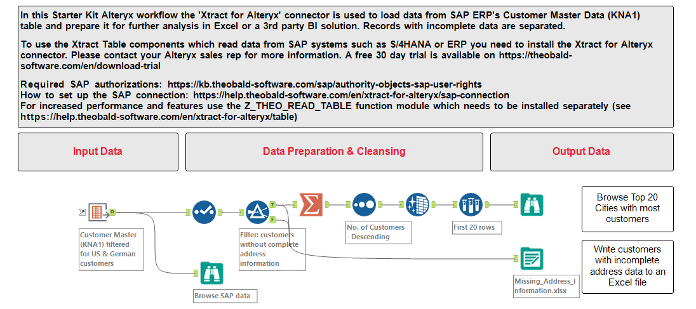

{ .lg .middle width="30px"} This section offers a set of sample workflows you can download and use as a base to design your own processes.

<!--- align Download buttons-->

!!! note
	{ width="40%" align=right }

	How to get started with Theobald Software sample workflows:

	1. Download a sample workflow.
	2. Open the workflow in the Alterx Designer.
	2. Assign a valid [SAP Connection](documentation/sap-connection/index.md) to all Xtract components in the workflow.
	3. Read the intro section that explains the workflow.
	4. Start using the workflow or start editing until the workflow suits your requirements.

<!---
| Category | Description |
| -----|------------ | 
| [:simple-sap: SAP Migration Scenarios](#sap-migration-scenarios) | Workflows that support SAP migration, e.g., from ECC to S/4HANA |  
| [:component-bapi: Xtract BAPI](#xtract-bapi) | Workflows that execute SAP BAPIs and function modules |
| [:component-bwcube: Xtract Cube](#xtract-cube) | Workflows that extract data from SAP BW InfoCubes and BEx Queries |
| [:component-hierarchy: Xtract Hierarchy](#xtract-hierarchy) | Workflows that extract Hierarchies from an SAP BW system |
| [:component-odp: Xtract ODP](#xtract-odp) | Workflows that extract data via the SAP Operational Data Provisioning (ODP) framework |
| [:component-report: Xtract Report](#xtract-report) | Workflows that extract data from SAP ABAP Reports |
| [:component-table: Xtract Table](#xtract-table) | Workflows that extract data from SPA table and Views |
-->

### :simple-sap: SAP Migration Scenarios

Workflows that support SAP migration, e.g., from ECC to S/4HANA:

-   __Data Anonymization and Replication to QA system__

    ---

    This workflow  uses the [Xtract Table](documentation/table/index.md) component to support an SAP migration that is conducted in a phased approach by extracting the data from the relevant system depending on the user input. 
	
	[:material-download-circle: Download](assets/files/xfa/S4 Migration - Short-term bridge app.yxwz){ .md-button .md-button--stretch}

-   __Short-term Bridge App__

    ---

    This workflow  uses the [Xtract Table](documentation/table/index.md) component to create development and testing data sets with anonymized data from the productive system to speed up quality assurance processes. 
	
	[:material-download-circle: Download](assets/files/xfa/S4 Migration - Data Anonymization and Replication to QA system.yxzp){ .md-button .md-button--stretch }

-   __Source & Target Validations - Report level__

    ---

    This workflow uses the [Xtract Report](documentation/report/index.md) component to validate data integrity between source and target systems. 
	
	[:material-download-circle: Download](assets/files/xfa/S4 Migration - Source & Target Validations - Report level.yxmd){ .md-button .md-button--stretch }

-   __Source & Target Validations - Table level__

    ---

    This workflow  uses the [Xtract Table](documentation/table/index.md) component to validate data integrity between source and target systems. 
	
	[:material-download-circle: Download](assets/files/xfa/S4 Migration - Source & Target Validations - Table level.yxmd){ .md-button .md-button--stretch }

-   __Source & Target Validations - Table & other__

    ---

    This workflow  uses the [Xtract Table](documentation/table/index.md) component to validate data integrity between source and target systems. This workflow can be used for tests and demos, as it uses a flat file as a target to resemble the source system with minor changes that are discovered in the reconciliation. 
	
	[:material-download-circle: Download](assets/files/xfa/S4 Migration - Source & Target Validations - Table & other.yxzp){ .md-button .md-button--stretch }

---

### :component-bapi: Xtract BAPI

Workflows that execute SAP BAPIs and function modules:

-   __Read and Write Data with BAPIs__

    ---

    This workflow demonstrates using [Xtract BAPI](documentation/bapi/index.md) to create a purchase requisition in SAP and load the data of the purchase requisition into Alteryx. 
	
	[:material-download-circle: Download](assets/files/xfa/BAPI-ERP-ReadandWrite.yxmd){ .md-button .md-button--stretch}

-   __Read SAP LongTexts__

    ---

    This workflow demonstrates using [Xtract BAPI](documentation/bapi/index.md) to read SAP long texts in different languages. 
	
	[:material-download-circle: Download](assets/files/xfa/SAP-Read-Long-Texts.yxmd){ .md-button .md-button--stretch }

-   __Read SAP Attachment Files__

    ---

    This workflow demonstrates extracting attachments of all formats from an SAP systems, e.g., .pdf files of purchase orders, images, and other objects. 
	For more information, see [Knowledge Base Article: Read and Download SAP Attachment Files](knowledge-base/read-sap-attachment-files.md). 
	
	[:material-download-circle: Download](assets/files/xfa/SAP-Read-Attachment-Files.yxmd){ .md-button .md-button--stretch}

-   __Sync Purchase Requisitions from ERP to S4__

    ---

    This workflow demonstrates syncing purchase requisitions from ERP to S/4. 
	It involves creating a new requisition in ERP, checking its absence in S/4, syncing by generating corresponding entries in both systems, and confirming the presence in S/4.  
	
	[:material-download-circle: Download](assets/files/xfa/BAPI-Sync-PRs-from-ERP-to-S4.yxmd){ .md-button .md-button--stretch }

---

### :component-bwcube: Xtract Cube

Workflows that extract data from SAP BW InfoCubes and BEx Queries:

-   __Cube: BWInfoProvider__

    ---

    This workflow demonstrates using [Xtract Cube](documentation/bw-cube/index.md) to load data from an SAP BW InfoProvider. 
	
	[:material-download-circle: Download](assets/files/xfa/Cube-BWInfoProvider.yxmd){ .md-button .md-button--stretch}

-   __Cube: BWQuery__

    ---

    This workflow demonstrates using [Xtract Cube](documentation/bw-cube/index.md) to load data from an SAP BW Query. 
	
	[:material-download-circle: Download](assets/files/xfa/Cube-BWQuery.yxmd){ .md-button .md-button--stretch }

---

### :component-hierarchy: Xtract Hierarchy

Workflows that extract Hierarchies from an SAP BW system:

-   __BW CostCenter Hierarchy__

    ---

    This workflow demonstrates using [Xtract Hierarchy](documentation/bw-hierarchy/index.md) to load data from an SAP BW CostCenter hierarchy. 
	This workflow also showcases the different hierarchy representations "Parent-Child" and "Natural". 
	
	[:material-download-circle: Download](assets/files/xfa/Hierarchy-BW.yxmd){ .md-button .md-button--stretch}

---

### :component-odp: Xtract ODP

Workflows that extract data via the SAP Operational Data Provisioning (ODP) framework:

-   __Read & Merge Data from SAP BW__

    ---

    This workflow demonstrates using [Xtract ODP](documentation/odp/index.md) to load sales documents and customer master data from an SAP BW system. 
	The loaded data is then combined, cleaned, and prepared for further analysis. 
	
	[:material-download-circle: Download](assets/files/xfa/ODP-BW-Full.yxmd){ .md-button .md-button--stretch}

-   __Read & Merge Delta Data from SAP BW__

    ---

    This workflow demonstrates using [Xtract ODP](documentation/odp/index.md) to load delta sales documents and customer master data from an SAP BW system. 
	Sales documents are loaded using Xtract ODP's delta function, which retrieves only data that has changed since the last execution. 
	
	[:material-download-circle: Download](assets/files/xfa/ODP-BW-Delta.yxmd){ .md-button .md-button--stretch }

-   __Read & Merge Data from SAP ERP__

    ---

    This workflow demonstrates using [Xtract ODP](documentation/odp/index.md) to load sales documents and customer master data from an SAP ERP system. 
	The loaded data is then combined, cleaned, and prepared for further analysis. 
	
	[:material-download-circle: Download](assets/files/xfa/ODP-ERP-Full.yxmd){ .md-button .md-button--stretch}

-   __Read & Merge Delta of Data from SAP ERP__

    ---

    This workflow demonstrates using [Xtract ODP](documentation/odp/index.md) to load delta sales documents and customer master data from an SAP ERP system. 
	Sales documents are loaded using Xtract ODP's delta function, which retrieves only changed data since the last execution. 
	For more information, see [Knowledge Base Article: ODP based Delta Extraction of Sales and Customer Data](knowledge-base/delta-extraction-of-sales-data.md).  
	
	[:material-download-circle: Download](assets/files/xfa/ODP-ERP-Delta.yxmd){ .md-button .md-button--stretch }

-   __Read SAP S/4HANA CDS Views__

    ---

    This workflow demonstrates using [Xtract ODP](documentation/odp/index.md) to load business partner master data from SAP S/4HANA CDS views. 
	The loaded data is then cleaned and filtered for further analysis.  
	
	[:material-download-circle: Download](assets/files/xfa/ODP-S4-Full.yxmd){ .md-button .md-button--stretch}

-   __Read Delta of SAP S/4HANA CDS Views__

    ---

    This workflow demonstrates using [Xtract ODP](documentation/odp/index.md) to load the delta data of suppliers and customers from SAP S/4HANA CDS views. 
	The loaded data is then checked for missing address information.  
	
	[:material-download-circle: Download](assets/files/xfa/ODP-S4-Delta.yxmd){ .md-button .md-button--stretch }

---

### :component-report: Xtract Report

Workflows that extract data from SAP ABAP Reports:
 

-   __Read Reports from SAP ERP__

    ---

    This workflow demonstrates using [Xtract Report](documentation/report/index.md) to load data from the ABAP Report RLT10010 (Evaluation of Movements per Storage Type).  
	
	[:material-download-circle: Download](assets/files/xfa/Report-ERP-ABAPReport.yxmd){ .md-button .md-button--stretch}

-   __Read Reports from an SAP S/4HANA Transaction__

    ---

    This workflow demonstrates using [Xtract Report](documentation/report/index.md) to load a list of sales orders from an SAP S/4HANA transaction. 
	
	[:material-download-circle: Download](assets/files/xfa/Report-S4-TCode.yxmd){ .md-button .md-button--stretch }

---

### :component-table: Xtract Table

Workflows that extract data from SPA table and Views:

-   __Read SAP Tables from SAP ERP__

    ---

    This workflow demonstrates using [Xtract Table](documentation/table/index.md) to load customer master data and to prepare the data for further analysis in Excel or a 3rd party BI solution.  
	
	[:material-download-circle: Download](assets/files/xfa/Table-ERP.yxmd){ .md-button .md-button--stretch}

-   __Read & Join SAP Tables from SAP ERP__

    ---

    This workflow demonstrates using [Xtract Table](documentation/table/index.md) to perform a table join of the SAP tables KNA1 (Customer Master Data) and KNVV (Customer Master Sales Data) 
	and to prepare the data for further analysis in Excel or a 3rd party BI solution. 
	
	[:material-download-circle: Download](assets/files/xfa/Table-ERP-Join.yxmd){ .md-button .md-button--stretch }

-   __Read Universal Journal Data from SAP S/4HANA__

    ---

    This workflow demonstrates using [Xtract Table](documentation/table/index.md) to load data from SAP S/4HANA's Universal Journal and to prepare the data for further analysis in Excel or a 3rd party BI solution.  
	
	[:material-download-circle: Download](assets/files/xfa/Table-S4.yxmd){ .md-button .md-button--stretch}

-   __Parameterize SAP Table Extractions__

    ---

    This workflow demonstrates how to use scalar and list parameters with the [Xtract Table](documentation/table/index.md) component. 
	
	[:material-download-circle: Download](assets/files/xfa/Table-Dynamic-Parameters.yxmd){ .md-button .md-button--stretch }

******
#### Related Links
- [Theobald Software Product Page: Xtract for Alteryx](https://theobald-software.com/xtract-for-alteryx/)
- [Knowledge Base: Xtract for Alteryx](knwoledge-base/index.md)
