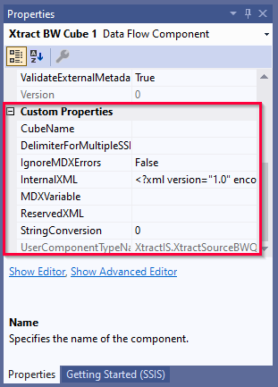

This page shows how to parameterize the {{ bwcube }} {{ component }} using SSIS variables directly in the component and by using SSIS expressions to set *Data Flow Properties*.

### Parameterization using SSIS Variables

SSIS variables store values that an SQL Server Integration Services package and its containers, tasks, and event handlers can use at runtime.
The following settings in the {{ bwcube }} {{ component }} allow entry of an SSIS variable:

- [BEx variables](variables-and-filters.md/#edit-variables): for BEx variables of type *Multiple Single*, enter a single SSIS variable, set a delimiter for custom property *DelimiterForMultipleSSISVariableValues* and enter multiple single values in the SSIS variable separated by the delimiter.
- [Dimension Filters](variables-and-filters.md/#set-dimension-filters): the SSIS variable can be filled with multiple single entries separated by comma.
- [MDXVariable](#mdxvariable): enter an SSIS variable and fill the SSIS variable with the complete MDX statement.

#### Use SSIS Variables with @-Notation



### Custom Properties of {{ bwcube }}

The *Custom Properties* are properties that are unique to the {{ component }}.
When parameterizing the component using SSIS variables, the *Custom Properties* are overwritten.

The *Custom Properties* of the {{ bwcube }} {{ component }} are displayed in the "Properties" window. 

#### CubeName
Corresponds to the setting [*Cube Name*](index.md/#look-up-a-bw-cube-or-query) in the {{ bwcube }} {{ component }}.

#### DelimiterForMultipleSSISVariableValues
Delimiter for multiple input variables, see [Parameterization using SSIS Variables](#parameterization-using-ssis-variables).

#### IgnoreMDXErrors
If set to *true*, MDX errors do not lead to SSIS errors.

#### MDXVariable
Enter an SSIS variable in the MDX textbox and fill the SSIS variable with the complete MDX statement, see [Parameterization using SSIS Variables](#parameterization-using-ssis-variables). 

#### StringConversion
Corresponds to the seeting [String Conversion](settings.md/#string-conversion). 

****
#### Related Links
- [Microsoft Documentation: Integration Services (SSIS) Variables](https://docs.microsoft.com/en-us/sql/integration-services/integration-services-ssis-variables?view=sql-server-ver15)
