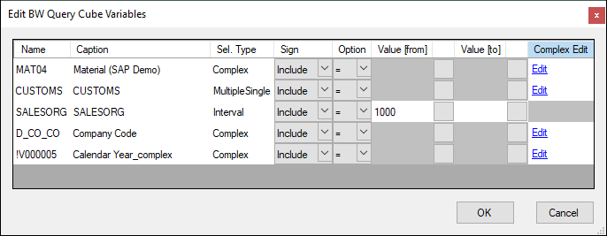
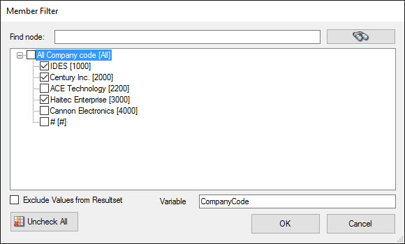

This page shows how to use variables and dimension filters to filter the data that is extracted with the {{ bwcube }} {{ component }}.
There are two options for filtering:
- [Variables](#edit-variables) are usually defined in SAP to create filter options for BW Queries. They can be edited in the {{ bwcube }} {{ component }}.
- [Dimension Filters](#set-dimension-filters) are defined in the {{ bwcube }} {{ component }} to filter data from InfoProviders or BW Queries that do not have variables.

### Edit Variables

BW queries often have defined variables to create filter options. 
Depending on the type of BEx variable (single value, multiple value, interval or complex selection) input fields of the variables are enabled or disabled.

In the main window of the {{ component }}, click **Variables**. The window "Edit BW Query Cube Variables" opens.
Variables can be edited and entered using the variable editor shown below. 

{:class="img-responsive"}

#### Complex Selections
If the query variable represents a complex selection, click **Edit** to open an additional menu. 

#### Static Values
Enter values directly into the input fields.

#### Pre-Defined Values
Click an empty button next to an input field to open a list of values that are defined in SAP.
Select a pre-defined value.

#### SSIS Variables
The use of SSIS variables is supported. 
To use SSIS variables in input fields of the component, place an @ symbol before the variable name, e.g., *@vDate* for a variable *vDate*. 
For more information, see [Use SSIS Variables with @-Notation](parameterization.md/#parameterization-using-ssis-variables).

### Set Dimension Filters 

Each dimension of a BEx Query or an InfoCube offers the possibility to set a filter to execute the MDX statement in BW using the selected filter values.

In the main window of the {{ component }}, click **Filter** next to a selected dimension. The window "Member Filter" opens. 

{:class="img-responsive"}

#### Pre-Defined Values
The window "Member Filter" displays a list of values that are defined in SAP.
You can select pre-defined values to filter the result

#### Define a Variable for the Filter Values
1. Write the variable name into the field Variable, e.g., `CompanyCode`. 
2. When you execute the extraction, set the value, e.g., `CompanyCode=1000`. 
To pass multiple values, use comma as seperator, e.g., `CompanyCode=1000,2000`.

#### Exclude Values from the Result Set
Activate **Exclude Values from Resultset** to exclude the filter values from the result set.

!!! note
	Dimensions with a hierarchy are supported.
