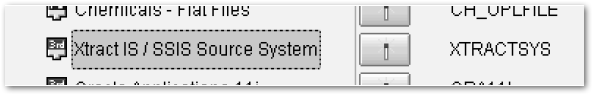
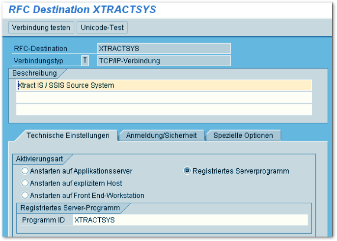
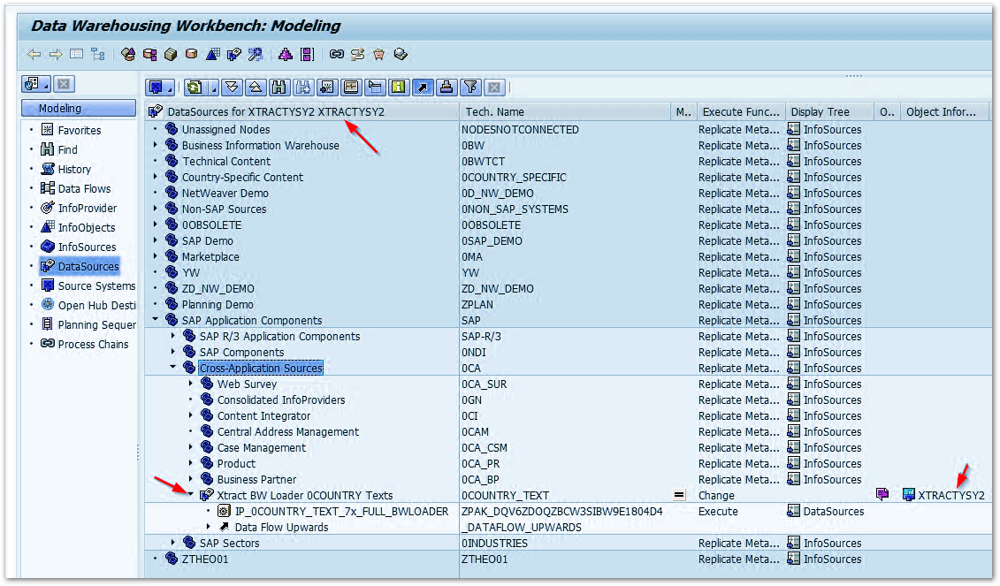
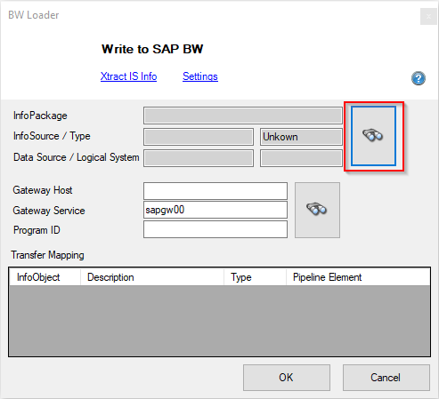
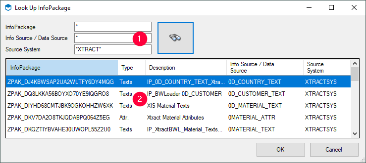
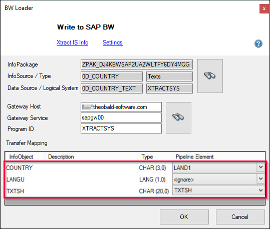

This page shows how to use the {{ bwloader }} {{ component }}. 
Unlike the other {{ components }}, the {{ bwloader }} {{ component }} is a data destination, not a data source. 



### Prerequisites

For the {{ bwloader }} {{ component }} to deliver data correctly, an InfoPackage is required. Create the following InfoPackage in the SAP BW system:

- Create a new source system of the type *3rd party / Staging BAPIs*. The {{ bwloader }} {{ component }} requires the program ID of the source. 
{:class="img-responsive"} 
{:class="img-responsive"}
- When using a 3.x data flow, you can assign the source system to the InfoSource and create an InfoPackage.
- When using a 7.x data flow, create a DataSource for the newly created 3rd party source system and create an InfoPackage.
{{ bwloader }} loads data to the PSA of the DataSource. 
{:class="img-responsive"}

For more information on how to create data imports in SAP BW, refer to the SAP Documentation.

### Look up an InfoPackage

1. In the main window of the component, click the search botton. The window “Look Up InfoPackage” opens.  

2. Look up the name of an InfoPackage, an Info Source or a Source System :number-1:. Use wildcards (*) if needed. 
{:class="img-responsive"}
3. Click the search button. Search results are displayed.
4. Select an item from the list :number-2: and click **[OK]** to confirm.

The lookup finds InfoPackages based on either 3.x or 7.x DataSources.

### Define the {{ bwloader }} {{ Component }}

1. In the main window of the {{ component }} enter values for the following fields or use the search button to look up available RFC Destinations: 

	| Input Field | Description| 
	|-------------|---------------|
	| **Gateway Host** |  the network address of your BW system. | 
	| **Gateway Service** |  usually "sapgwXX" (substitute XX with your system number). | 
	| **Program ID** | is the Program ID that is defined in the BW SourceSystem. | 
	
2. Click **[OK]** to save your input.
3. Pass input data to the input pipeline of the {{ bwloader }} {{ component }}.
4. Open the main window of the {{ bwloader }} {{ component }} component.
5. Map each element of the pipeline to one element of the transfer structure. 
{:class="img-responsive"}
6. Check the [settings](settings.md) before running the SSIS package.
7. Click **[OK]** to save your input.

You can now run the SSIS package.

### Load Data into SAP BW

There are two options on how data can be loaded into SAP BW.

1. The InfoPackage that initiates the data load is triggered from SSIS.
2. The InfoPackage is started from within SAP.

For the second scenario there are two options:

-   __Option 1__

    ---

    Set the setting [*No InfoPackage start (Only wait)*](settings.md/#no-infopackage-start) to *true*.
	In this case the SSIS package must be started and running. 
	Then you can start the InfoPackage in BW manually or by scheduler and the process in SSIS will continue.

-   __Option 2__

    ---

    Use the BI Notification Receiver. The BI Notification Receiver enables triggering multiple SSIS packages from BW without having to run the SSIS packages all the time. 
	This application registers itself to BW as an external system and waits for notification. 

