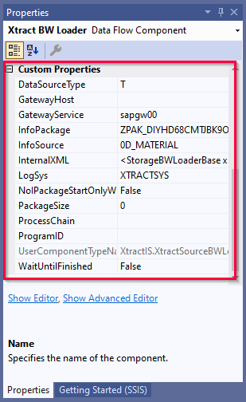

### Parameterization using SSIS Variables

SSIS variables store values that an SQL Server Integration Services package and its containers, tasks, and event handlers can use at runtime.
The following settings in the {{ bwloader }} {{ component }} allow entry of an SSIS variable:

- [*Package Size*](settings.md/#package-size)
- [*Gateway host*](index.md/#define-the-xtract-bwloader-component)
- [*Gateway service*](index.md/#define-the-xtract-bwloader-component)
- [*Program ID*](index.md/#define-the-xtract-bwloader-component)

#### Use SSIS Variables with @-Notation



### Custom Properties of {{ bwloader }}

The *Custom Properties* are properties that are unique to the {{ component }}.
When parameterizing the component using SSIS variables, the *Custom Properties* are overwritten.

The *Custom Properties* of the {{ bwloader }} {{ component }} are displayed in the "Properties" window. 

List of relevant *Custom Properties*:

|Property |Comment|
|:----|:----|
| *DataSourceType* | Corresponds to the setting [*Data Source*](index.md/#look-up-an-infopackage) in the {{ bwloader }} {{ component }} |
| *GatewayHost* | Corresponds to the setting [*Gateway host*](index.md/#define-the-xtract-bwloader-component) in the {{ bwloader }} {{ component }}.|
| *GatewayService* | Corresponds to the setting [*Gateway service*](index.md/#define-the-xtract-bwloader-component) in the {{ bwloader }} {{ component }}.|
| *InfoPackage* | Corresponds to the setting [*InfoPackage*](index.md/#look-up-an-infopackage) in the {{ bwloader }} {{ component }}.|
| *InfoSource* | Corresponds to the setting [*InfoSource*](index.md/#look-up-an-infopackage) in the {{ bwloader }} {{ component }}.|
| *LogSys* | Corresponds to the [*Logical System*](index.md/#look-up-an-infopackage) of the DataSource.|
| *NolPackageStartOnlyWait* | Corresponds to the setting [*No InfoPackage Start (Only Wait)*](settings.md/#no-infopackage-start) in the {{ bwloader }} {{ component }}.|
| *PackageSize* | Corresponds to the setting [*Package Size*](settings.md/#package-size) in the {{ bwloader }} {{ component }}.|
| *ProcessChain* | Corresponds to the setting [*Trigger Process Chain after Upload*](settings.md/#trigger-process-chain) in the {{ bwloader }} {{ component }}.|
| *ProgramID* | Corresponds to the setting [*Program ID*](index.md/#define-the-xtract-bwloader-component) in the {{ bwloader }} {{ component }}. |
| *WaitUntilFinished* | Corresponds to the setting [*Wait data transfer to be finished*](settings.md/#wait-data-transfer-to-be-finished) in the {{ bwloader }} {{ component }} |

*****
#### Related Links:
- [Integration Services (SSIS) Variables](https://docs.microsoft.com/en-us/sql/integration-services/integration-services-ssis-variables?view=sql-server-ver15)