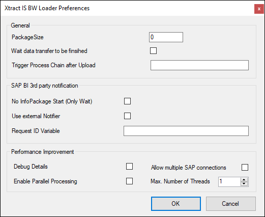



### General

{:class="img-responsive"}

#### Package Size


#### Wait data transfer to be finished
If this option is checked, the component waits until data processing is completed. You will receive additional error messages if data processing fails.

#### Trigger Process Chain
If you want to trigger a process chain after uploading just type in the name of the process chain here.

### SAP BI 3rd party notification

#### No InfoPackage Start
The best way to upload data is to trigger the InfoPackage (default value). Under some conditions it might be useful not to trigger the InfoPackage but only to wait for notification (sleeping mode). In this case check this option.

#### Use external Notifier
See chapter [External Notification](./external-notification).

#### Request ID variable
See chapter [External Notification](./external-notification).

### Performance Improvement
#### Debug Details
Generates more detailed log entries to enable easier error detection

#### Enable Parallel Processing
Enables multiple uploads at the same time.

#### Allow multiple SAP connections
Allows to establish more than one connection to SAP which improves performance.

#### Max. Number of Threads
Maximum number of application threads that prepare the packages to be uploaded.

