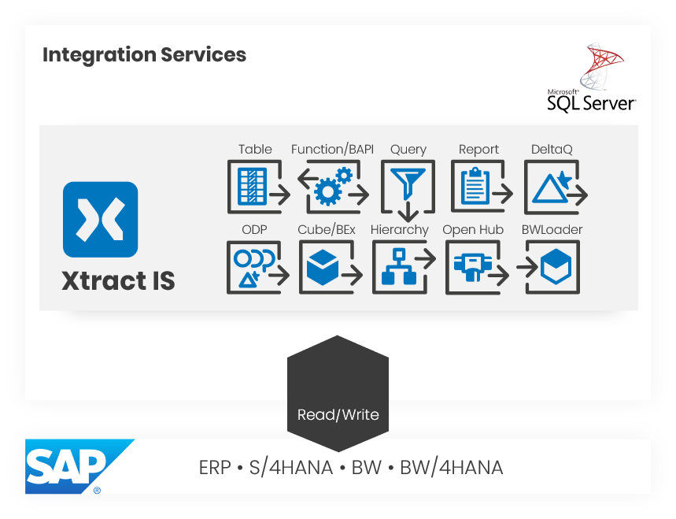

-   { .lg .middle width="30px"} This section contains user documentation for {{ productName }}.

### About Xtract IS

Xtract IS is a plug-in for the [SQL Server Integration Services (SSIS)](https://docs.microsoft.com/en-us/sql/integration-services/sql-server-integration-services).
Xtract IS allows extracting data from SAP systems and writing data to SAP systems.

{:class="img-responsive"}

### Available {{ Components }}

Xtract IS offers the following {{ components }} to cover a wide range of data extraction scenarios.

|  {{ Component }}  |  Data Flow Component Type | Description   |  
|----------|-------------|-------------|
| [{{ bapi }}](bapi/index.md) | Transformation | Execute BAPIs and Function Modules. |
| [{{ bwcube }}](bw-cube/index.md) | Source   | Extract data from SAP BW InfoCubes and BEx Queries. |
| [{{ bwloader }}](bwloader/index.md) | Destination | Load data into SAP BW systems. |
| [{{ hierarchy }}](hierarchy/index.md) | Source   | Extract Hierarchies from an SAP BW / BI system. |
| [{{ deltaq }}](deltaq/index.md) | Source | Extract data from DataSources (OLTP) and extractors from ERP and ECC systems. | 
| [{{ odp }}](odp/index.md) | Source | Extract data via the SAP Operational Data Provisioning (ODP) framework. | 
| [{{ ohs }}](ohs/index.md) | Source | Extract data from InfoSpokes and OHS destinations. | 
| [{{ query }}](query/index.md) | Source | Extract data from ERP queries.  **Note: BEx queries are covered by {{ bwcube }}**. | 
| [{{ report }}](reports/index.md) | Source | Extract data from SAP ABAP reports. | 
| [{{ table }}](table/index.md) | Source | Extract data from SAP tables and views. |
| [{{ tableCDC }}](table-cdc/index.md) | Source | Extract delta data from SAP tables and views. |

