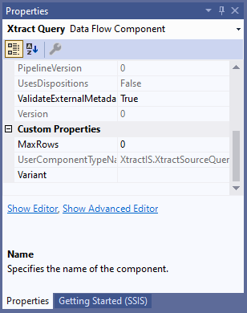

This page shows how to parameterize the {{ query }} {{ component }} using SSIS variables directly in the component and by using SSIS expressions to set *Data Flow Properties*.

### Parameterization using SSIS Variables

SSIS variables store values that an SQL Server Integration Services package and its containers, tasks, and event handlers can use at runtime.  You can use SSIS variables for selections.
Available SSIS variables are listed in the selection settings when parameter input (:runtime-parameters-dynamic:) is selected, see [Edit Selections](variants-and-selections.md#edit-selections).  



### Data Flow Properties of {{ query }}
List of *Data Flow Properties* that can be parameterized:

|Property|Description|
|:----|:----|
| *[Xtract Query].[Variant]*| Corresponds to the settings [Variants](variants-and-selections.md#choose-a-variant) in the {{ query }} {{ component }}.|

### Custom Properties of {{ query }}

The *Custom Properties* are properties that are unique to the {{ component }}.
When parameterizing the component using SSIS variables, the *Custom Properties* are overwritten.

The *Custom Properties* of the {{ query }} {{ component }} are displayed in the "Properties" window. 

List of the relevant *Custom Properties*:

|Property| Description|
|:----|:----|
| *MaxRows* | Corresponds to the settings [MaxRows](settings.md/#max-rows) in the {{ query }} {{ component }}.|
| *Variant* | Corresponds to the settings [Variants](variants-and-selections.md#choose-a-variant) in the {{ query }} {{ component }}.. |

****
#### Related Links
- [Microsoft Documentation: Integration Services (SSIS) Variables](https://docs.microsoft.com/en-us/sql/integration-services/integration-services-ssis-variables?view=sql-server-ver15)
- [Microsoft Documentation: Use Property Expressions in Packages](https://learn.microsoft.com/en-us/sql/integration-services/expressions/use-property-expressions-in-packages)
