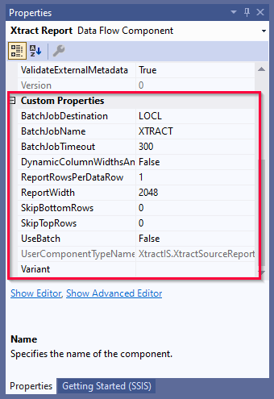

This page shows how to parameterize the {{ report }} {{ component }} using SSIS variables directly in the component and by using SSIS expressions to set *Data Flow Properties*.

### Parameterization using SSIS Variables

SSIS variables store values that an SQL Server Integration Services package and its containers, tasks, and event handlers can use at runtime.  You can use SSIS variables for selections.
Available SSIS variables are listed in the selection settings when parameter input (:runtime-parameters-dynamic:) is selected, see [Edit Selections](variants-and-selections.md#edit-selections).  

!!! note 
	The {{ report }} {{ component }} does not support variables of the data types *DateTime* and *DBNull*. 
	For more information on the data types of system variables, see [Microsoft Documentation: System Variables](https://docs.microsoft.com/en-us/sql/integration-services/system-variables?view=sql-server-ver15).



### Data Flow Properties of {{ report }}
List of *Data Flow Properties* that can be parameterized:

|Property|Description|
|:----|:----|
| *[Xtract Report].[Variant]*| Corresponds to the settings [Variants](variants-and-selections.md/#choose-a-variant) in the {{ r }} {{ component }}.|
| *[Xtract Report].[BatchJobDestination]* | Corresponds to the setting [Spool Destination](settings.md/#spool-destination) in the {{ report }} {{ component }}.|
| *[Xtract Report].[BatchJobName]*        | Corresponds to the setting [Background Job Name](settings.md/#background-job-name) in the {{ report }} {{ component }}.|
| *[Xtract Report].[BatchJobTimeout]*     | Corresponds to the setting [Background Job Timeout](settings.md/#background-job-timeout) in the {{ report }} {{ component }}.|

### Custom Properties of {{ report }}

The *Custom Properties* are properties that are unique to the {{ component }}.
When parameterizing the component using SSIS variables, the *Custom Properties* are overwritten.

The *Custom Properties* of the {{ report }} {{ component }} are displayed in the "Properties" window. 

List of the relevant *Custom Properties*:

|Property|Description|
|:----|:----|
| *BatchJobDestination* | Corresponds to the setting [Spool Destination](settings.md/#spool-destination) in the {{ report }} {{ component }}.|
| *BatchJobName* | Corresponds to the setting [Background Job Name](settings.md/#background-job-name) in the {{ report }} {{ component }}.|
| *BatchJobTimeout* | Corresponds to the setting [Background Job Timeout](settings.md/#background-job-timeout) in the {{ report }} {{ component }}.|
| *DynamicColumnWidthsAndOffsets* | Corresponds to the setting [Dynamic Column Widths and Offsets](report-columns-define.md/#dynamic-column-width-and-offset) in the {{ report }} {{ component }}. |
| *ReportRowsPerDataRow* | Corresponds to the setting [Report Rows Per Data Row](report-columns-define.md#report-rows-per-data-row) in the {{ report }} {{ component }}. |
| *ReportWidth* | Corresponds to the setting [Report Width](report-columns-define.md/#report-width) in the {{ report }} {{ component }}. |
| *SkipBottomRows* | Corresponds to the setting [Skip Rows from Bottom](report-columns-define.md/#skip-rows-from-bottom) in the {{ report }} {{ component }}. |
| *SkipTopRows* | Corresponds to the setting [Skip Rows from Top](report-columns-define.md/#skip-rows-from-top) in the {{ report }} {{ component }}. |
| *UseBatch* | Corresponds to the setting [Use Background Mode](settings.md/#use-background-mode) in the {{ report }} {{ component }}. |
| *Variant* | Corresponds to the setting [Variant](variants-and-selections.md/#choose-a-variant) in the {{ report }} {{ component }}.|

****
#### Related Links
- [Microsoft Documentation: Integration Services (SSIS) Variables](https://docs.microsoft.com/en-us/sql/integration-services/integration-services-ssis-variables?view=sql-server-ver15)
- [Microsoft Documentation: Use Property Expressions in Packages](https://learn.microsoft.com/en-us/sql/integration-services/expressions/use-property-expressions-in-packages)
