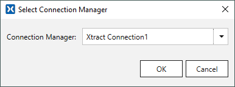
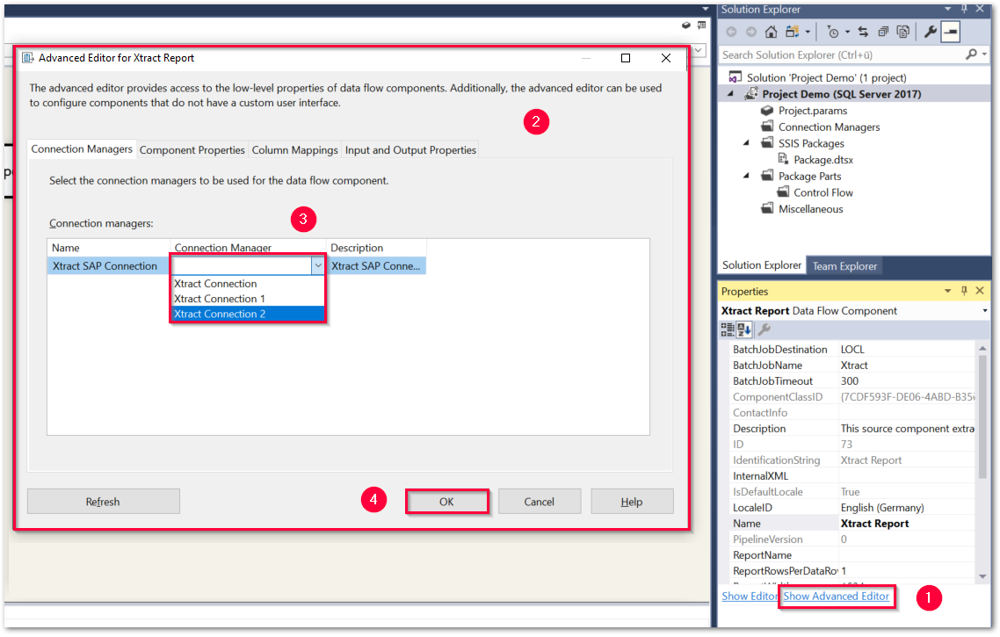

This page shows how to connect to SAP. 
A connection to an SAP system is required to perform tasks like designing ETL packages, extracting metadata, previewing and deploying data using {{ productName }}. 
SSIS can connect to SAP using the "XTRACT" Connection Manager. 



<!---

-   __Supported Connection Methods__

    ---

    - Connection to a single application server
	- Connection to a message server (Load Balancing)

-   __Supported Authentication Methods__

    ---
	
	- [Plain login](#plain-authentication) using SAP username and password (system or dialogue user)
	- [Secure Network Communication (SNC)](#snc-authentication) using username and password via basic authentication

-->
	
**Supported Connection Methods** 

- Connection to a single application server
- Connection to a message server (Load Balancing) 

**Supported Authentication Methods**

- [Plain login](#connect-to-sap) using SAP username and password (system or dialogue user)
- [Secure Network Communication (SNC)](snc-authentication.md) using username and password via basic authentication

### Connect to SAP

Follow the steps below to create a connection manager that connects to SAP:

1. Create a new Integration Services Project and add a data flow task.
2. Right-click in the connection managers area and select **New Connection** from the context menu.
The window "Add SSIS Connection Manager" opens. 
{:class="img-responsive"}
3. Select the XTRACT Connection Manager from the list of available connection managers and click **[Add...]**. 
The Xtract IS Connection manager is now available in the connection managers area.
4. Double-click the Xtract IS Connection Manager. The window "Xtract IS Connection Manager" opens. 
{:class="img-responsive" }
5. Enter the system details of your SAP system and enter the SAP username and password of an SAP system or dialogue user.  

	!!! tip
		Input values for the SAP connection can be found in the Properties of the SAP Logon Pad or the can be requested from the SAP Basis team.
	
6. Click **[Test connection]** to validate the connection parameters. 
7. Click **[OK]** to save the XTRACT Connection Manager.

For information on how to connect to SAP using Secure Network Authentication (SNC), see [SNC Authentication](snc-authentication.md).
For information on properties and parameters of the XTRACT Connection Manager, see [Parameterize Connections](parameterize-connections.md).

### Assign Connection Managers to Xtract {{ Components }}

XTRACT Connection Managers can be assigned to an Xtract {{ component }} automatically or manually.

=== "Assign Automatically"

	1. Create an XTRACT Connection Manager as shown in [Connect to SAP](#connect-to-sap).
	2. Drag & drop an Xtract {{ component }} into the data flow task.  
	3. Double-click the Xtract {{ component }} to automatically assign a Connection Manager.
	If there are multiple XTRACT Connection Managers, the window "Select Connection Manager" opens. 
	 
	Select an XTRACT Connection Manager and click **[OK]**.

=== "Assign Manually"

	1. Create an XTRACT Connection Manager as shown in [Connect to SAP](#connect-to-sap).
	2. Drag & drop an Xtract {{ component }} into the data flow task.   
	3. Select the Xtract {{ component }} and click *Show Advanced Editor* in the *Properties* menu of the {{ component }} :number-1:. 
	The window "Advanced Editor" opens :number-2:.  
	
	4. Select an XTRACT Connection Manager from the drop-down-menu :number-3:. 
	5. Confirm your selection with **[OK]** :number-4:.

	!!! note
		The {{ bapi }} {{ component }} does not have an *Advanced Editor*. 
		To manually assign an XTRACT Connection Manager to an {{ bapi }} {{ component }}, open the main window of the {{ bapi }} {{ component }}.
		The main window of the {{ bapi }} {{ component }} contains a *Change Connection Manager* menu. 



*****
#### Related Links
- [Microsoft Documentation: Create connection managers](https://learn.microsoft.com/en-us/sql/integration-services/connection-manager/integration-services-ssis-connections?view=sql-server-ver16#create-connection-managers). 
- [XTRACT Connection Manager: Properties and Parameters](parameterize-connections.md)
- [Connection Settings: Connection Methods](settings.md#connection-methods)
