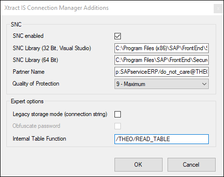

This page contains an overview of the SAP connection settings in the XTRACT Connection Manager. 
For information on the properties of an XTRACT Connection Manager, see [List of XTRACT Connection Manager Properties](parameterize-connections.md/#list-of-xtract-connection-manager-properties).

{:class="img-responsive" }

### Xtract Conenction Manager Settings

Some input fields for the SAP connection vary depending on the selected connection method. 

=== "Use Single Application Server"

	| Input Field | Description |
	| :------ |:--- | 
	| **Client** | A three-digit number of the SAP client between 000 and 999, e.g., 800. | 
	| **Username** | SAP username. | 
	| **Password** | Password of the SAP user. | 
	| **Language** | The logon language for the SAP system, e.g., EN for English or DE for German. | 
	| **Application server** |  Host name or IP address of the application server (Property Host).  | 
	| **Instance number** | A two-digit number between 00 and 99 (Property SystemNumber). | 

=== "Use Load Balancing"

	| Input Field | Description |
	| :------ |:--- | 
	| **Client** | A three-digit number of the SAP client between 000 and 999, e.g., 800. | 
	| **Username** | SAP username. | 
	| **Password** | Password of the SAP user. | 
	| **Language** | The logon language for the SAP system, e.g., EN for English or DE for German. | 
	| **System ID** |  Three-digit System ID (Property SID e.g.,  MSS). | 
	| **Logon group** |  Property LogonGroup, usually *PUBLIC*. | 
	| **Message Server** |  Name or IP address of the message server (Property MessageServer). | 





#### Test Connection

Clicking **[Test Connection]** validates the connection parameters. 
A window with a status message opens in the bottom right corner of the window.

### Additions

The "Additions" menu contains settings for Secure Network Communication (SNC), as well as some expert options.

In the window "XTRACT Connection Manager" click **Additions**. 
The window "XTRACT Connection Manager Additions" opens.

{:class="img-responsive"}

#### SNC

The section *SNC* contains the Secure Network Connection options of the XTRACT Connection Manager.
For more information, see [SNC Authentication](snc-authentication.md) 

| Input Field | Description |
| :------ |:--- | 
| **SNC enabled** | Activate this option to enable Secure Network Communication (SNC) between {{ productName }} and SAP. |
| **SNC library (32 Bit, Visual Studio)** | Path to the SNC library for 32 Bit, e.g., `C:\Program Files (x86)\SAP\FrontEnd\SecureLogin\sapcrypto.dll` |
| **SNC library (64 Bit)** | Path to the SNC library for 64 Bit, e.g., `C:\Program Files\SAP\FrontEnd\SecureLogin\sapcrypto.dll` |
| **Partner Name** | The SAP Partner Name configured for the SAP application server, e.g., `p:SAPserviceERP/Alice@THEOBALD.LOCAL`. |
| **Quality of Protection** | The SNC level of protection. The default value is *9 - Maximum*. For more information, see [SAP Help: Secure Network Communications (SNC) - Levels of Protection](https://help.sap.com/docs/SAP_NETWEAVER_701/6f3e0bea6c4b101484fcf5305b4d624b/e656f466e99a11d1a5b00000e835363f.html?version=7.01.22#levels-of-protection). |

#### Expert Options

| Input Field | Description |
| :------ |:--- | 
| **Legacy storage mode (connection string)** | Activate this option, if you still use a single connection string for the SAP connection (default in {{ productName }} versions before 09.2017). You can either use *Connection properties* or a *Connection string*, not both. *Connection string* does not support [sensitive environment variable](parameterize-connections.md/#sensitive-environment-variables-in-ssisdb-catalog).| 
| **Obfuscate Password** | Masks the SAP connection password. This option is activated by default when activating **Legacy storage mode**.|
| **Internal Table Function** | Defines the function module that is used for Xtract IS' internal communication with SAP, e.g., retrieving metadata. To [change the selected function module](../setup-in-sap/custom-function-module-for-table-extraction.md), type the name of function module manually. |
| **AttachesSapGui** | This option is only accessible in the *Properties* of the XTRACT Connection Manager and not in the GUI. There are SAP Reports and BAPIs that require an installed SAP GUI even when they are called remotely. In this case, set the *AttachesSapGui* property in the *Expert Options* of the XTRACT Connection Manager to *True*. |

