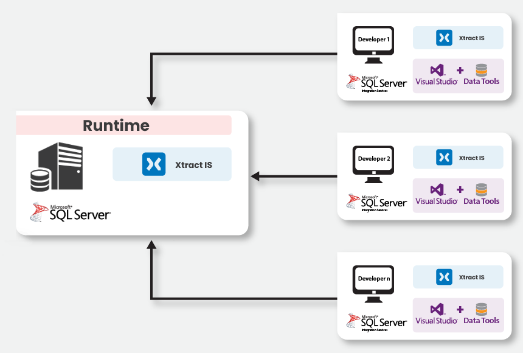
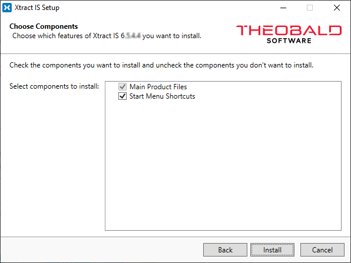
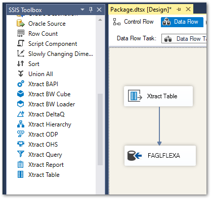
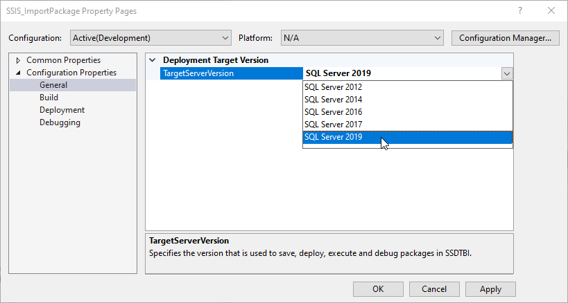

This page shows how and where to install Xtract IS. 

### Prerequisites

- Administrator permissions are required to install Xtract IS.
- Make sure to install the necessary tools in the correct order:

| Order | Runtime Environment | Development Environment(s) |
|:-------------:|-------------|--------------|
| :number-1: | SQL Server (+ [Integration Services](https://learn.microsoft.com/en-us/sql/integration-services/install-windows/install-integration-services?view=sql-server-ver16#install-integration-services)) | [Visual Studio](https://visualstudio.microsoft.com/downloads) + [SQL Server Data Tools](https://learn.microsoft.com/en-us/sql/ssdt/download-sql-server-data-tools-ssdt?view=sql-server-ver16) |
| :number-2: | Optional: [Visual Studio](https://visualstudio.microsoft.com/downloads) + [SQL Server Data Tools](https://learn.microsoft.com/en-us/sql/ssdt/download-sql-server-data-tools-ssdt?view=sql-server-ver16) | [SQL Server Integration Services](https://marketplace.visualstudio.com/items?itemName=SSIS.MicrosoftDataToolsIntegrationServices) |
| :number-3: | :products-xtract-is: Xtract IS | :products-xtract-is: Xtract IS |


!!! note
	When installing Visual Studio, select the Data Storage & Processing toolset.
	

{:class="img-responsive"}

The SQL Server runs on the runtime environment. 
On the runtime environment, the developed SSIS packages are deployed (SSISDB) and can be scheduled by means of SQL Server Agent. 

In order to use Xtract IS Data Flow Tasks, the Xtract IS must be installed on all instances with a valid license. 
For more information, see section [Licensing](./installing-the-license).

### Setup

`XtractISSetup.exe` is an industry standard setup. 
Execute the Execute the `XtractISSetup.exe` file and follow the instructions of the setup program.
The Xtract IS Setup installs Xtract IS as a plug-in into SSIS.

{:class="img-responsive"}

For information on how to install a license, see [License](./install-the-license#install-the-xtract-is-license).

#### Installation Directory Files

The list below shows several important files that are placed into the default directory `{{ installationDir }}` after installation:

|Filename | Description |
|:----|:---|
| ABAP Directory | Directory with SAP function modules. Read the readme.txt within the directory for more information. See also [SAP Customizing](../sap-customizing). |
| XtractISSetup.exe | Application for installing and registering the Xtract IS components within SSIS.|
| XtractISConversionPreparer.exe| Tool, which prepares older version of SSIS packages (containing Xtract IS components) for migration to newer versions of SSIS. See also section [SSIS Migration](./ssis-migration).|
| XtractISVerisonInfo.exe | Starts the `XtractISVerisonInfo.exe` via the command line tool to display and read the currently installed version.|
| XtractLicenseManager.exe | Application to manage and view licenses.|
| Uninstall Xtract IS| Tool for uninstalling and removing Xtract IS with all its components from your machine. |
| gac-uninstall.bat | **For debugging only**. <br>Tool to clear the GAC of all Xtract IS related components in case of installation issues.|
| Eula_XtractIS.rtf | Document containing the license agreement for the use of the software Xtract IS.|
| XtractISLicense.json | License file with information about the server, the component and runtime. |


### Unattended Installation

The installation of Xtract IS can be initiated unattended without the GUI.

- Execute the `XtractISSetup.exe` via command line and use the switch `--unattended`. 
- Execute the `XtractLicenseManager.exe` (License Manager) via command line and pass the path to the license file as an argument. 

`XtractISSetup.exe` and `XtractLicenseManager.exe` are Windows applications, meaning the Windows Command Prompt does not wait until the installation is complete. 
To wait until the installation is complete, use the [start](https://docs.microsoft.com/en-us/windows-server/administration/windows-commands/start) command with the `/wait` switch. 

!!! note
	All switches are case sensitive.

```
start /wait XtractISSetup.exe --unattended
start /wait XtractLicenseManager.exe "C:\Program Files\XtractIS\XtractISLicense.json"
```


	


### Xtract IS Components in Visual Studio

After a successful installation, the Xtract IS {{ components }} are available in the SSIS Toolbox of a Data Flow Task in your Visual Studio Integration Services project.

{:class="img-responsive"}

The Xtract IS {{ components }} may still be invisible due to version incompatibility issues.

The deployment target version of the SSIS project used must match the version of the installed SQL Server Data Tools (SSDT).
If the versions do not match, the necessary Xtract IS extensions will be missing from the SQL Server installation (SSDT) and runtime errors may be displayed. 

Change the Target Server version for deployment to display the Xtract IS components in the toolbox.

{:class="img-responsive"}


***
#### Related Links
- [Visual Studio + SQL Server Data Tools](https://visualstudio.microsoft.com/free-developer-offers/)
- [SQL Server Integration Services](https://marketplace.visualstudio.com/items?itemName=SSIS.MicrosoftDataToolsIntegrationServices)
- [Integration Services](https://learn.microsoft.com/en-us/sql/integration-services/install-windows/install-integration-services?view=sql-server-ver16#install-integration-services)

