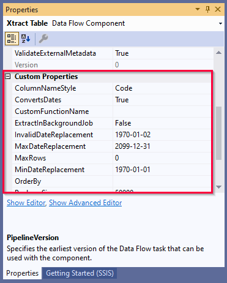

This page shows how to parameterize the {{ tableCDC }} {{ component }} using SSIS variables directly in the component and by using SSIS expressions to set *Data Flow Properties*.

### Parameterization using SSIS Variables

SSIS variables can be used to parameterize the WHERE Clause in the {{ table }} {{ component }}, see [Dynamic WHERE Clause with SSIS Variables](where-clause.md#dynamic-where-clause-with-ssis-variables).



### Data Flow Properties of {{ tableCDC }}
List of *Data Flow Properties* that can be parameterized:

|Property Name|Description|
|:----|:----|
| *[Xtract Table CDC].[ConvertsDates]*|Enable or disable conversion of SAP dates, see [Custom Properties](#custom-properties). |
| *[Xtract Table CDC].[InvalidDateReplacement]*|Every invalid value will be converted into the entered value, see [Custom Properties](#custom-properties).|
| *[Xtract Table CDC].[MinDateReplacement]*|Converts the SAP date 00000000 to the entered value, see [Custom Properties](#custom-properties).|
| *[Xtract Table CDC].[MaxDateReplacement]*|Converts the SAP date 9999XXXX to the entered value, see [Custom Properties](#custom-properties).|

### Custom Properties of {{ tableCDC }}

The *Custom Properties* are properties that are unique to the {{ component }}.
When parameterizing the component using SSIS variables, the *Custom Properties* are overwritten.

The *Custom Properties* of the {{ tableCDC }} {{ component }} are displayed in the "Properties" window. 



****
#### Related Links
- [{{ table }} Settings](settings.md)  
- [Knowledge Base Article: Dynamization of WHERE Conditions](../../knowledge-base/dynamization-of-where-conditions.md)