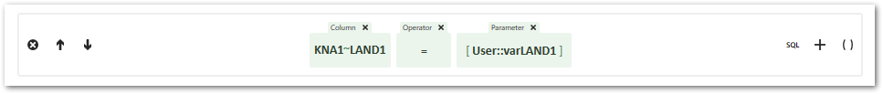
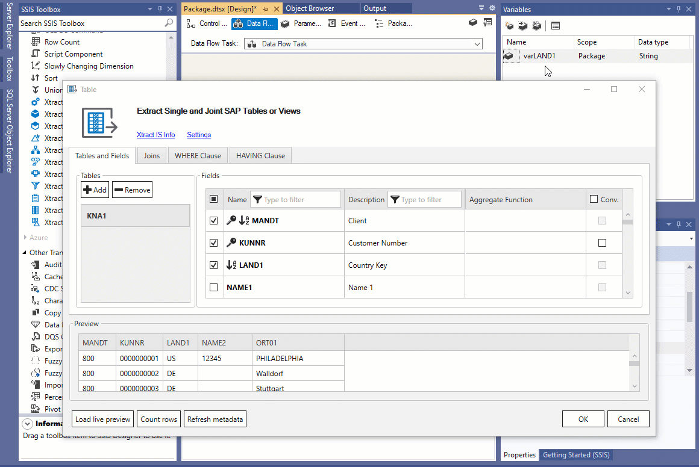

This page shows how to parameterize the {{ table }} {{ component }} using SSIS variables directly in the component and by using SSIS expressions to set *Data Flow Properties*.

### Parameterization using SSIS Variables

SSIS variables can be used to parameterize the WHERE Clause in the {{ table }} {{ component }}:

1. Define an SSIS variable. Make sure the data type of the variable matches the data type of the table records you want to filter.
2. Open the {{ table }} {{ component }} and navigate to the WHERE Clause tab.
3. Click **[Editor mode]** to open the WHERE Clause Editor.
4. Add a new filter criteria and use the **[Default with Parameter]** template. 

5. Click inside the *Parameter* component. A drop-down-list that displays all available parameters and SSIS variables opens. Select your SSIS variable from the list.
6. To test the WHERE clause, assign a default value for the SSIS variable and click {{ previewBtn }}.

{:class="img-responsive" style="border:1px solid black;"}



### Data Flow Properties of {{ table }}
List of *Data Flow Properties* that can be parameterized:

|Property Name|Description|
|:----|:----|
| *[Xtract Table].[WhereClause]*| Corresponds to the tab *WHERE clause* in the Table component. Allows parameterization of the complete WHERE clause, see [Knowledge Base Article: Dynamization of WHERE Conditions](../../knowledge-base/dynamization-of-where-conditions.md).|
| *[Xtract Table].[ConvertsDates]*| Enable or disable conversion of SAP dates, see [Custom Properties](#custom-properties-of-xtract-table). |
| *[Xtract Table].[CustomFunctionName]*| Corresponds to the setting [Function Module](settings.md#function-module) in the {{ table }} {{ component }}.|
| *[Xtract Table].[MaxRows]*| Corresponds to the setting [Row Limit](settings.md#max-limit) in the {{ table }} {{ component }}. |
| *[Xtract Table].[MinDateReplacement]*| Converts the SAP date 00000000 to the entered value, see [Custom Properties](#custom-properties-of-xtract-table).|
| *[Xtract Table].[MaxDateReplacement]*| Converts the SAP date 9999XXXX to the entered value, see [Custom Properties](#custom-properties-of-xtract-table).|
| *[Xtract Table].[InvalidDateReplacement]*| Every invalid value will be converted into the entered value, see [Custom Properties](#custom-properties-of-xtract-table).|
| *[Xtract Table].[PackageSize]*| Corresponds to the setting [Package Size](settings.md#package-size) in the {{ table }} {{ component }}. |

### Custom Properties of {{ table }}

The *Custom Properties* are properties that are unique to the {{ component }}.
When parameterizing the component using SSIS variables, the *Custom Porperties* are overwritten.

The *Custom Properties* of the {{ table }} {{ component }} are displayed in the "Properties" window. 

| Property	| Description |
|-----------|-------------|
| *ColumnNameStyle* | *Code*: the SAP technical column name is used as column name in the output, e.g., MAKTX.  *PrefixedCode*: the SAP technical column name is prefixed by SAP object name and the tilde character, e.g., MAKT~MAKTX.   *CodeAndText*: the SAP technical column name and the SAP description separated by an underscore are used as column name in the output, e.g., MAKTX_Material Description (Short Text).  *TextAndCode*: the SAP description and the SAP technical column name description separated by an underscore are used as column name in the destination e.g., Material Description (Short Text)_MAKTX.|
| *ConvertsDates* | When this property is set to *True* (default) SAP date fields (YYYYMMDD) assume the SSIS pipeline type DT_DBDATE instead of DT_WSTR. For the date conversions to apply, set the property *UseLegacyDateConversion* to *False*. In case of invalid data in SAP date fields, the following date conversions are applied:  <li>*InvalidDateReplacement* </li><li>*MaxDateReplacement*</li><li>*MinDateReplacement* |
| *CustomFunctionName* | Corresponds to the setting [Function Module](settings.md#function-module) in the {{ table }} {{ component }}.|
| *ExtractInBackgroundJob* | Corresponds to the setting [Extract data in background job](settings.md#extract-data-in-background-job).|
| *InvalidDateReplacement* | Allows the replacement of an invalid date format. The default value of the property is *1970-01-02*. To use the property enter a replacement value for invalid SAP dates, such as '20190132' (January 32nd  2019) in the format yyyy-mm-dd. The value NULL is supported.|
| *MaxDateReplacement* | Allows replacing the SAP dates with the year 9999. The default value of the property is 2099-12-31. To use the property enter a replacement value in the format yyyy-mm-dd that contains the year ‘9999’. Example: ‘99990101’ (January 1st 9999). The value NULL is supported.|
| *MinDateReplacement* | Allows replacing the SAP dates with the year *0000*. The default value of the property is 1970-01-01. To use the property enter a replacement value in the format yyyy-mm-dd that contains the year '0000'. Example: '00000000'. The value NULL is supported.|
| *MaxRows* | Corresponds to the setting [Row Limit](settings.md#max-limit) in the {{ table }} {{ component }}. |
| *OrderBy* | Defines the table field that is used as the sort criterion for the result. |
| *PackageSize* | Corresponds to the setting [Package Size](settings.md#package-size) in the {{ table }} {{ component }}. |
| *UseWideStrings* | Defines whether DT_WSTR / DT_NTEXT (*true*) or DT_STR / DT_TEXT (*false*) is used as the data type for string columns. |
| *UseLegacyDateConversion* | The property *UseLegacyDateConversion* is used for migration of table extractions from Xtract IS versions < 5.0.0. The default value of this property is *False*. As a prerequisite for using *UseLegacyDateConversion* property, the *ConvertsDates* property must be set to *True*. Setting *UseLegacyDateConversion* to *True* does the following:<li> Invalid SAP date values are replaced with the value entered in the *InvalidDateReplacement* property.</li><li> There is no replacement for SAP dates that contain the year '9999'. The value entered in the *MaxDateReplacement* property is *not* considered.</li><li> SAP dates that contain the year '0000' are replaced with *NULL*. The value entered in the *MinDateReplacement* property is *not* considered. </li> |
| *WhereClause* | Corresponds to the tab *WHERE clause* in the Table {{ component }}. This property allows parameterization of the complete WHERE clause, see [Knowledge Base Article: Dynamization of WHERE Conditions](../../knowledge-base/dynamization-of-where-conditions.md).|

****
#### Related Links
- [{{ table }} Settings](settings.md)  
- [Knowledge Base Article: Dynamization of WHERE Conditions](../../knowledge-base/dynamization-of-where-conditions.md)