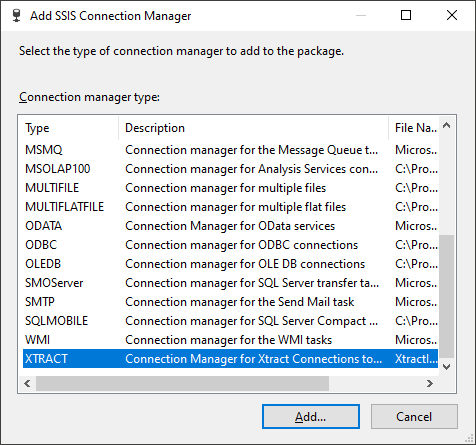
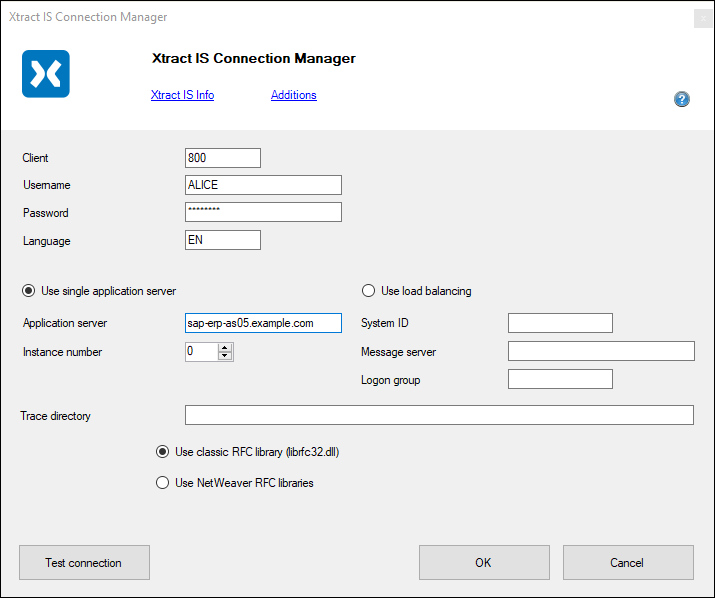
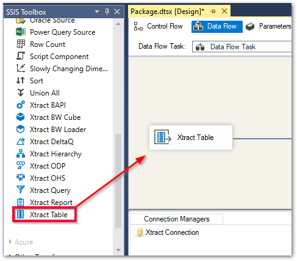
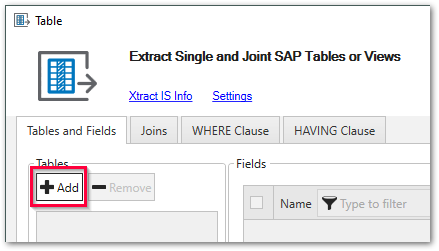

{ .lg .middle width="30px"} This section shows how to install and set up {{ productName }} for the first time.

### Installation

1. [Download](https://theobald-software.com/en/download-trial/) a 30 days trial version of Xtract IS.
2. Make sure to meet all [prerequisites](documentation/setup/installation.md#prerequisites), before installing Xtract IS.
3. Run the Xtract IS executable (XtractISSetup.exe) to install Xtract IS.
For information on system requirements, see [Requirements](documentation/setup/requirements.md).
4. Open Visual Studio and create a Visual Studio Integration Services project.
The Xtract IS {{ components }} are available in the SSIS toolbox of a Data Flow Task.

!!! note
	If the Xtract IS {{ components }} are not displayed in the SSIS toolbox, 
	check if the deployment target version of the SSIS project matches the version of the installed SQL Server Data Tools (SSDT), see [Xtract IS Components in Visual Studio](documentation/setup/installation.md#xtract-is-components-in-visual-studio).

For more information, see [Documentation: Setup](documentation/setup/index.md).

### Connect to SAP

Before connecting to SAP for the first time, set up an SAP dialog user with the necessary [SAP Authorization Objects](documentation/setup-in-sap/sap-authority-objects.md/#general-authorization-objects).

1. Create a new connection manager by right-clicking within the “Solution Explorer” area and selecting **New Connection Manager** in the context menu. 
The window “Add SSIS Connection Manager” opens. 

2. Select the XTRACT Connection Manager from the list of available connection managers and click **[Add...]**. 
The XTRACT Connection Manager is now available in the connection managers area.
3. Double-click the XTRACT Connection Manager. The window "XTRACT Connection Manager" opens. 
{:class="img-responsive" }
4. Enter the system details of your SAP system and enter the SAP username and password of an SAP system or dialogue user.  

	!!! tip
		Input values for the SAP connection can be found in the Properties of the SAP Logon Pad or they can be requested from the SAP Basis team.
	
5. Click **[Test connection]** to validate the connection parameters. 
6. Click **[OK]** to save the XTRACT Connection Manager.

For more information, see [Documentation: SAP Connection](documentation/sap-connection/index.md).

### Add Xtract {{ Components }} to a Data Flow Task

1. Set up a **Data Flow Task** by dragging the dataflow component into the "Control Flow" canvas. 
Double-click the dataflow component to open the dataflow canvas.
2. Make sure that at least one XTRACT Connection Manager is available in the data flow task.
3. Drag & drop an Xtract {{ components }} from the SSIS toolbox into the data flow task:
{:class="img-responsive"}
4. Double-click the Xtract {{ component }}. An XTRACT Connection Manager is automatically assigned and the main window of the {{ component }} opens. 
The majority of the functions of the {{ component }} can be accessed in the main window.

Xtract IS offers the following {{ components }}:

|  {{ Component }}  |   Data Flow Component Type | Description   |  
|----------|-------------|-------------|
| [:component-bapi:  {{ bapi }}](documentation/bapi/index.md) |  Transformation | Execute BAPIs and Function Modules. |
| [:component-bwcube:  {{ bwcube }}](documentation//bwcube/index.md) | Source   | Extract data from SAP BW InfoCubes and BEx Queries. |
| [:component-bwloader:  {{ bwloader }}](documentation/bwloader/index.md) | Destination | Load data into SAP BW systems. |
| [:component-hierarchy:  {{ hierarchy }}](documentation/hierarchy/index.md) | Source   | Extract Hierarchies from an SAP BW / BI system. |
| [:component-deltaq:  {{ deltaq }}](documentation/deltaq/index.md) | Source   | Extract data from DataSources (OLTP) and extractors from ERP and ECC systems. | 
| [:component-odp:  {{ odp }}](documentation/odp/index.md) | Source   | Extract data via the SAP Operational Data Provisioning (ODP) framework. | 
| [:component-ohs:  {{ ohs }}](documentation/ohs/index.md) | Source   | Extract data from InfoSpokes and OHS destinations. | 
| [:component-query:  {{ query }}](documentation/query/index.md) | Source   | Extract data from ERP queries. **Note: BEx queries are covered by the {{ bwcube }} {{ component }}**. | 
| [:component-report: {{ report }}](documentation/report/index.md) | Source   | Extract data from SAP ABAP reports. | 
| [:component-table:  {{ table }}](documentation/table/index.md) | Source   | Extract data from SAP tables and views. |
| [:component-table-cdc:  {{ tableCDC }}](documentation/table-cdc/index.md) | Source   | Extract delta data from SAP tables and views. |

<!---

-->

#### How to Create a Simple SAP Data Extraction for Beginners

Follow the steps below to create a simple SSIS package that extracts customer master data from the SAP table KNA1:

1. Drag & drop an {{ table }} {{ component }} from the SSIS toolbox into the data flow task.
2. Double-click the {{ table }} {{ component }}. 
An XTRACT Connection Manager is automatically assigned and the main window of the {{ component }} opens. 
3. Click **[:material-plus-thick:Add]** to look up an SAP table. The window “Table Lookup” opens. 

4. In the field **Table Name**, enter the name of the table to extract (KNA1) :number-1:. Use wildcards (*) if needed. 

5. Click **[:magnifying-glass:]** :number-2:. Search results are displayed.
6. Select the table KNA1 :number-3: and click **[OK]**. The application returns to the main window of the {{ component }}.
7. Optional: Select the table columns you want to extract. By default all columns are extracted. 
For more information on filter options and advanced settings, see, [Documentation: Define the {{ table }} {{ Component }}](documentation/table/index.md/#define-the-xtract-table-component)
8. Click {{ previewBtn }} to display a live preview of the first 100 records.
9. Click **[OK]** to save the {{ component }}.

You can now add tools to process the data returned by {{ table }} and run the {{ extraction }}.