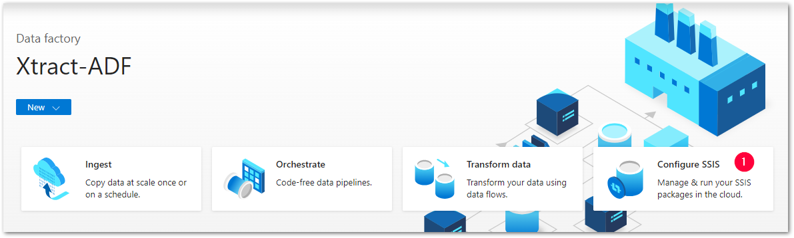
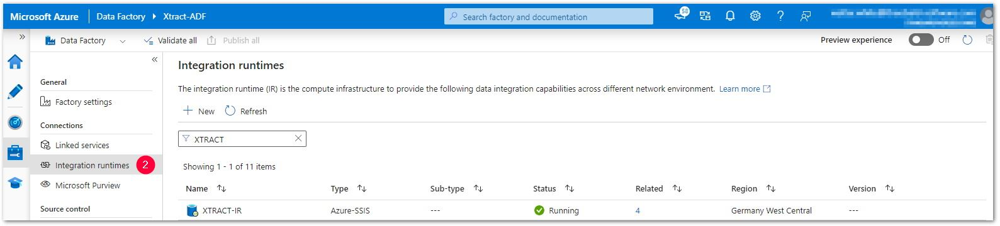

The following article shows how to access the Azure SSIS-IR Cluster ID. 
The Azure SSIS-IR ClusterID is needed to create a customer bound license.  

### Azure SSIS-IR Cluster ID in the Azure Portal

The Azure SSIS-IR Cluster ID is composed of the name of the Data Factory and the name of the Integration Runtime. 
Syntax example: `Microsoft.DataFactory/factories/[data factory name]/integrationruntimes/[integration runtime name]`. 

1. Login to your [Azure Data Factory](https://adf.azure.com/) (ADF) account.
2. Navigate to **[Launch Studio]** and select **Configure SSIS**. Data factory window opens :number-1:.   
{:class="img-responsive" }
3. Select your Data Factory, e.g., *Xtract-ADF* in the depicted example. 
4. In the general menu, select *Integration Runtimes* > *[Name-of-the-IR]*, e.g., *XTRACT-IR* in the depicted example :number-2:. 
The integration runtime window opens and all possible runtimes are displayed, including the type, the status and further information. 
{:class="img-responsive" }
5. The Azure SSIS-IR Cluster ID of the depicted example is: 
`Microsoft.DataFactory/factories/Xtract-ADF/integrationruntimes/XTRACT-IR`

****

#### Related Links
- [SSIS Integration Runtime](https://docs.microsoft.com/en-us/azure/data-factory/concepts-integration-runtime#azure-ssis-integration-runtime)
