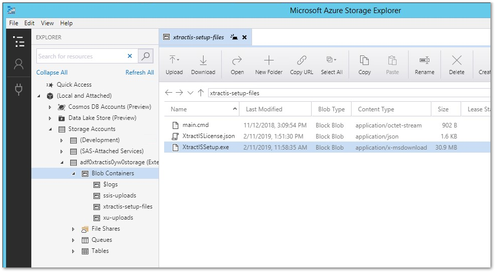
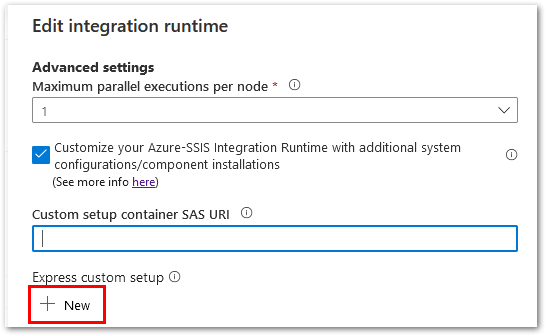
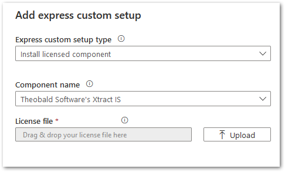

This page shows how to setup Xtract IS for Azure on an Azure SSIS-IR.

### Manual Setup

#### Create an Azure Storage container

Follow the instructions in the [Microsoft Documentation: Standard Custom Setup](https://docs.microsoft.com/en-us/azure/data-factory/how-to-configure-azure-ssis-ir-custom-setup#standard-custom-setup) to set up 3rd party extensibility for Azure-SSIS IR. 
The only the part of the setup of an Azure storage container and the creation of a Shared Access Signature is relevant.

Copy the following files provided in the customer portal into the Azure storage container:
- *XtractISSetup.exe*
- [main.cmd](https://cdn-files.theobald-software.com/download/XtractIS/main.cmd)
- [XtractISLicense.json](../documentation/setup/license.md) (license file provided after purchasing Xtract IS for Azure)

{:class="img-responsive" }

#### Add Azure Storage Container to SSIS-IR

=== "Use Azure Portal UI"

	When provisioning the Azure-SSIS IR via the Azure Portal UI, enter the Azure Storage container's SAS URI in the *Custom setup container SAS URI* field.  
	{:class="img-responsive" }

=== "Use PowerShell"

	When provisioning the Azure-SSIS IR via a [PowerShell](https://docs.microsoft.com/de-de/azure/data-factory/tutorial-deploy-ssis-packages-azure-powershell#create-an-azure-ssis-integration-runtime) populate the parameter `-SetupScriptContainerSasUri` with the Azure Storage container's SAS URI.

Start the Integration Runtime. 
During the startup of the Integration Runtime the *main.cmd* is executed, which triggers an unattended installation of Xtract IS for Azure on the SSIS-IR.

!!! note
    The startup process of the Azure SSIS-IR might take up to 20 minutes.

!!! tip "Recommendation"
	A regular update of the software is crucial for stable performance.
	Check the [changelog](../changelog.md) for updates. 
	A newer version can be installed over the older version.

### Express Custom Setup

As an alternative to the manual setup, the Express Custom Setup can be used for installing Xtract IS for Azure on an Azure SSIS-IR. See [Microsoft documentation](https://docs.microsoft.com/en-us/azure/data-factory/how-to-configure-azure-ssis-ir-custom-setup#express-custom-setup) for more information.

{:class="img-responsive" width="49%" }
{:class="img-responsive" width="50%" }

To use Xtract IS for Azure via the Express Custom Setup, a valid license file is required.
The Express Custom Setup installs a specific version of Xtract IS for Azure. For information on the currently used version, see [Microsoft Documentation: Installing licensed components](https://docs.microsoft.com/en-us/azure/data-factory/how-to-configure-azure-ssis-ir-custom-setup#installing-licensed-components) or contact [Theobald Software](mailto:info@theobald-software.com).

### Azure SSIS Cluster ID

After purchasing Xtract IS for Azure, Theobald Software requires the [Cluster ID of the Azure SSIS-IR](https://docs.microsoft.com/en-us/azure/data-factory/how-to-develop-azure-ssis-ir-licensed-components) to generate a license file. 
For more information, see [Knowledge Base Article: Determining the Azure SSIS-IR Cluster ID](../knowledge-base/determine-the-azure-cluster-ID.md).

### Use a Self-Hosted Integration Runtime (SHIR)

Xtract IS for Azure supports the usage of SHIR for connecting to an on-prem SAP system from Azure SSIS-IR.
For more information, see [Microsoft Documentation: Configure a self-hosted IR as a proxy for an Azure-SSIS IR in Azure Data Factory](https://docs.microsoft.com/en-us/azure/data-factory/self-hosted-integration-runtime-proxy-ssis). 

