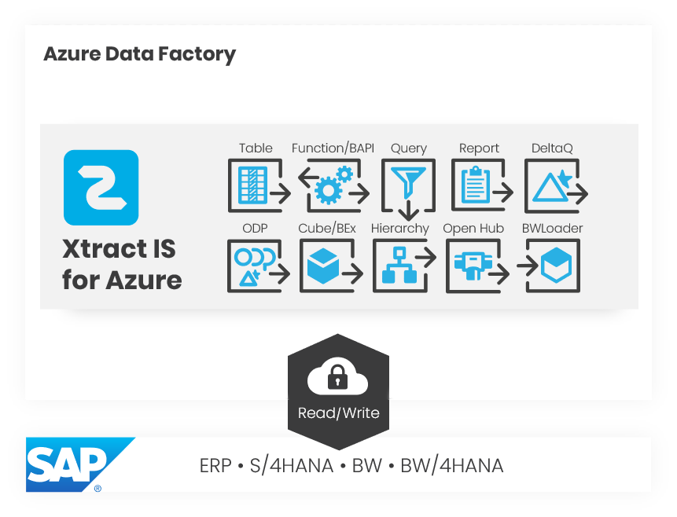

{ .lg .middle width="30px"} This section shows how to set up Xtract IS on an Azure SSIS Integration Runtime.

### About Xtract IS for Azure

Xtract IS for Azure is a plug and play solution that allows running SSIS packages that contain Xtract IS components for connecting to an SAP source and extracting data from SAP on an [Azure-SSIS Integration Runtime (IR), based on Microsoft's Azure Data Factory v2 (ADFv2)](https://docs.microsoft.com/en-us/azure/data-factory/create-azure-ssis-integration-runtime).

{:class="img-responsive"}

### Prerequisites

The SAP system needs to be accessible from the Azure-SSIS IR, e.g., through a VPN tunnel or a self-hosted Integration Runtime.

For information on system requirements, see [Requirements](requirements.md).

### Software Architecture

With Azure-SSIS IR, SSIS packages are developed on a local Xtract IS (on-prem) Visual Studio/SSDT environment.
Instead of deploying the developed packages to an on-prem SSIS server, the packages are deployed to an Azure-SSIS IR to be scheduled and run in the Azure cloud.

Xtract IS for Azure is based on the existing Xtract IS (on-prem) version, see [Xtract IS Documentation](../documentation/introduction.md).

-   :yunio-edit: __Development of SSIS Packages__

    ---

    Installation of Xtract IS on a Visual Studio/SSDT environment, see [Xtract IS Setup](../documentation/setup/installation.md)

-   :yunio-run: __Running SSIS Packages__

    ---

    Installation of Xtract for Azure on an Azure-SSIS IR, see [Xtract IS for Azure Installation](installation.md) 

### {{ Components }}

{{ productName }} offers the following {{ components }} to cover a wide range of data extraction scenarios.

::cards:: cols=3

- title: {{ bapi }}
  icon: ../assets/images/logos/components/Function-BAPI.svg
  content: Execute BAPIs and Function Modules.     type&#58; transformation ECC S4/HANA BW BW/4HANA
  url: ../documentation/bapi/index.md
  
- title: {{ bwcube }}
  icon: ../assets/images/logos/components/Cube-BEx.svg
  content: Extract data from SAP BW InfoCubes and BEx Queries.   type&#58; sourceBW BW/4HANA 
  url: ../documentation/bwcube/index.md
  
- title: {{ bwloader }}
  icon: ../assets/images/logos/components/BWLoader.svg
  content: Load data into SAP BW systems.       type&#58; destination BW BW/4HANA
  url: ../documentation/bwloader/index.md

- title: {{ hierarchy }}
  icon: ../assets/images/logos/components/Hierarchy.svg
  content: Extract Hierarchies from an SAP BW / BI system.       type&#58; source BW BW/4HANA
  url: ../documentation/hierarchy/index.md
  
- title: {{ deltaq }}
  icon: ../assets/images/logos/components/DeltaQ.svg
  content: Extract data from DataSources (OLTP) and extractors from ERP and ECC systems.  type&#58; sourceECC S4/HANA BW BW/4HANA 
  url: ../documentation/deltaq/index.md

- title: {{ odp }}
  icon: ../assets/images/logos/components/ODP.svg
  content: Extract data via the SAP Operational Data Provisioning (ODP) framework.    type&#58; sourceECC S4/HANA BW BW/4HANA
  url: ../documentation/odp/index.md
  
- title: {{ ohs }}
  icon: ../assets/images/logos/components/Open-Hub.svg
  content: Extract data from InfoSpokes and OHS destinations.     type&#58; sourceBW BW/4HANA 
  url: ../documentation/ohs/index.md
  
- title: {{ query }}
  icon: ../assets/images/logos/components/Query.svg
  content: Extract data from ERP queries.  **BEx queries are covered by {{ bwcube }}**.   type&#58; sourceECC S4/HANA  
  url: ../documentation/query/index.md

- title: {{ report }}
  icon: ../assets/images/logos/components/Report.svg
  content: Extract data from SAP ABAP reports.     type&#58; sourceECC S4/HANA 
  url: ../documentation/report/index.md
  
- title: {{ table }}
  icon: ../assets/images/logos/components/Table.svg
  content: Extract data from SAP tables and views.    type&#58; sourceECC S4/HANA BW BW/4HANA 
  url: ../documentation/table/index.md

- title: {{ tableCDC }}
  icon: ../assets/images/logos/components/Table-CDC.svg
  content:  Extract delta data from SAP tables and views.    type&#58; sourceECC S4/HANA BW BW/4HANA
  url: ../documentation/table-cdc/index.md

::/cards::

