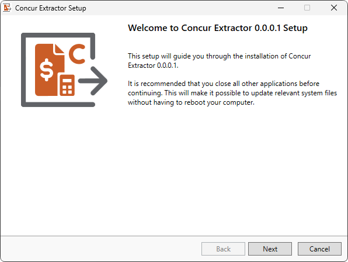
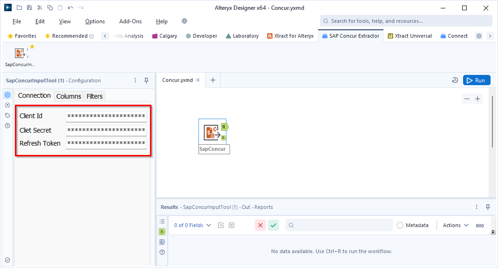
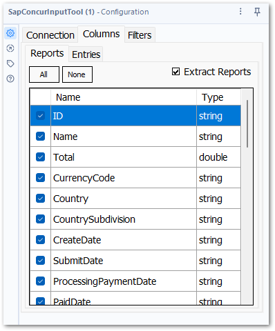
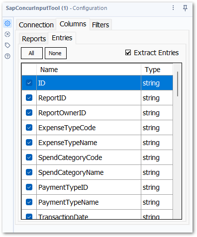
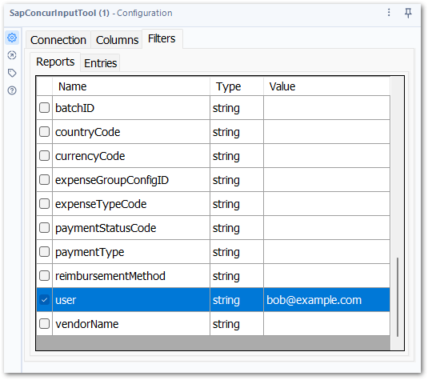

{{ productName }} is a simple SAP Concur connector for Alteryx that enables you to load expense data from SAP Concur directly into your Alteryx workflows. 
SAP Concur is a Travel and Expense Management solution from SAP. 
While SAP Concur offers reporting tools, they have very limited analytical capabilities and do not support combinations of travel expenses with other business data.

Integrating SAP Concur with Alteryx makes it possible to automate processes to simplify travel expense management or analyse expense data to make informed business decisions. 

## Setup

<!-- {{ productName }} provides an Alteryx tool -->

### Get Xtract SAP Concur

Contact the Theobald Software [sales team](mailto:sales@theobald-software.com?subject=Requesting%20Xtract%20SAP%20Concur%20Trial&body=I'd%20like%20to%20receive%20a%20demo%20version%20of%20Xtract%20SAP%20Concur.) to get access to a trial version of {{ productName }}. 

You are guaranteed to get unrestricted support by the Theobald Software support team during the evaluation phase.
In case of questions or doubts, feel free to contact Theobald Software at any time: 

- [:material-form-select:  Contact Forms](https://theobald-software.com/en/contact/)
- [:material-comment-account:  Support Portal](https://support.theobald-software.com)

### Prerequisites

- Register an application with SAP Concur to obtain a Client ID, a Client Secret and an Access Token. 
For more information, see [SAP Concur Documentation: Obtain Your Application clientID and clientSecret](https://developer.concur.com/api-reference/authentication/getting-started.html#obtain-your-application-clientid-and-clientsecret-).
- Administrator permissions are required to install {{ productName }}.

### Installation

The installation file ConcurExtractorSetup.exe is an industry standard setup. 
Execute the ConcurExtractorSetup.exe file and follow the instructions of the setup program.

During the setup you need to specify the installation directory for the Concur Extractor and the installation directory of Alteryx. 
If you have multiple instances of Alteryx installed, choose the instance on which you want to use the Concur Extractor. 

After the installation is completed, the SAP Concur Extractor toolbox is available in your Alteryx Designer.

## How to Use {{ productName }}

Add the {{ concur }} tool to your workflow and fill out the configuration properties. 

### Connection
In the *Connection* tab, enter the Client ID, the Client Secret and the Refresh Token from your SAP Concur system, see [SAP Concur Documentation: Obtain Your Application clientID and clientSecret](https://developer.concur.com/api-reference/authentication/getting-started.html#obtain-your-application-clientid-and-clientsecret-).

### Columns 
In the *Columns* tab, select the data you want to extract.

- __Reports__

	--- 
	
	The *Report* tab lists all columns that are available in SAP Concur expense reports. 
	Select the properties you want to extract. For more information about the report columns, see [SAP API Reference - Report](https://developer.concur.com/api-reference/expense/expense-report/v3.reports.html#report).

	To extract no reports, deactivate the checkbox **Extract Reports**. 

	

- __Entries__

	--- 
	
	The *Entries* tab lists all expense entries that are available in SAP Concur. 
	Select the properties you want to extract. For more information about entries, see [SAP API Reference - Entries](https://developer.concur.com/api-reference/expense/expense-report/v3.reports.html#report).

	To extract no entries, deactivate the checkbox **Extract Entries**. 
	
	

### Filters
In the *Filters* tab, apply filters to define which reports and/or entries are extracted. 
Select a filter property and enter a value for the filter in the *Value* column. 

- __Reports__

	--- 
	
	For information about SAP Concur's Report filters, refer to the [SAP API Reference – Report Parameters](https://developer.concur.com/api-reference/expense/expense-report/v3.reports.html#parameters). 

- __Entries__

	--- 
	
	For information about SAP Concur's Entry filters, refer to the [SAP API Reference – Entries Parameters](https://developer.concur.com/api-reference/expense/expense-report/expense-entry.html#parameters).

Example:  
To extract only reports from a certain user, open the *Reports* tab, select the property *user* and enter a user name:

 
## Run Data Extractions

Run the workflow to extract the data. The output of the {{ concur }} {{ component }} has 2 anchors:
-	Reports are available in the ‘R’ output of the {{ concur }} {{ component }}.
-	Entries are available in the ‘E’ output of the {{ concur }} {{ component }}.

Contact the Theobald Software [sales team](mailto:sales@theobald-software.com) for demo sessions and sample workflows.

