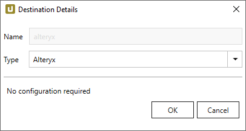
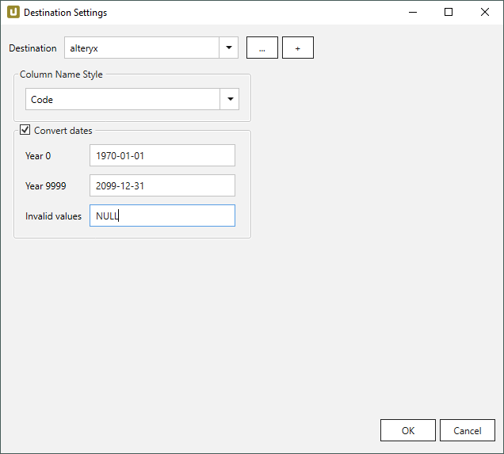
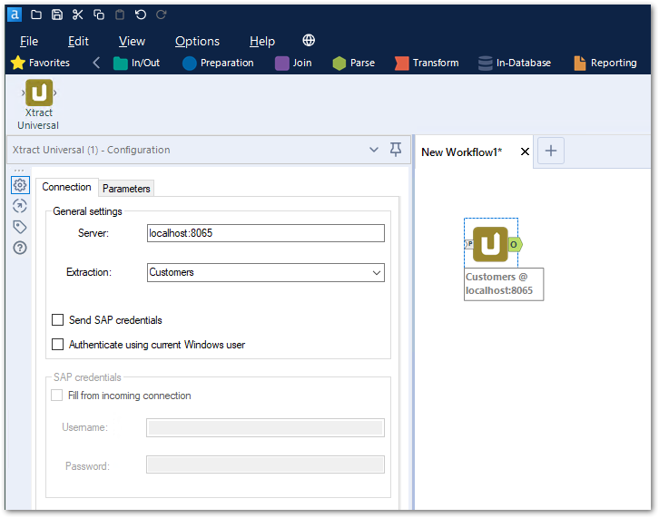
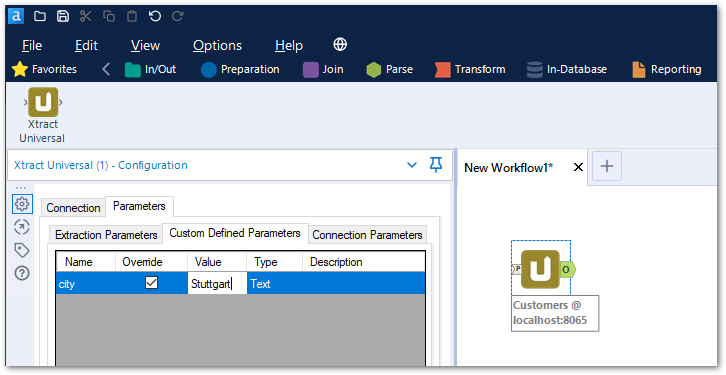
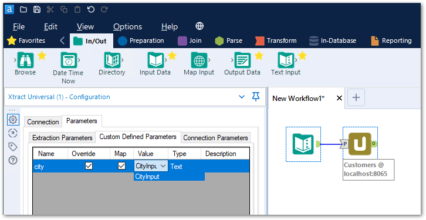
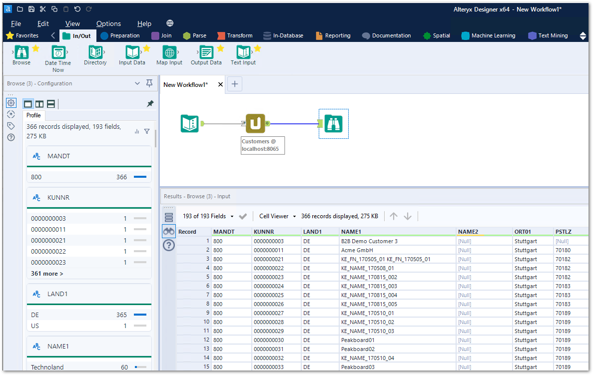

This page shows how to set up and use the {{ page.meta.title }} destination. 
The {{ page.meta.title }} destination enables users to load SAP data from Alteryx.

## Requirements

To use the {{ page.meta.title }} destination, the Xtract Universal Alteryx plugin for the Alteryx Designer must be installed. 

=== "Installation using the Xtract Universal Setup"

	The Xtract Universal setup installs the Xtract Universal Alteryx plugin if there is a valid Alteryx installation on the current system.
	If you install Alteryx after installing Xtract Universal, run the Xtract Universal setup again.
	The Xtract Universal setup creates the following entries and extensions in the installation directory of that Alteryx installation:
	- `Alteryx\Settings\AdditionalPlugins\XtractUniversal.ini`
	- `Alteryx\bin\RuntimeData\icons\categories\XtractUniversal.png`
	- `Alteryx\bin\RuntimeData\DefaultSettings.xml`

	!!! note
		Run the Xtract Universal setup on every machine that needs the Xtract Universal Alteryx plugin. 
		If there is more than one Alteryx installation on your system, the Xtract Universal setup only detects one installation. 
		In this case, a manual installation is required.

=== "Manual installation (for a separate Alteryx system)"

	1. Copy the Alteryx folder `{{ installationDir }}\alteryx` from your local Xtract Universal installation directory to any directory on the server you want to install the plug-in. 
	2. Run the `{{ installationDir }}\alteryx\AlteryxPluginSetup.exe` from a Windows command shell. 

	!!! note
		The following commands are supported followed by a parameter pointing to the Alteryx installation directory: 
		- */i* (for install) e.g., `{{ installationDir }}\alteryx>AlteryxPluginSetup /i "C:\Users\mywindowsuser\AppData\Local\Alteryx"`
		- */u* (for uninstall)

When encountering issues during or after the installation of the plugin (e.g., the plugin is not showing in Alteryx), send the setup.log file located in `{{ installationDir }}\alteryx\setup.log` to the [Theobald Support](https://support.theobald-software.com).


To use the {{ page.meta.title }} destination, no further settings are necessary.

{:class="img-responsive"}



{:class="img-responsive"}





## Use Xtract Universal in Alteryx

To use Xtract Universal extractions in the Alteryx Designer, add the the Xtract Universal tool to your Alteryx workflow.
The specify the [*Connection*](#connection) settings and the [*Parameters*](#parameters) settings of the Xtract Universal tool.

{:class="img-responsive"}

### Connection

Connect to the Xtract Universal Server and select the extraction you want to to execute in Alteryx.

!!! note
	Make sure the Xtract Universal server is running.
	
#### Server
Enter the name, IP or domain and port to access the server within the network, see [Connect to an Xtract Universal Server](../designer.md/#connect-the-designer-to-a-server).
Format: `[Server]:[Port]`.

#### Extraction
Select an extraction from the drop-down menu.  
Only extractions with that have the Alteryx destination [assigned](#assign-the-alteryx-destination-to-an-extraction) to them are displayed. 

#### Send SAP credentials
Activate the checkbox **Send SAP credentials**, if the option *Require SAP Credentials to be explicitly supplied for execution* is active in the [SAP source](../sap-connection/settings.md/#authentication) settings in Xtract Universal. 
The setting *Send SAP credentials* can be useful in self service scenarios. 
When each extraction needs to be executed using an individual user's SAP credentials instead of the globally defined credentials.

#### Authenticate using current Windows user
Activate the checkbox **Authenticate using current Windows user** to use the Windows user that runs Alteryx for authentication.

### Parameters

In the tab *Parameters* tab, the Xtract Universal tool loads available [parameters](../parameters/index.md) for the specified extraction. 
The depicted examples show how to override custom parameters created in Xtract Universal.

=== "Override Custom Parameters with Static Values"

	In the following example, an extraction of SAP customers contains the [custom parameter](../parameters/extraction-parameters.md/#custom) *city*. 
	The parameter is available in the tab *Custom Defined Parameters* and can be overwritten with a static value.
	To override the parameter *city*, activate the checkbox **Override** and enter a new value, e.g., "Stuttgart".

	{:class="img-responsive"}

=== "Override Custom Parameters with Dynamic Values"
	The Xtract Universal tool can receive inputs, e.g., via the *Input Data* tool.
	The data input can be used to dynamically override parameters in Xtract Universal.  
	In the following example, an extraction of SAP customers contains the [custom parameter](../parameters/extraction-parameters.md/#custom) *city* 
	The parameter is available in the tab *Custom Defined Parameters* and can be overwritten with a dynamic input value.
	
	To override the parameter *city*, activate the checkbox **Override** and the checkbox **Map**. 
	Select an item out of the drop-down list in the field **value**.

	{:class="img-responsive"}

!!! tip
	If the connection to the specified Xtract Universal server is not established and no errors are shown, the Xtract Unversal tool offers a tooltip in the following format: 
	`[Extraction] @ [Server]`.

{:class="img-responsive"}

