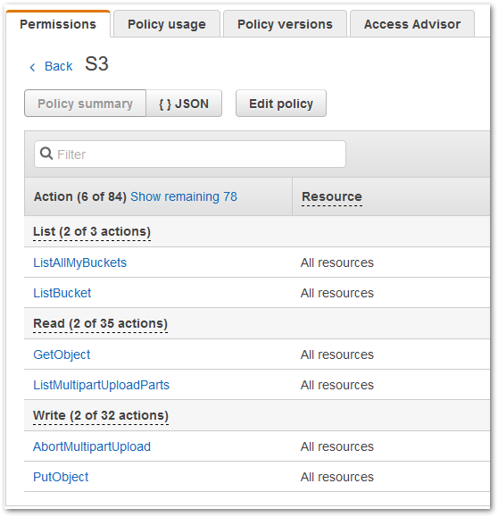
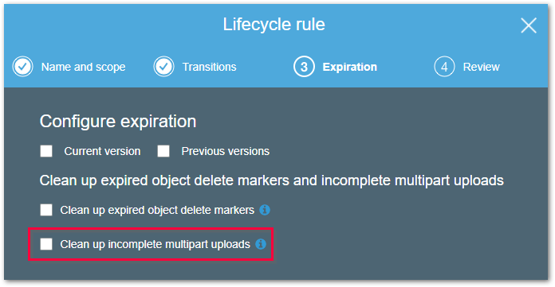
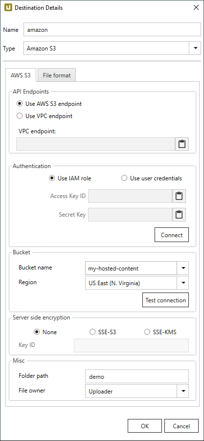
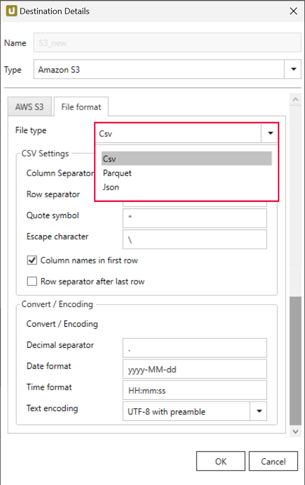
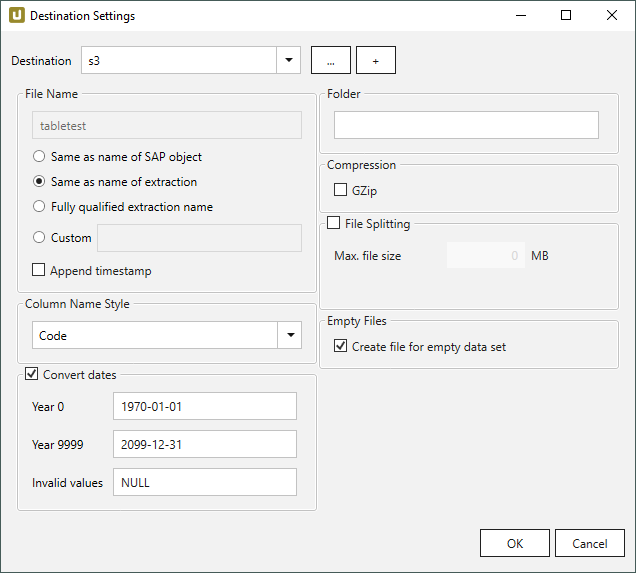

This page shows how to set up and use the {{ page.meta.title }} destination. 
The {{ page.meta.title }} destination loads data to the [Amazon S3](https://aws.amazon.com/s3/) cloud storage. 
For more information on Amazon S3, see [AWS Documentation: Getting Started with Amazon S3](https://aws.amazon.com/s3/getting-started/).

!!! tip
	You can install Xtract Universal in an Amazon Elastic Compute (EC2) instance. 
	Check [Amazon EC2: Getting Started with Amazon EC2](https://aws.amazon.com/ec2/getting-started/) to deploy an instance where you can install Xtract Universal in your AWS Account. 
	Make sure the instance is deployed in the same region as your SAP solution to reduce latency and optimize performance.

## Requirements

- An Amazon Web Services (AWS) Account.
- [Access Keys](https://docs.aws.amazon.com/IAM/latest/UserGuide/id_credentials_access-keys.html) (consisting of "access key ID" and "secret access key") of your AWS user or an IAM role attached to the EC2 instance that runs Xtract Universal, see [AWS Documentation: Using an IAM role to grant permissions to applications running on Amazon EC2 instances](https://docs.aws.amazon.com/IAM/latest/UserGuide/id_roles_use_switch-role-ec2.html).
For more information on the IAM role, see [AWS Documentation: Security best practices in IAM](https://docs.aws.amazon.com/IAM/latest/UserGuide/best-practices.html).
- An S3 bucket, in which you can upload data.
- Sufficient permissions for list, read and write activities on S3. You must grant these rights in the user policy, but you can limit them to certain buckets. 
In the following example, the set permissions have been tested in a test environment:  
{:class="img-responsive"}

!!! note
	Xtract Universal uses so called [Multipart](https://docs.aws.amazon.com/AmazonS3/latest/dev/mpuoverview.html) upload for uploading data to S3. 
	Data extracted from SAP is uploaded to S3 not as one big chunk of data but in smaller parts. 
	These parts are buffered on the S3 side. If the extraction is successful, those parts are assembled by S3 into one file. 
	While the extraction is still running this file is not visible on S3.

!!! tip "Recommendation"
	It's recommended you enable S3 versioning or perform data backups regularly, see [Amazon AWS: Getting Started - Backup & Restore with AWS](https://aws.amazon.com/backup-restore/getting-started/).

### Extraction Failed
In case the extraction fails, the already uploaded parts are deleted from S3. 
In case of an "uncontrolled" extraction failure, for example due to network issues, Xtract Universal will not be able to delete those uploaded parts from S3.

Therefore it is recommended to change the settings on S3 in a way that will trigger the automatic deletion of unused multiparts, e.g. after a day. 
You can find this setting by selecting a bucket and opening the "Management" tab. 
Select "Lifecycle" and "Add lifecycle rule" and create a rule for deleting unused multiparts.

{:class="img-responsive"}



{:class="img-responsive"}

### API Endpoints

The endpoint defines which IP address is used to connect to an Amazon S3 instance. 

#### Use AWS S3 Endpoint
When this option is active, {{ productName }} connects to Amazon S3 using a URL that consists of the bucket name and the Amazon S3 default URL:
`https://[BucketName].s3.amazonaws.com/`

#### Use VPC Endpoint
When this option is active, {{ productName }} connects to Amazon S3 using a [Virtual Private Cloud (VPC) endpoint](https://docs.aws.amazon.com/AmazonS3/latest/userguide/privatelink-interface-endpoints.html).
This option requires {{ productName }} to run on an AWS VPC instance.

Enter the VPC endpoint in the field **VPC endpoint**, e.g., `http://bucket.vpce-0123456789abcdefg-hijklmno.s3.us-east-1.vpce.amazonaws.com`.

### Authenthication

The authentication method defines how Xtract Universal authenticates itself against Amazon AWS.

#### Use IAM role

When this option is active, the credentials and permissions of the IAM role assigned to the [EC2 instance](https://docs.aws.amazon.com/IAM/latest/UserGuide/id_roles_use_switch-role-ec2.html), on which Xtract Universal is running are used for authentication. 
For more information on the IAM role, see [AWS Documentation: Security best practices in IAM](https://docs.aws.amazon.com/IAM/latest/UserGuide/best-practices.html).

#### Use user credentials
Preferable authentication method towards Amazon AWS. 
Determine the values for the [Access Keys (access key ID and secret key)](https://docs.aws.amazon.com/IAM/latest/UserGuide/id_credentials_access-keys.html) via AWS Identity and Access Management ([IAM](https://console.aws.amazon.com/iam/home#/home)).

#### Connect
After entering *Access key ID* and *Secret key*, click **[Connect]** to connect to AWS. After successfully connecting, select bucket name and region.

### Bucket

#### Bucket name and Region
Select a bucket and a region of the bucket's location. The SAP data is extracted into the selected bucket.

!!! note
	The drop-down menus list **all** available buckets and regions, make sure to select the correct combination of bucket & region. Validate the connectivity to the selected bucket by clicking **[Test Connection)**.

#### Test Connection
Validates the right combination of bucket and region. Insures bucket's accessibility from Xtract Universal using the entered access keys.

### Server-side encryption

Choose how to encrypt data after uploading them to S3. 

!!! note
	The setting "Server-side encryption" does not relate to transport encryption between Xtract Universal and S3. 
	By default, the channel for sending data to S3 is always encrypted. 

#### None
Server-sided encryption of data not active. 
For more information, see [AWS Documentation: Protecting data with server-side encryption](https://docs.aws.amazon.com/AmazonS3/latest/dev/serv-side-encryption.html).

#### SSE-S3
Encrypts data using the by default available S3 user account encryption key, see [S3 Managed Encryption Keys](https://docs.aws.amazon.com/AmazonS3/latest/dev/UsingServerSideEncryption.html).

#### SSE-KMS / Key ID
Encryption using a custom encryption key created on AWS, see [AWS Key Management Services](https://docs.aws.amazon.com/AmazonS3/latest/dev/UsingKMSEncryption.html). 
The key can be created on the [AWS website](https://console.aws.amazon.com/iam/home#/encryptionKeys/.)

### Misc

All settings in *Misc* are optional.

#### Folder Path
Enter the directory to upload files into, see [**Destination Settings > Folder name**](#folder-name).

#### File Owner
If you upload files as an AWS user of an Account A to an Account B, you can select the option "Bucket Owner".
Without a declared owner, uploaded files cannot be opened directly.

### File Format

Select the required file format. You can choose between *CSV*, *JSON* and *Parquet*.

{:class="img-responsive" }

#### CVS Settings

The settings for file type *CSV* correspond to the settings of the *Flat File CSV* destination:

- [CSV Settings](csv-flat-file.md/#csv-settings)
- [Convert / Encoding](csv-flat-file.md/#convert-encoding)

#### Parquet Settings

The settings for file type *Parquet* correspond to the settings of the *Flat File Parquet* destination:

- [Compatibility Mode](parquet.md/#compatibility-mode)

## Connection Retry



For more general information about retry strategies in an AWS S3 environment go to the official [AWS Help](https://docs.aws.amazon.com/general/latest/gr/api-retries.html).



{:class="img-responsive"}



!!! note 
	If the name of an object does not begin with a letter, it will be prefixed with an ‘x’, e.g. an object by the name `_namespace_tabname.csv` will be renamed `x_namespace_tabname.csv` when uploaded to the destination.
	This is to ensure that all uploaded objects are compatible with Azure Data Factory, Hadoop and Spark, which require object names to begin with a letter or give special meaning to objects whose names start with certain non-alphabetic characters. 







### Folder name

To write extraction data to a location within a specific folder in an Amazon S3 bucket, enter a folder name without slashes.
Subfolders are supported and can be defined using the following syntax:  
`[folder]/[subfolder_1]/[subfolder_2]/…`







****

## Related Links
- [Knowledge Base Article: Run Xtract Universal in a VM on AWS EC2](../../knowledge-base/run-xu-in-aws.md)
- [Amazon AWS: Getting Started - Backup & Restore with AWS](https://aws.amazon.com/backup-restore/getting-started/)
- [Amazon S3: Getting Started with Amazon S3](https://aws.amazon.com/s3/getting-started/)
- [Amazon EC2: Getting Started with Amazon EC2](https://aws.amazon.com/ec2/getting-started/)
- [Amazon Documentation: Amazon EC2 security groups for Linux instances](https://docs.aws.amazon.com/AWSEC2/latest/UserGuide/ec2-security-groups.html)
- [Amazon Documentation: Security best practices in IAM](https://docs.aws.amazon.com/IAM/latest/UserGuide/best-practices.html)
- [Amazon Documentation: Overview of managing access](https://docs.aws.amazon.com/AmazonS3/latest/userguide/access-control-overview.html)
