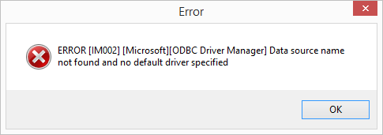
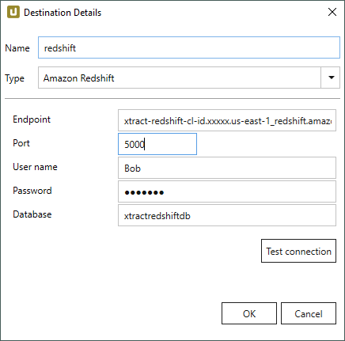
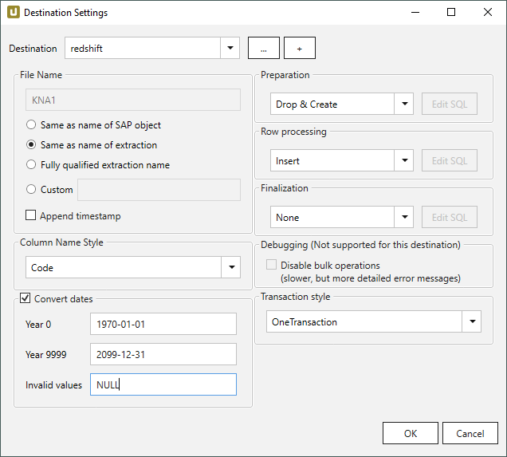

This page shows how to set up and use the {{ page.meta.title }} destination. 
The {{ page.meta.title }} destination loads data to the [Amazon Redshift database](https://aws.amazon.com/redshift/).
For more information on Amazon Redshift, see [Getting Started with Amazon Redshift](https://docs.aws.amazon.com/redshift/latest/gsg/getting-started.html).

## Requirements

- Run an instance with valid credentials.
- Your client computer has to be authorized to access the cluster.
- For establishing a connection to Amazon Redshift, a suitable database driver is required.
- Download and install the x64 Redshift ODBC driver version 2.x from the official [website](https://docs.aws.amazon.com/redshift/latest/mgmt/odbc20-install-config-win.html).
If the driver is missing, the connection test fails. 
{:class="img-responsive"}

!!! note
	Prior to Xtract Universal version 2.102.0 you have to install the Mono.Security.dll assembly instead of above mentioned ODBC driver.
	You can download the complete Mono package from [the official project site](http://download.mono-project.com/archive/2.0/download/). 
	Make sure to install the Mono.Security assembly, compiled on .NET 2.0. by copying the Mono.Security.dll file into your Xtract Universal installation directory.



{:class="img-responsive"}

#### Endpoint
Enter the server address of the Amazon Redshift System.
(Found in the Redshift Management Console)

#### Port
Enter the port number for the connection.

#### Username / Password
Enter the username and password of the database user.

#### Database
Enter the name of the database you want to write to.

#### Test Connection
Checks the database connection.



{:class="img-responsive"}











 

 

 