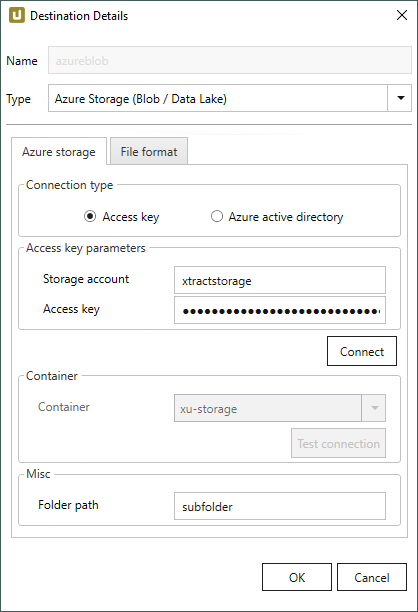
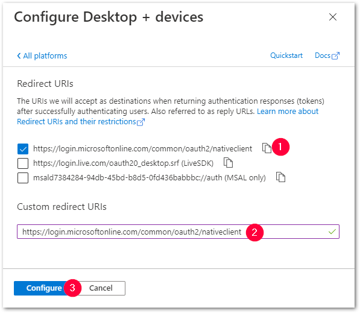
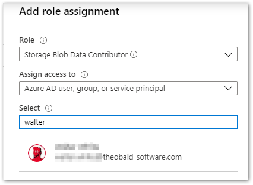
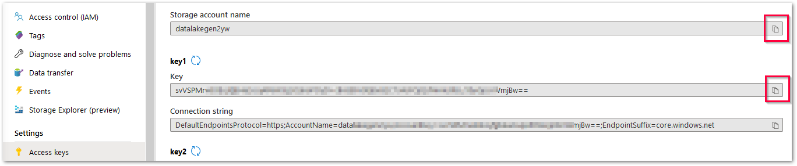
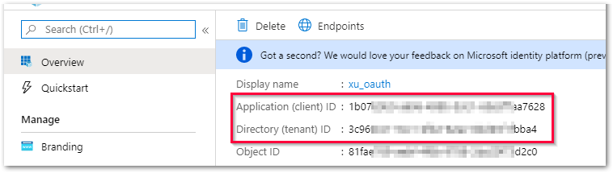
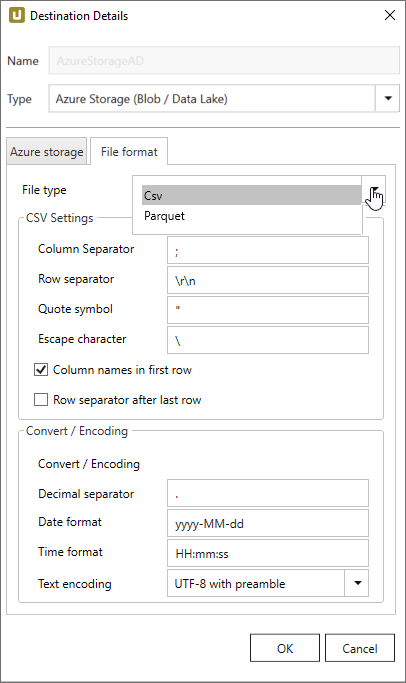
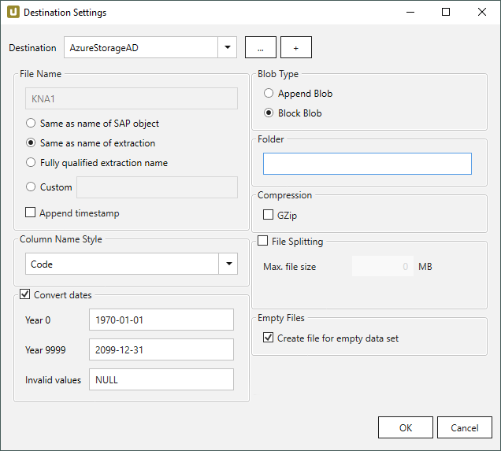

This page shows how to set up and use the {{ page.meta.title }} destination. 
The {{ page.meta.title }} destination loads data to a cloud based Azure Storage. 

## Requirements

The Azure Storage (Blob / Data Lake) destination supports the following Azure storage account types:

- General-purpose V2 (including Azure Data Lake Storage Gen2)
- General-purpose V1
- BlockBlobStorage
- BlobStorage
 
To use the Azure Storage (Blob / Data Lake) destination you need one of the above Azure storage accounts. 
For more information, see [Microsoft Documentation: Azure storage account overview](https://docs.microsoft.com/en-us/azure/storage/common/storage-account-overview).



{:class="img-responsive"}

### Connection Type

The subsection *Connection Type* offers the following methods for authenticating and authorizing access to Azure storage:

- Access Key
- Entra ID
- Shared Access Signature (SAS)

For information on advantages and disadvantages of the different authentication methods, see [Microsoft Documentation: Choosing the right authentication method](https://learn.microsoft.com/en-us/azure/storage/common/storage-explorer-security).

-   :octicons-key-16: __Access Key__

    ---

    This method of authentication authorizes access to the complete storage account. 
	For more information, see [Microsoft Documentation: Manage storage account access keys](https://docs.microsoft.com/en-us/azure/storage/common/storage-account-keys-manage). 

-   :octicons-id-badge-16: __Entra ID__

    ---

    This method of authentication uses OAuth 2.0 and [Microsoft Entra ID](https://learn.microsoft.com/en-us/rest/api/storageservices/authorize-with-azure-active-directory) (formerly Azure Active Directory), see [Authentication via Microsoft Entra ID for Azure Storage](../../knowledge-base/authentication-via-entra-id-with-azure-storage.md). 
	Access rights can be granted on storage account or container level.

-   :octicons-person-16: __Shared Access Signature (Account)__

    ---

    This method of authentication uses Shared Access Signatures (SAS) to access the complete storage account.
	For more information, see [Microsoft Documentation: Grant limited access to Azure Storage resources using shared access signatures](https://learn.microsoft.com/en-us/azure/storage/common/storage-sas-overview?toc=%2Fazure%2Fstorage%2Fblobs%2Ftoc.json&bc=%2Fazure%2Fstorage%2Fblobs%2Fbreadcrumb%2Ftoc.json).

-   :octicons-package-16: __Shared Access Signature (Container)__

    ---

    This method of authentication uses Shared Access Signatures (SAS) to access a specific storage container.
	For more information, see [Microsoft Documentation: Create SAS tokens for storage containers](https://learn.microsoft.com/en-us/azure/ai-services/document-intelligence/create-sas-tokens?view=doc-intel-4.0.0#use-the-azure-portal)

	
!!! note
	The following permissions are required when using Shared Access Signature (SAS):
	

	- Add
	- Create
	- Write
	- Delete
	- List

	

<!---
Removed according to Bharat

#### Prerequisites for Authentication via Microsoft Entra ID

Authentication via Microsoft Entra ID requires an Azure AD tenant. How to set up an Azure AD tenant is described in the [Microsoft documentation](https://docs.microsoft.com/en-us/azure/active-directory/develop/quickstart-create-new-tenant).  
Before using authentication via Microsoft Entra ID, perform the following steps in the Azure Portal:

1. In the Azure Portal, open the *Microsoft Entra ID* service.
2. Register an app with your Azure AD tenant. To do this, follow the steps as described in the [Microsoft documentation](https://docs.microsoft.com/en-us/azure/storage/common/storage-auth-aad-app#register-your-application-with-an-azure-ad-tenant). 
Register the app as *Public client/native (mobile & desktop)*.
3. Add *API permissions* to the registered app to grant access to the Azure Storage web API. The following permissions are required:
	
	- *Azure Storage - Delegated permissions - user impersonation*
	- *Microsoft Graph - User.Read*. 
		
	Follow the steps described in the [Microsoft documentation](https://docs.microsoft.com/en-us/azure/storage/common/storage-auth-aad-app#grant-your-registered-app-permissions-to-azure-storage).
4. Assign [https://login.microsoftonline.com/common/oauth2/nativeclient](https://login.microsoftonline.com/common/oauth2/nativeclient) as the standard Redirect URI :number-1:. 
This can be done in the Azure AD app registration via **Manage > Authentication > Add a platform > Mobile and desktop applications**. 
Copy and paste the URL into in the *Custom redirect URI* field :number-2: and click **[Configure]** :number-3:. 
In the *Authentication* screen, click **[Save]** to confirm your input.
{:class="img-responsive"}
5. In the Azure Portal, open your Azure Storage account.
6. Assign access rights to the Azure Storage as described in the [Microsoft documentation](https://docs.microsoft.com/en-us/azure/storage/common/storage-auth-aad-rbac-portal#assign-rbac-roles-using-the-azure-portal). 
The required RBAC role is *Storage Blob Data Contributor*. 
{:class="img-responsive"}
-->
	
### Access Key Parameters / SAS Parameters

The input fields in the subsection *Access key parameters* / *SAS parameters* vary depending on the selected [connection type](#connection-type).

=== ":octicons-key-16: Access Key"

	#### Storage account
	Enter your storage account name. Do not enter the full URL. 
	
	#### Access key
	Enter the access key of the Azure Storage account. 
	
	!!! tip
		You can copy the storage account name and access key from the [Azure Portal](https://docs.microsoft.com/en-us/azure/storage/common/storage-account-keys-manage?toc=/azure/storage/blobs/toc.json#view-access-keys-and-connection-string). 
		{:class="img-responsive"}

	#### Connect
	Click **[Connect]** to establish a connection to the storage account. 
	If the connection is successful, a "Connection successful" info window opens.

=== ":octicons-id-badge-16: Entra ID"
		
	#### Storage account
	Enter your storage account name. 
	
	#### Tenant ID
	Enter the ID of the Azure AD tenant. 
	
	#### Client ID
	Enter the ID of the registered app. 

	!!! tip
		You can copy the tenant ID and client ID in the [Azure portal](https://portal.azure.com/). 
		{:class="img-responsive"}
	
	#### Connect
	
	Click **[Connect]** to establish a connection to the storage account. 
	A browser window pops up, where you have to sign in using your Azure AD credentials.
	The "Permissions requested" window lists the requested permissions, see [Knowledge Base Article: Authentication via Microsoft Entra ID](../../knowledge-base/authentication-via-entra-id-with-azure-storage.md). 
	Click **[Accept]**. If the connection is successful, a "Connection successful" info window opens.  

	{:class="img-responsive"}

=== ":octicons-person-16: SAS (Account)"

	#### Storage account
	Enter your storage account name. Do not enter the full URL.
	
	#### SAS token
	Enter the SAS token at the Azure Storage container level. 
	
	!!! tip
		You can copy the SAS token from the Azure portal (**Storage accounts > [account_name] > Security + networking > Shared access signature**).
		
	#### Connect
	Click **[Connect]** to establish a connection to the storage account. 
	If the connection is successful, you can select an existing container from the drop down list **Container**.

	
=== ":octicons-package-16: SAS (Container)"

	#### Storage account
	Enter your storage account name. Do not enter the full URL.
	
	#### Container
	Enter the name of an existing Azure storage container.
	
	#### SAS token
	Enter the SAS token generated at the Azure Storage container level. 

	!!! tip
		You can copy the SAS token from the Azure portal (**Storage accounts > [account_name] > Data storage > Containers > [account_name] > Generate SAS**).
		
	#### Connect
	Click **[Connect]** to establish a connection to the storage account. 

	
### Container 
This subsection is activated after a connection to the storage account was successfully established. 

- When using Access Key authentication, select a Blob container from the drop-down list.
- When using Entry ID authentication, enter the name of the Blob container manually.
- When using Shared Access Signature (Account) authentication, select a Blob container from the drop-down list.

#### Test connection
Click **[Test Connection]** to check if the storage container can be accessed.  
If the connection is successful, a "Connection to container <*name of container*> successful" info window opens.  

The *Azure Storage (Blob / Data Lake)* destination can now be used.

### Misc 

!!! note 
	The settings in *Misc* can only be used in combination with a Blob container.  

#### Folder path
Option to create a folder structure within the container for saving files.
Script expressions are supported, see [**Destination Settings > Folder**](#folder).

For creating a single folder, enter a folder name without slashes: `[folder]`  
Subfolders are supported and can be defined using the following syntax: `[folder]/[subfolder_1]/[subfolder_2]/[..]`

### File Format

Select the required file format. You can choose between *CSV*, *JSON* and *Parquet*.

{:class="img-responsive"}

#### CVS Settings

The settings for file type *CSV* correspond to the settings of the *Flat File CSV* destination:

- [CSV Settings](csv-flat-file.md/#csv-settings)
- [Convert / Encoding](csv-flat-file.md/#convert-encoding)

#### JSON Settings

To use the JSON file format, no further settings are necessary.

#### Parquet Settings

The settings for file type *Parquet* correspond to the settings of the *Flat File Parquet* destination:

- [Compatibility Mode](parquet.md/#compatibility-mode)

## Connection Retry and Rollback



The retry function is implemented according to [Microsoft Guidelines](https://docs.microsoft.com/en-us/azure/architecture/best-practices/retry-service-specific#retry-strategies).
The retry logic is based on WebExceptionStatus. 

Rollback covers scenarios where extractions do not fail due to connection failures to Azure but due to an error when connecting to SAP.
In those cases Xtract Universal tries to remove any files from Azure storage that were created in the course of the extraction.

<!---- using an exponential backoff, meaning 8 retries with an increasing waiting time between the requests: 1s, 2s, 4s, 8s, 16s, etc.
See also [Microsoft documentation](https://docs.microsoft.com/en-us/azure/architecture/best-practices/retry-service-specific#general-rest-and-retry-guidelines). --->



{:class="img-responsive"}



!!! note
	If the name of an object does not begin with a letter, it will be prefixed with an ‘x’, e.g. an object by the name `_namespace_tabname.csv` will be renamed `x_namespace_tabname.csv` when uploaded to the destination.
	This is to ensure that all uploaded objects are compatible with Azure Data Factory, Hadoop and Spark, which require object names to begin with a letter or give special meaning to objects whose names start with certain non-alphabetic characters. 







### Blob Type

#### Append Blob
Creates an [Append Blob](https://docs.microsoft.com/en-us/rest/api/storageservices/understanding-block-blobs--append-blobs--and-page-blobs#about-append-blobs).

#### Block Blob
Creates a [Block Blob](https://docs.microsoft.com/en-us/rest/api/storageservices/understanding-block-blobs--append-blobs--and-page-blobs#about-block-blobs).

!!! note
	For both file types an MD5 hash is created upon upload to Azure storage.

### Folder
Option to create a folder structure within the container for saving files, see [**Destination Details > Folder Path**](#folder-path).  

For creating a single folder, enter a folder name without slashes: `[folder]`  
Subfolders are supported and can be defined using the following syntax: `[folder]/[subfolder_1]/[subfolder_2]/[..]`









<!--
### Common Data Model (preview)
	
#### Entity name
Enter a name for the generated .cdm.json file.

#### Manifest
Enter the name of your manifest file.

-->

## Tutorial

The following YouTube tutorial shows how to set up Xtract Universal with the Azure Storage destination:

	<iframe width="560" height="315" src="https://www.youtube.com/embed/Q9mF-vsFxnQ?si=ou7o3dVY-1_t11qa" title="YouTube video player" frameborder="0" allow="accelerometer; autoplay; clipboard-write; encrypted-media; gyroscope; picture-in-picture; web-share" referrerpolicy="strict-origin-when-cross-origin" allowfullscreen></iframe>

****

## Related Links
- [Knowledge Base Article: Authentication via Microsoft Entra ID for Azure Storage](../../knowledge-base/authentication-via-entra-id-with-azure-storage.md)
- [Integration via Azure Data Factory](../execute-and-automate/call-via-etl.md#integration-via-azure-data-factory)