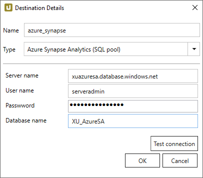
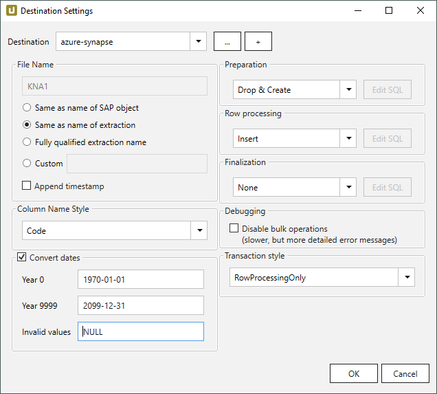

This page shows how to set up and use the {{ page.meta.title }} destination. 
The {{ page.meta.title }} destination loads data to an Azure Synapse SQL Pool.

## Requirements

To use the Azure Synapse Analytics SQL Pool destination, you need:
- An [Azure Analytics SQL database](https://docs.microsoft.com/en-us/azure/azure-sql/database/single-database-create-quickstart?tabs=azure-portal).
- [Azure portal firewall rules](https://docs.microsoft.com/en-us/azure/azure-sql/database/secure-database-tutorial#create-firewall-rules) that grant access for the IP addresses Xtract Universal is running on.



{:class="img-responsive"}

#### Server Name
Enter the name of the Azure Servers in the following format: 
`[servername].database.windows.net`

#### User Name
Enter the user name.

#### Password
Enter the password.

#### Database Name
Enter the name of the Azure Synapse SQl Pool.

#### Test Connection
Check the database connection.



{:class="img-responsive"}













 

 



***

## Related Links
- [Microsoft Documentation: Microsoft Azure Synapse Analytics](https://docs.microsoft.com/en-us/azure/synapse-analytics/)
- [Integration via Azure Data Factory](../execute-and-automate/call-via-etl.md#integration-via-azure-data-factory)