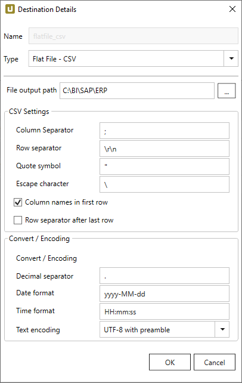
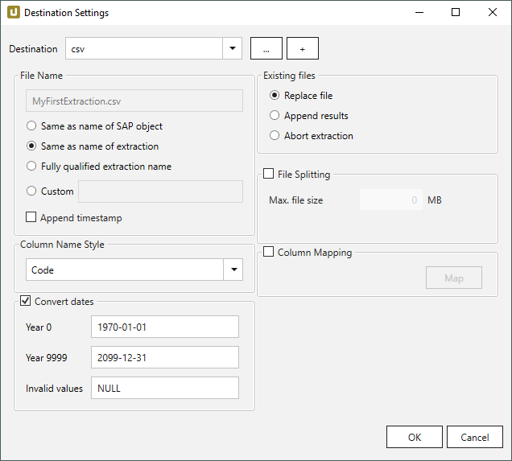

This page shows how to set up and use the {{ page.meta.title }} destination. 
The {{ page.meta.title }} destination is a CSV (comma-separated values) flat file that can be written to a local directory or a network drive.  



{:class="img-responsive"}

### File output path









{:class="img-responsive"}








 





