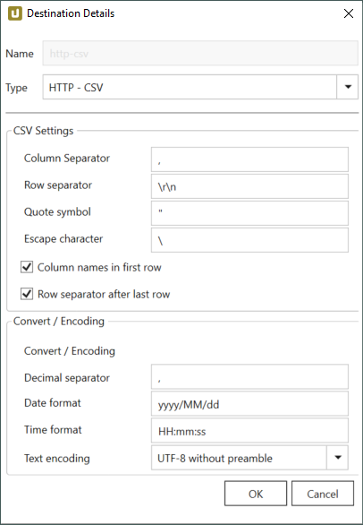
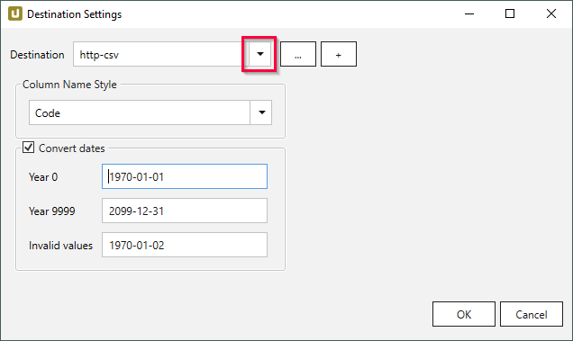
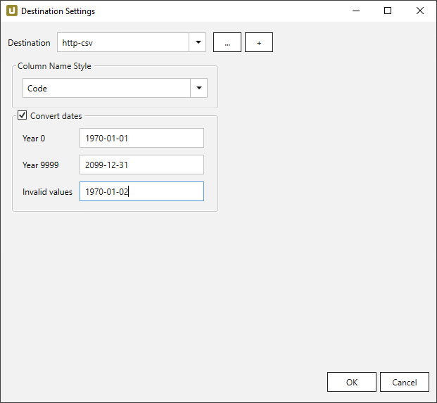

This page shows how to set up and use the {{ page.meta.title }} destination.  
The {{ page.meta.title }} destination is a generic CSV stream over HTTP. 
It is supported by many products, e.g., Layer2, INFONEA and KNIME. 

## Create a new {{ page.meta.title }} Destination

Follow the steps below to add a new {{ page.meta.title }} destination to {{ productName }}:

1. In the main window of the Designer, navigate to **Server > [Manage Destinations](./managing-destinations)**. The window “Manage Destinations” opens. 

2. Click **[Add]** to create a new destination. The window "Destination Details" opens. 

3. Enter a **Name** for the destination.
4. Select the destination type *{{ page.meta.title }}* from the drop-down menu. 
A list of connection details opens.
5. Fill out the [destination details](#destination details) to connect to the destination.
5. Click **[OK]** to confirm your input.

The destination can now be assigned to extractions.

### Destination Details

The destination details define the connection to the destination.

{:class="img-responsive"}





## Assign the {{ page.meta.title }} Destination to an Extraction

Extractions write data to their assigned destination. Follow the steps below to assign a destination to an extraction:

1. In the main window of the Designer, select an extraction.
2. Click **[:designer-destination:Destination]**. The window “Destination Settings” opens. 
{:class="img-responsive"}
3. In the “Destination Settings” window, select a destination from the drop down menu. 
{:class="img-responsive"}
4. Optional: edit the [destination settings](#destination-settings).
5. Click **[OK]** to confirm your input.

When running the extraction, the extracted SAP data is now written to the destination.

### Destination Settings

The destination settings only affect the extraction type that the destination is assigned to.
To open the destination settings, select an extraction in the main window of the Designer and click **[:designer-destination:Destination]**.
The window "Destination Settings" opens.

{:class="img-responsive"}




