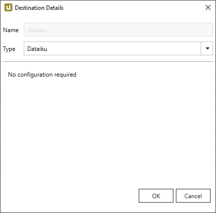
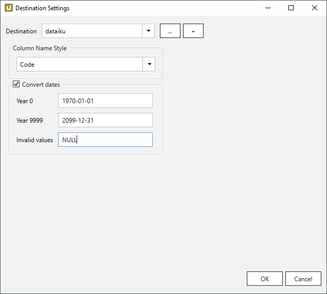
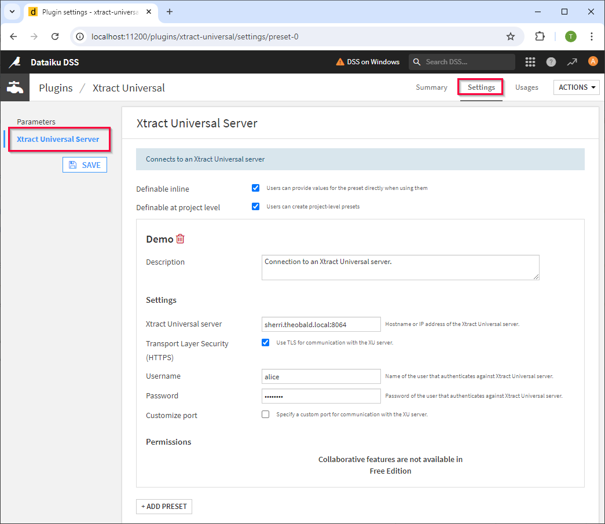
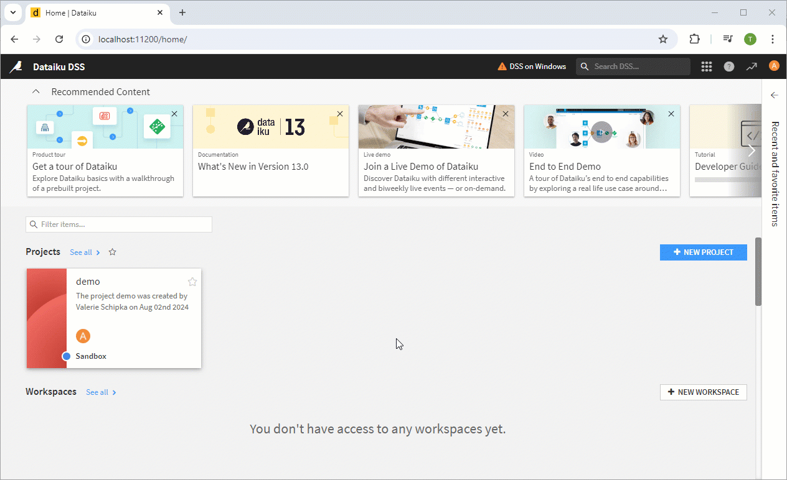

This page shows how to set up and use the {{ page.meta.title }} destination. 
The {{ page.meta.title }} destination enables users to load SAP data from [Dataiku](https://www.dataiku.com/).

## Requirements

To use the {{ page.meta.title }} destination, the Xtract Universal Dataiku plugin for the Dataiku must be installed. 
The plugin can be fetched from the gitHub repository [xu-dataiku-plugin](https://github.com/theobald-software/xu-dataiku-plugin).

For information on how to install plugins in Dataiku, see [Dataiku Documentation: Installing plugins](https://doc.dataiku.com/dss/latest/plugins/installing.html).

<!---
The plugin is available in the [Dataiku Plugin Store]().
-->


To use the {{ page.meta.title }} destination, no further settings are necessary.

{:class="img-responsive"}



{:class="img-responsive"}





## Use Xtract Universal in Dataiku

To use Xtract Universal extractions in the Dataiku Designer, make sure that the [Xtract Universal Dataiku Plugin](https://github.com/theobald-software/xu-dataiku-plugin) is installed in Dataiku. 

### Plugin Settings

The Xtract Universal plugin has a settings menu that contains settings for the [connection to an Xtract Universal server](#connection).
To open the plugin settings, navigate to **Plugin > Installed > Xtract Universal > Settings > Xtract Universal Server**.

{:class="img-responsive"}

#### Definable inline
Allows users to define a connection to an Xtract Universal server on a dataset level.
The connection can be defined when adding a new Xtract Universal dataset to a flow. 
If active, the drop-down menu to select an Xtract Universal server preset contains the option *Manually defined*.

#### Definable at project level
Allows users to define a connection to an Xtract Universal server on a project level.
Connections that are created at the project level are available for all datasets within the project.
The connection can be defined in the project settings. To open the project settings for Xtract Universal, navigate to **Settings > Plugin presets > Xtract Universal**.

#### ADD PRESET
Click **[+ADD PRESET]** to create a connection to an Xtract Universal server on the plugin level.
Connections that are created at the plugin level are available in all projects and datasets.

#### Description
Add a description of the connection.

#### Xtract Universal Server
Enter the name, IP or domain and port to access the server that runs Xtract Universal within the network.
The Xtract Universal server is the hostname or IP address without the port. The port is specified in the **Customize Port** option.

#### Transport Layer Security (HTTPS)
Activate this option if [TLS is enabled in Xtract Universal](../access-restrictions/restrict-server-access.md/#activate-tls-encryption).
Optionally, enter a valid username and password for the authentication against the Xtract Universal server.
Currently, only [Xtract Universal users](../access-restrictions/user-management.md/#create-custom-users) are supported (no Active Directory users).

#### Customize Port
Specify the port that is used to communicate with the Xtract Universal server.
Make sure the connection uses the same port that is defined in the Xtract Universal [web server settings](../server/server-settings.md/#web-server).
The default ports are 8064 without TLS and 8164 with TLS.

### Connection

There are multiple ways to connect to an Xtract Universal Server:
- Add a connection on the plugin level
- Add a connection on a [project level](#definable-at-project-level)
- Add a connection on a [dataset level](#definable-inline) (deactivated by default)

Follow the steps below to add a connection to an Xtract Universal server on the plugin level.
Connections that are defined on the plugin level are available in all projects and datasets.

1. Open the plugin settings for the Xtract Universal server. 
The settings are located in **Plugin > Installed > Xtract Universal > Settings > Xtract Universal Server**.
2. Click **[+ADD PRESET]** to create a new connection.
3. When prompted, enter a name for the connection and click **[CREATE]**.
4. In the field **Xtract Universal server**, enter the host name or IP address of the Xtract Universal server.
5. If [TLS is enabled in Xtract Universal](../access-restrictions/restrict-server-access.md/#activate-tls-encryption), activate the option **Use TLS for communication with the XU server** and provide valid credentials.
6. If a non-default port is used for the Xtract Universal [web server](../server/server-settings.md/#web-server), click **Customize port** to specify the port.
7. Click **[SAVE]**.

{:class="img-responsive"}

The connection is now available in all projects and datasets.

### Add Datasets with Xtract Universal

Connect to the Xtract Universal Server and select the extraction you want to to execute in Dataiku.

!!! note
	Make sure the Xtract Universal server is running.

1. Open a project in Dataiku.
2. Click **[+DATASET] >	Xtract Universal**.
3. Click **Xtract Universal Extraction**.
4. In the drop-down menu **Xtract Universal server preset**, select an existing [connection to an Xtract Universal server](#connection).
5. In the drop-down menu **Extraction**, select an existing extraction.
Only extractions with that have the Dataiku destination [assigned](#assign-the-dataiku-destination-to-an-extraction) to them are displayed. 

	!!! tip
		If no extractions are available, check if the [connection settings](#plugin-settings) are correct and if there are extractions on the server that use the Dataiku destination.

6. Optional: click **[+ADD AN OBJECT]** to pass values to an Xtract Universal [extraction parameter](../parameters/extraction-parameters.md). 
The plugin fetches all available parameters from Xtract Universal.
	- Select a parameter from the drop down menu **Name**.
	- Enter a value for the parameter in the input field **Value**.
7. Click **[TEST & GET SCHEMA]**. A preview of the data is displayed.
8. Click **[CREATE]**. The data is loaded into the workflow.
		
{:class="img-responsive"}

!!! tip 
	In case of errors, navigate to **Administration > Maintenance** to check the logs. 
	The logs contain plugin logs and stack traces, see [Dataiku Documentation: Diagnosing and debugging issues](https://doc.dataiku.com/dss/latest/troubleshooting/diagnosing.html).

## Related Links
- [Dataiku Documentation](https://doc.dataiku.com/dss/latest/)
- [Dataiku Knowledge Base](https://knowledge.dataiku.com/latest/)
- [Xtract Universal Server](../server/index.md)