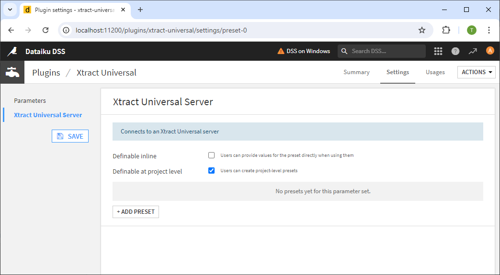
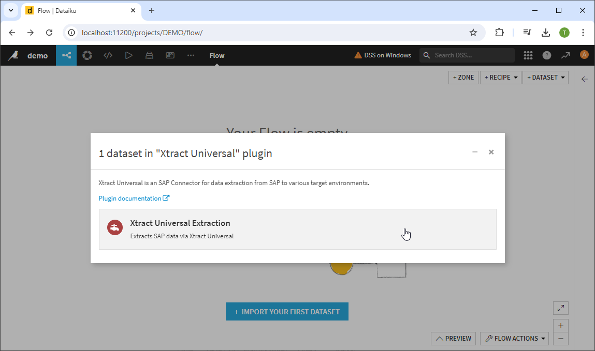

This page shows how to set up and use the {{ page.meta.title }} destination. 
The {{ page.meta.title }} destination enables users to load SAP data from [Dataiku](https://www.dataiku.com/).

## Requirements

To use the {{ page.meta.title }} destination, the Xtract Universal Dataiku plugin for the Dataiku must be installed. 
The plugin can be fetched from the gitHub repository [xu-dataiku-plugin](https://github.com/theobald-software/xu-dataiku-plugin).
For information on how to install plugins in Dataiku, see [Dataiku Documentation: Installing plugins](https://doc.dataiku.com/dss/latest/plugins/installing.html).

<!---
The plugin is available in the [Dataiku Plugin Store]().
-->


To use the {{ page.meta.title }} destination, no further settings are necessary.

{:class="img-responsive"}



{:class="img-responsive"}





## Use Xtract Universal in Dataiku

To use Xtract Universal extractions in the Dataiku Designer, make sure that the [Xtract Universal Dataiku Plugin]](https://github.com/theobald-software/xu-dataiku-plugin) is installed in Dataiku. 

### Connection

There are multiple ways to connect to an Xtract Universal Server:
- Add a connection on the plugin level
- Add a connection on a project level
- Add a connection on a dataset level (deactivated by default)

Connect to the Xtract Universal Server and select the extraction you want to to execute in Dataiku.

!!! note
	Make sure the Xtract Universal server is running.
	
Open the plugin settings for the Xtract Universal Server. 
The settings are located in **Plugin > Installed > Xtract Universal > Settings > Xtract Universal Server**.

{:class="img-responsive"}

#### Definable inline
Allows users to define a connection to an Xtract Universal server on a dataset level.

#### Definable at project level
Allows users to define a connection to an Xtract Universal server on a project level.
Connections that are created at the project level are available for all datasets within the project.

#### Add Preset
Click **+ Add Preset** to create a connection to an Xtract Universal server on a plugin level.
Connections that are created at the plugin level are available in all projects and datasets.

### Connection

{:class="img-responsive"}

#### Server
Enter the name, IP or domain and port to access the server within the network, see [Connect to an Xtract Universal Server](../designer.md/#connect-the-designer-to-a-server).
Format: `[Server]:[Port]`.

#### Transport Layer Security (HTTPS)
Activate the checkbox **Use TLS for communication with the XU server.** if the Xtract Universal server requires authentication, see [server settings](../server/server-settings.md/#configuration-server).

Enter the username and password to ...

#### Customize Port

### Add Datasets with Xtract Universal

{:class="img-responsive"}

{:class="img-responsive"}

#### Extraction
Select an extraction from the drop-down menu.  
Only extractions with that have the Dataiku destination [assigned](#assign-the-dataiku-destination-to-an-extraction) to them are displayed. 
If there are no extractions in the drop down list, check if the connection settings of the Xtract Universal Dataiku Plugin are correct.

#### Parameters

In the tab *Parameters* tab, the Xtract Universal tool loads available [parameters](../parameters/index.md) for the specified extraction. 
The depicted examples show how to override custom parameters created in Xtract Universal.

=== "Override Custom Parameters with Static Values"

	In the following example, an extraction of SAP customers contains the [custom parameter](../parameters/extraction-parameters.md/#custom) *city*. 
	The parameter is available in the tab *Custom Defined Parameters* and can be overwritten with a static value.
	To override the parameter *city*, activate the checkbox **Override** and enter a new value, e.g., "Stuttgart".

=== "Override Custom Parameters with Dynamic Values"
	The Xtract Universal tool can receive inputs, e.g., via the *Input Data* tool.
	The data input can be used to dynamically override parameters in Xtract Universal.  
	In the following example, an extraction of SAP customers contains the [custom parameter](../parameters/extraction-parameters.md/#custom) *city* 
	The parameter is available in the tab *Custom Defined Parameters* and can be overwritten with a dynamic input value.
	
	To override the parameter *city*, activate the checkbox **Override** and the checkbox **Map**. 
	Select an item out of the drop-down list in the field **value**.

!!! tip
	If the connection to the specified Xtract Universal server is not established and no errors are shown, the Xtract Unversal tool offers a tooltip in the following format: 
	`[Extraction] @ [Server]`.

