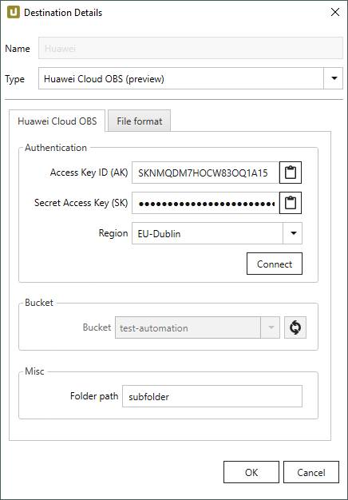
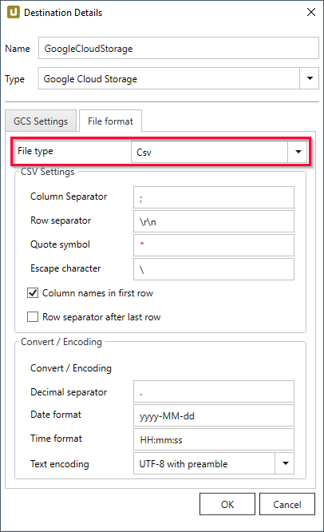
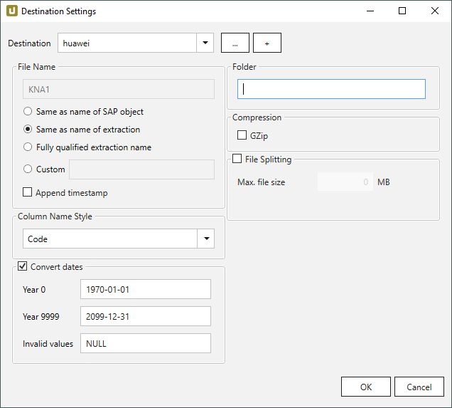

This page shows how to set up and use the {{ page.meta.title }} destination. 
The {{ page.meta.title }} destination loads data to a Huawei Cloud Object Storage Service (OBS).

!!! warning
	**File Fragments in the Cloud Storage** 
	Huawei Cloud OBS destination uses multipart upload. That means that data is uploaded in fragments that are merged into a single file at the end of the extraction. 
	When an extraction fails due to connection issues, the request to cancel the multipart upload can fail.  
	Delete the fragments manually, see [Huawei Cloud Support: Deleting Fragments Directly](https://support.huaweicloud.com/intl/en-us/obs_faq/obs_faq_0046.html#section1). 



{:class="img-responsive"}

### Authentication

#### Access Key ID (AK)
Enter the access key of the Huawei Cloud OBS account. 
For more information on how to create access keys, see [Huawei Cloud Support: Creating Access Keys (AK and SK)](https://support.huaweicloud.com/intl/en-us/clientogw-obs/obs_03_0405.html)
 
#### Secret Access Key ID (SK)
Enter the secret access key of the Huawei Cloud OBS account. For more information on how to create access keys, see [Huawei Cloud Support: Creating Access Keys (AK and SK)](https://support.huaweicloud.com/intl/en-us/clientogw-obs/obs_03_0405.html)

#### Region
Select the region of the data storage.

#### Connect
Click **[Connect]** to establish a connection to the storage account. 
If the connection is successful, "Connected" is displayed next to the button.

### Bucket

This setting only becomes available after a connection to the storage account is established. 
Select a bucket. The SAP data is extracted into the selected bucket. 
Click **[:designer-refresh:]** to refresh the list of available buckets.

### Misc

#### Folder path
Option to create a folder structure within the container for saving files.
Script expressions are supported, see [**Destination Settings > Folder**](#folder).

For creating a single folder, enter a folder name without slashes: `[folder]`  
Subfolders are supported and can be defined using the following syntax: `[folder]/[subfolder_1]/[subfolder_2]/[..]`

### File Format

Select the required file format. You can choose between *CSV*, *JSON* and *Parquet*.

{:class="img-responsive" }

#### CVS Settings

The settings for file type *CSV* correspond to the settings of the *Flat File CSV* destination:

- [CSV Settings](csv-flat-file.md/#csv-settings)
- [Convert / Encoding](csv-flat-file.md/#convert-encoding)

#### JSON Settings

To use the JSON file format, no further settings are necessary.

#### Parquet Settings

The settings for file type *Parquet* correspond to the settings of the *Flat File Parquet* destination:

- [Compatibility Mode](parquet.md/#compatibility-mode)

## Connection Retry and Rollback



Rollback covers scenarios where extractions do not fail due to connection failures to Huawei but e.g. due to an error when connecting to SAP.
In those cases Xtract Universal tries to remove any files from the Huawei Cloud storage that were created in the course of the extraction.



{:class="img-responsive"}









### Folder

Option to create a folder structure within the container for saving files, see [Destination Details > Folder Path](#folder-path).

For creating a single folder, enter a folder name without slashes: `[folder]`  
Subfolders are supported and can be defined using the following syntax: `[folder]/[subfolder_1]/[subfolder_2]/[..]`






