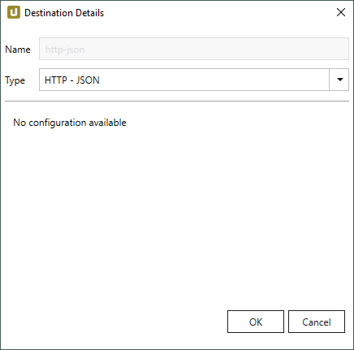
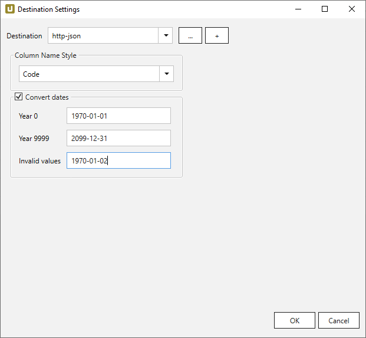

This page shows how to set up and use the {{ page.meta.title }} destination.  
The {{ page.meta.title }} destination is a generic JSON stream over HTTP. 


To use the JSON destination, no further settings have to be made.

{:class="img-responsive"}



{:class="img-responsive"}




