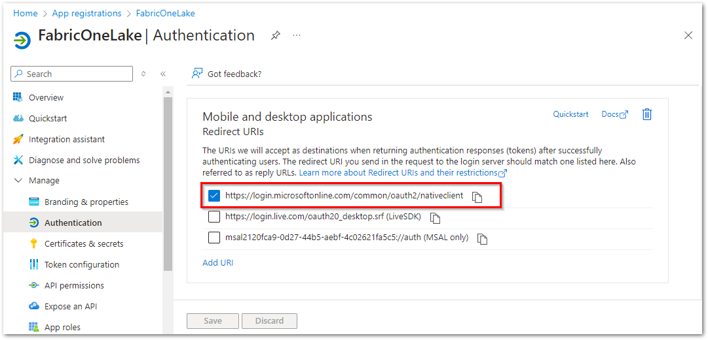
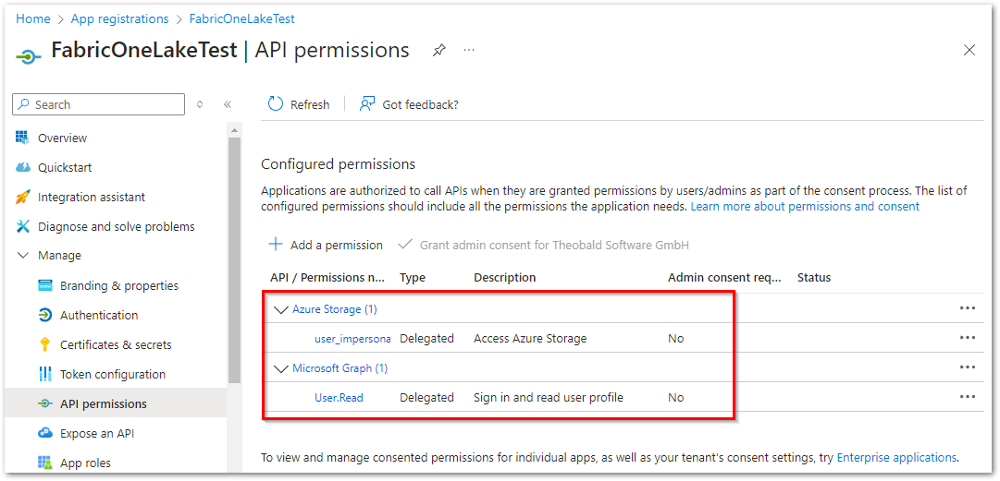
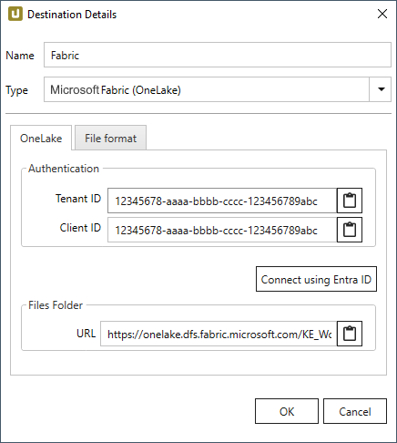
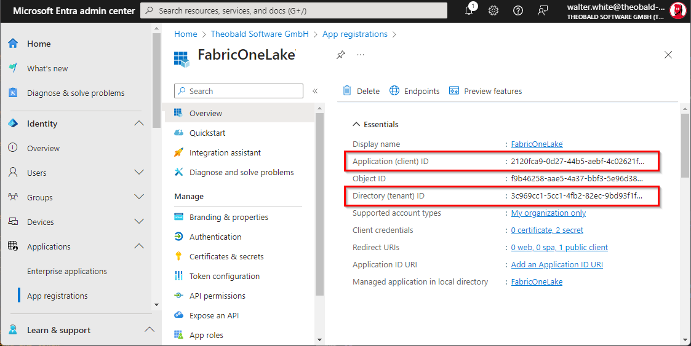
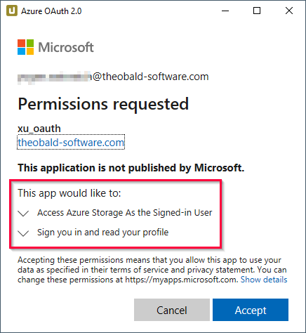
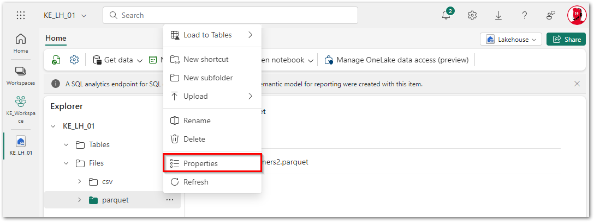
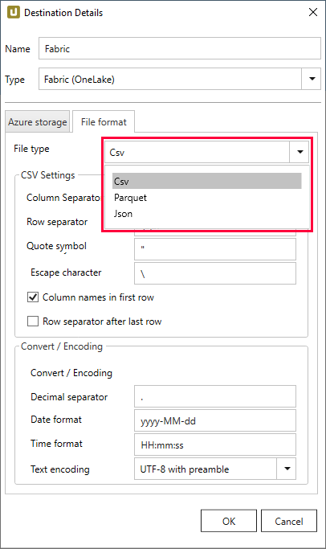
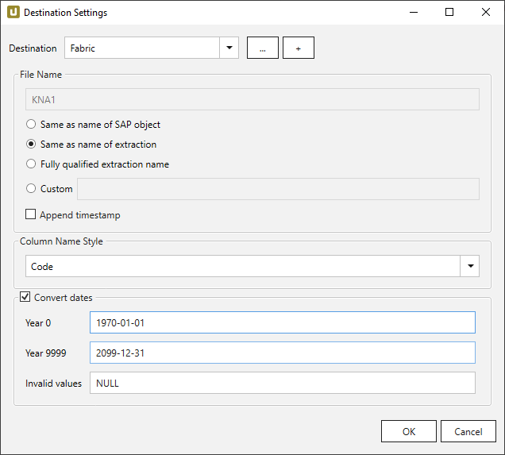

This page shows how to set up and use the {{ page.meta.title }} destination. 
The {{ page.meta.title }} destination enables users to load SAP data to a Microsoft Fabric Lakehouse.

## Requirements
The {{ page.meta.title }} destination uses [Microsoft Entra ID (formerly Azure Active Directory)](https://www.microsoft.com/en-us/security/business/identity-access/microsoft-entra-id) with OAuth 2.0 for authentication.
Make sure the authentication uses the following settings:
- Register Microsoft Fabric OneLake as a *Mobile and desktop application*, see [Microsoft Documentation: Configure platform settings](https://learn.microsoft.com/en-us/entra/identity-platform/quickstart-register-app?tabs=certificate#configure-platform-settings): 

- Add the following API permissions:
	- Azure Storage - *user impersonation*
	- Microsoft Graph - *User.Read*
	
	For more information, see [Microsoft Documentation: Add permissions to your web API](https://learn.microsoft.com/en-us/entra/identity-platform/quickstart-configure-app-access-web-apis#add-permissions-to-access-your-web-api). 
	
	



{:class="img-responsive"}

### Authentication

The {{ page.meta.title }} destination uses [Microsoft Entra ID](https://www.microsoft.com/en-us/security/business/identity-access/microsoft-entra-id) for authentication.
Register Microsoft OneLake as an application in Entra ID and configure OneLake to use the registered application.
	
#### Tenant ID
Enter the Directory (tenant) ID of the registered app.
	
#### Client ID
Enter the Application (client) ID of the registered app. 

!!! tip
	You can copy the tenant ID and client ID in the [Microsoft Entra admin center](https://entra.microsoft.com/#home) or the [Azure portal](https://portal.azure.com/), where the app is registered. 
	{:class="img-responsive"}

#### Connect
	
Click **[Connect]** to establish a connection to the storage account.   A browser window will open, prompting you to sign in with your Microsoft credentials. 
The "Permissions requested" window lists the requested permissions, see [Knowledge Base Article: Authentication via Microsoft Entra ID](../../knowledge-base/authentication-via-entra-id-with-azure-storage.md). 
Click **[Accept]**. If the connection is successful, a "Connection successful" info window opens.  

{:class="img-responsive"}

### Files Folder

#### URL

Enter the URL of the Lakehouse, including the folder path in which the data is written.
The URL uses the following format: 
`https://onelake.dfs.fabric.microsoft.com/<workspaceGUID>/<itemGUID>/<folder>/`

Example: 
`https://onelake.dfs.fabric.microsoft.com/12345678-aaaa-bbbb-cccc-123456789abc/12345678-dddd-ffff-gggg-123456789abc/folder-name`

!!! tip
	You can copy the URL in the [Microsoft Fabric portal](https://app.fabric.microsoft.com/home) using the properties of a OneLake folder:
	
	

### File Format

Select the required file format. You can choose between *CSV*, *JSON* and *Parquet*.

{:class="img-responsive"}

#### CVS Settings

The settings for file type *CSV* correspond to the settings of the *Flat File CSV* destination:

- [CSV Settings](csv-flat-file.md/#csv-settings)
- [Convert / Encoding](csv-flat-file.md/#convert-encoding)

#### JSON Settings

To use the JSON file format, no further settings are necessary.

#### Parquet Settings

The settings for file type *Parquet* correspond to the settings of the *Flat File Parquet* destination - [Compatibility Mode](parquet.md/#compatibility-mode).

## Connection Retry and Rollback



The retry function is implemented according to [Microsoft Guidelines](https://docs.microsoft.com/en-us/azure/architecture/best-practices/retry-service-specific#retry-strategies).
The retry logic is based on WebExceptionStatus. 

Rollback applies to situations where extractions fail, not because of connection issues, but due to an error when connecting to SAP. In these cases, Xtract Universal attempts to delete any files created in the Lakehouse during the extraction process.
	


{:class="img-responsive"}



!!! note
	When an object's name doesn't start with a letter, an 'x' is added at the beginning. , e.g., `_namespace_tabname.csv` becomes `x_namespace_tabname.csv` when uploaded.   This ensures compatibility with Azure Data Factory, Hadoop, and Spark, which require names to start with a letter or handle certain symbols differently.







----

## Related Links
- [Mirosoft Tutorial: Create a Fabric workspace](https://learn.microsoft.com/en-us/fabric/data-engineering/tutorial-lakehouse-get-started)
- [Mirosoft Tutorial: Create a lakehouse, ingest sample data, and build a report](https://learn.microsoft.com/en-us/fabric/data-engineering/tutorial-build-lakehouse)