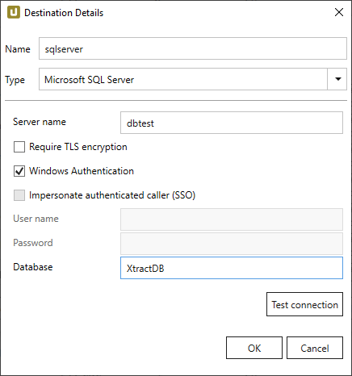
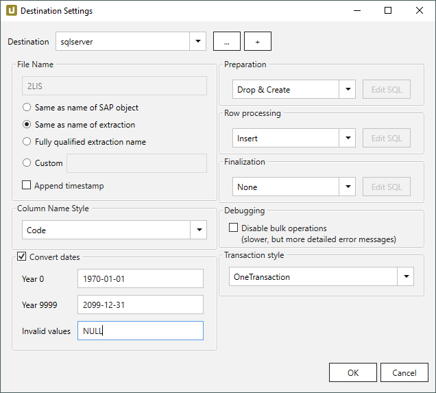
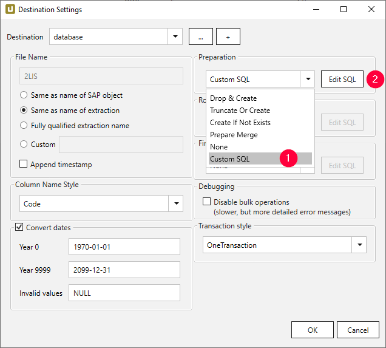
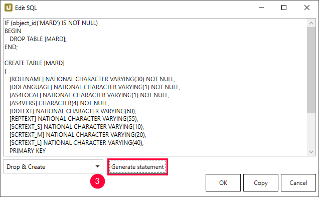
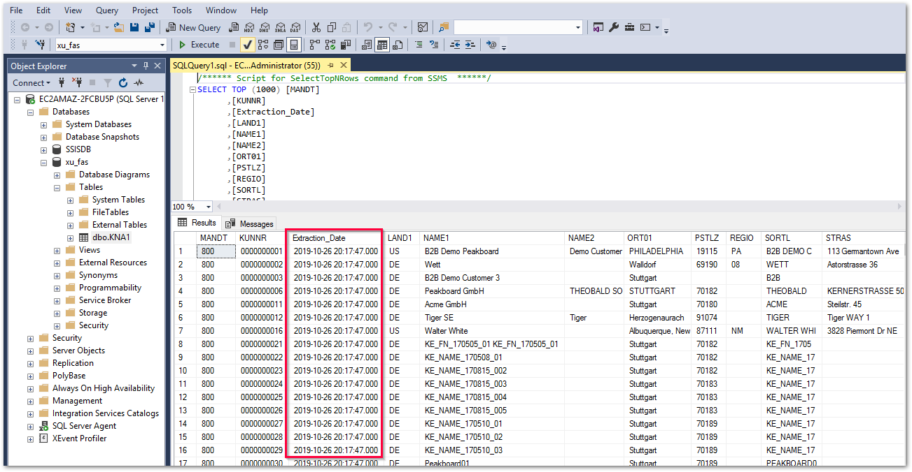

This page shows how to set up and use the {{ page.meta.title }} destination. 
The {{ page.meta.title }} destination loads data to a Microsoft SQL Server Database or a Microsoft Azure SQL Database destination.

## Requirements

No driver installation is required since the ADO .NET driver for SQL Server is delivered and installed as a part of the .NET framework.



{:class="img-responsive"}

#### Server Name
Specifies the host address of the SQL Server. Please note the following syntax:

|Syntax | Example |
|:---|:---|
|[ServerName]| `dbtest`|
|[ServerName],[Port]| `dbtest,1433`|
|[ServerName].[Domain],[Port] |  `dbtest.theobald.software,1433`|

It is only necessary to specify the port if it has been edited outside the SQL standard.

#### Require TLS encryption
Client-side enforcement for using [TLS encrpytion](https://docs.microsoft.com/en-us/azure/sql-database/sql-database-connect-query#tls-considerations-for-sql-database-connectivity). 
Adds the following parameters to the connection string:

-  Encrypt = On
- TrustServerCertificate = Off

For more information, see [Microsoft Documentation: Enable Encrypted Connections to the Database Engine](https://docs.microsoft.com/en-us/sql/database-engine/configure-windows/enable-encrypted-connections-to-the-database-engine?view=sql-server-2017)

#### Windows Authentication
Uses the service account, under which the XU service is running, for authentication against SQL Server.

!!! note 
	To successfully connect to the database using Windows authentication, make sure to [run the XU service under a Windows AD user](../setup/service-account.md) with access to the database.

#### Impersonate authenticated caller
Uses the Windows AD user, executing the extraction, for authentication against SQL Server using [Kerberos authentication.](https://blogs.msdn.microsoft.com/sqlupdates/2014/12/05/sql-server-kerberos-and-spn-quick-reference/)
For using this functionality a similar configuration as for [Kerberos Single Sign On against SAP](../../knowledge-base/sso-with-kerberos-snc.md) is required.

#### User Name
SQL Server authentication - user name 

#### Password
SQL Server authentication - password

#### Database Name
Defines the name of the SQL Server database.

#### Test Connection
Checks the database connection. 




{:class="img-responsive"}













 

## Merge Data

 

## Custom SQL Statements

The {{ page.meta.title }} destination supports the use of custom SQl statements in the staging steps of the destination.
Follow the steps below to create custom SQL statements in the {{ page.meta.title }} destination:

1. In the main window of the Xtract Universal Designer, select an extraction from the list of extractions..
2. Click **[:designer-destination:Destination]**, the window "Destination Settings" opens.
3. Make sure to assign a database destination to the extraction.
4. Select the option *Custom SQL* from the drop-down list :number-1: in one of the following sections:
	- [Preparation](#preparation)
	- [Row Processing](#row-processing)
	- [Finalization](#finalization)
	
	{:class="img-responsive"}
4. Click **[Edit SQL]** :number-2:. The window "Edit SQL" opens.
5. Enter your custom SQL statement and click **[OK]** to confirm your input.


### Use Templates

Existing SQL commands can be used as templates.<br>
You can write your user-defined SQL expressions and adapt the loading of the data to your needs.
You can additionally execute stored procedures that exist in the database.
To do so, use the SQL templates provided in the following staging steps:

- [Preparation](#preparation), e.g., in *Drop & Create* or *Create if Not Exists*
- [Row Processing](#row-processing), e.g., in *Insert* or *Merge*
- [Finalization](#finalization)

Follow the steps below to generate a Custom SQL command from a template:

1. In one of the staging steps, select the *Custom SQL* option from the drop-down list :number-1:.
2. Click **[Edit SQL]** :number-2:. The dialogue "Edit SQL" opens.
{:class="img-responsive"}
3. Navigate to the drop-down menu and select an existing command :number-3:. 
4. Click **[Generate Statement]**. A new statement is generated.
{:class="img-responsive"}
5. Click **[Copy]** to copy the statement to the clipboard.
6. Click **[OK]** to confirm your input.

Check out the [Microsoft SQL Server example](microsoft-sql-server.md#custom-sql) for details on predefined expressions.

!!! note
	The custom SQL code is used for SQL Server destinations. 
	A syntactic adaptation of the code is necessary to use the custom SQL code for other database destinations.

### Use Script Expressions

You can use script expressions for the Custom SQL commands.<br>
The following Xtract Universal specific custom script expressions are supported: 

| Input                                                   | Description|
|:--------------------------------------------------------|:-----------|
|```#{Extraction.TableName }# ```|  Name of the database table extracted data is written to|
|```#{Extraction.RowsCount }# ```| Count of the extracted rows |
|```#{Extraction.RunState}# ```|  Status of the extraction (Running, FinishedNoErrors, FinishedErrors) |
|```#{(int)Extraction.RunState}# ```|  Status of the extraction as number (2 = Running, 3 = FinishedNoErrors, 4 = FinishedErrors) |
|```#{Extraction.Timestamp}# ```|  Timestamp of the extraction  |

For more information, see [Script Expressions](../parameters/script-expressions.md).

```sql linenums="1" title="Example: Verify the existence of a table in a database using 'ExistsTable'"
#{
   iif
   (
      ExistsTable("MAKT"),
      "TRUNCATE TABLE \"MAKT\";",
      "
         CREATE TABLE \"MAKT\"(
            \"MATNR\" VARCHAR(18),
            \"SPRAS\" VARCHAR(2),
            \"MAKTX\" VARCHAR(40));
      "
   )
}#
```

### Create a Status Overview

The table "ExtractionStatistics" provides an overview and status of the executed Xtract Universal extractions.
To create the "ExtractionStatistics" table, create an SQL table according to the following example:

```sql linenums="1" title="Create ExtractionStatistics"
CREATE TABLE [dbo].[ExtractionStatistics](
	[TableName] [nchar](50) NULL,
	[RowsCount] [int] NULL,
	[Timestamp] [nchar](50) NULL,
	[RunState] [nchar](50) NULL
) ON [PRIMARY]
GO
```

The *ExtractionStatistics* table is filled in the **Finalization** process step, using the following SQL statement:

```sql linenums="1" title="Fill ExtractionStatistics"
INSERT INTO [ExtractionStatistics]
(
     [TableName], 
     [RowsCount], 
     [Timestamp],
     [RunState]
)
VALUES
(
     '#{Extraction.TableName}#', 
     '#{Extraction.RowsCount}#', 
     '#{Extraction.Timestamp}#',
     '#{Extraction.RunState}#'
);
```

### Custom SQL Example
In the depicted example, the table *KNA1* is extended by a column with the current timestamp of type *DATETIME*.
The new column is filled dynamically using a .NET-based function. 

!!! note 
	The data types that can be used in the SQL statement depend on the SQL Server database version.

1. In the staging step **Preparation**, select the option *Custom SQL* from the drop-down list.
4. Click **[Edit SQL]**. The window "Edit SQL" opens.
2. In the drop-down menu, select the option *Drop & Create* and click **[Generate Statement]** to [use the template](#use-templates) for *Drop & Create*.
3. Add the following line in the generated statement: <br>
	```sql
	[Extraction_Date] NATIONAL CHARACTER VARYING(23)
	```
4. Click **[OK]** to confirm your input. <br>
5. In the staging step **Row Processing**, select the option *Insert*. <br>
At this point, no data is written from the SAP source system, but `NULL` values are written to the newly created *Extraction_Date* column.
6. In the staging step **Finalization**, select the option *Custom SQL* from the drop-down list to fill the `NULL` values using a custom SQL statement.
7. Click **[Edit SQL]**. The window "Edit SQL" opens.
8. Paste the following SQl statement into the editor:

	```sql
	UPDATE [dbo].[KNA1] 
	SET [Extraction_Date] = '#{Extraction.Timestamp}#' 
	WHERE [Extraction_Date] IS NULL;
	```

	The `NULL` values are filled with the [current date of the extraction](#use-script-expressions) and written to the SQL target table using the T-SQL command `UPDATE`. <br>
9. Click **[OK]** to confirm your input and [run the extraction](../execute-and-automate/run-an-extraction.md/#run-extractions-in-the-designer).

Check the existence of the extended column *Extraction_Date*  in the SQL Server View of table *KNA1*.<br>
{:class="img-responsive"}


****
## Related Links

- [Knowledge Base Article: Post-Processing Column Name Style](../../knowledge-base/adjust-column-name-style.md)
- [Integration via Azure Data Factory](../execute-and-automate/call-via-etl.md#integration-via-azure-data-factory)
