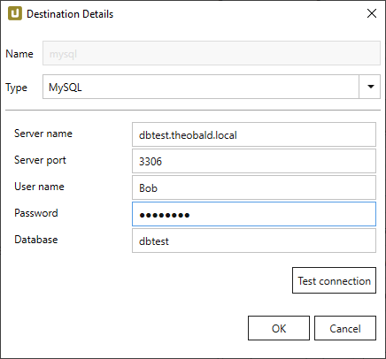
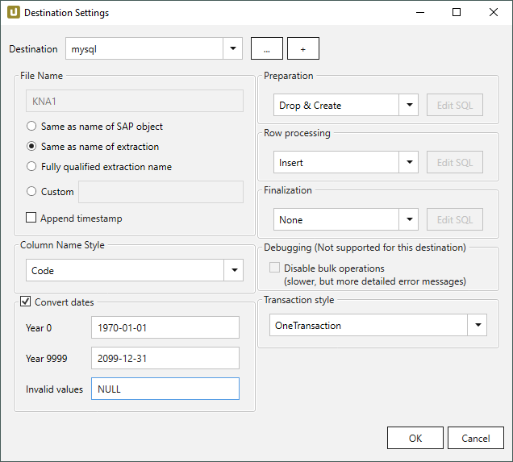

This page shows how to set up and use the {{ page.meta.title }} destination. 
The {{ page.meta.title }} destination loads data to a MySQL database.

## Requirements

As of Xtract Universal version 4.2.26.0 the MySQL ADO.Net driver is provided with the setup of Xtract Universal.
There are no additional installations needed to use MySQL database destination.



{:class="img-responsive"}



{:class="img-responsive"}











 

 

 