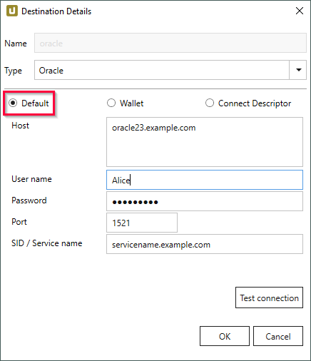
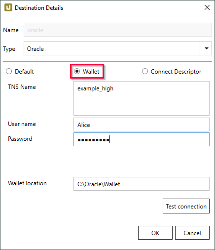
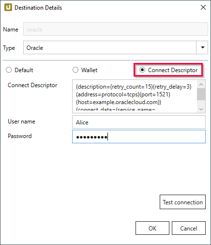
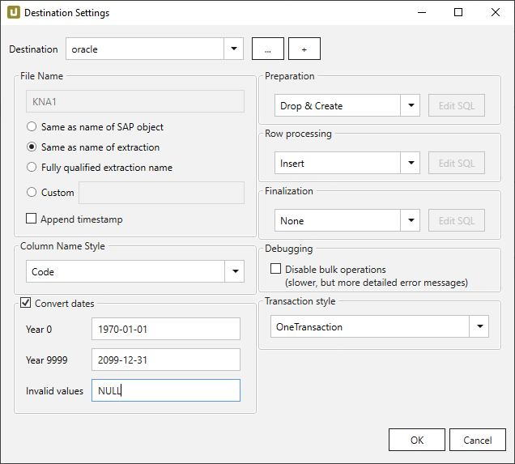

This page shows how to set up and use the {{ page.meta.title }} destination. 
The {{ page.meta.title }} destination loads data to an Oracle database.


## Requirements

As of Xtract Universal version 4.2.34.0 the Oracle data provider is included in to the setup of Xtract Universal. 
There are no additional installations needed to use Oracle database destination.


The Oracle destination supports 3 types of connections:

| Connection Type | Description |
|----------------|--------------|
| **Default** | Connect to an Oracle database (on-premises). |
| **Wallet** | Connect to an Oracle Database using a connection from a wallet. Use this option when [mTLS (Mutual TLS)](https://docs.oracle.com/en/cloud/paas/autonomous-database/adbsa/connect-introduction.html#GUID-9A472E49-3B2B-4D9F-9DC2-D3E6E4454285) authentication is required. |
| **Connect Descriptor** | Connect to an Oracle database (on-premises and cloud) via TLS. |

The input fields vary depending on the selected authentication method.

### Default

{:class="img-responsive"}

#### Host
Enter the name of the Oracle server.

#### Port
Enter the Oracle server connection port (Default: 1521).

#### SID / Service name
Enter the unique name (SID) or the alias (service name) of the Oracle database.

#### Username
Enter the user name.

#### Password
Enter the password.

#### Test Connection
Check the database connection. 

### Wallet

{:class="img-responsive"}

#### TNS Name
Enter the TNS name of the connection as it is stored in the `tnsnames.ora` file in your wallet.<br>
For more information, see [Oracle Documentation: Download Client Credentials (Wallets)](https://docs.oracle.com/en-us/iaas/autonomous-database/doc/download-client-credentials.html).

#### Username
Enter the user name.

#### Password
Enter the password.

#### Wallet location
Enter the path to your wallet, e.g., `C:\Oracle\Wallet`. <br>
Note that the wallet location must be accessible for the user that runs the Xtract Universal service.<br>

#### Test Connection
Check the database connection. 

### Connect Descriptor

{:class="img-responsive"}

#### Connect Descriptor
Enter a connect descriptor (connection string), see [Oracle Documentation: View TNS Names and Connection Strings for an Autonomous Database Instance](https://docs.oracle.com/en/cloud/paas/autonomous-database/serverless/adbsb/connect-download-wallet.html#GUID-BE884A1B-034D-4CD6-9B71-83A4CCFDE9FB).
A Connect Descriptor uses the following format:

```
(DESCRIPTION =
(ADDRESS = (PROTOCOL = TCP)
(HOST = [oracle host name])(PORT = [port number]))
(CONNECT_DATA =
(SERVER = DEDICATED)
(SERVICE_NAME = [oracle service name])))
```

#### Username
Enter the user name.

#### Password
Enter the password.

#### Test Connection
Check the database connection. 




{:class="img-responsive"}













 

 

 