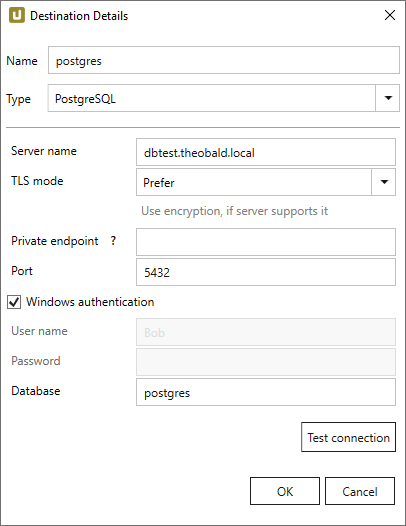
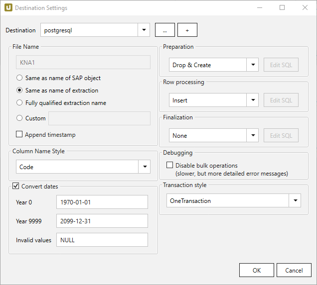

This page shows how to set up and use the {{ page.meta.title }} destination. 
The {{ page.meta.title }} destination loads data to an EXASolution database.

## Requirements

Data is pushed into the PostgreSQL DB system through the [Npgsql data provider version 8.1](https://www.npgsql.org/index.html). 
The data provider is provided with the setup of Xtract Universal. 

Xtract Universal supports all [PostgreSQL](https://www.npgsql.org/doc/compatibility.html#postgresql) versions compatible with Npgsql.
For more information, see [PostgreSQL: Versioning](https://www.postgresql.org/support/versioning/).

### TLS Encryption with PostgreSQL
Requirements for using TLS encryption with PostgreSQL:
- Xtract Universal and the Npgsql.dll driver must be up-to-date and must support TLS with new PostgreSQL versions.
If necessary, install the newest version of Xtract Universal.
- the [certificate](../access-restrictions/install-x.509-certificate.md) for the authentication must be valid.
- the Subject Alternative Name of the certificate must be used as the PostgreSQL host, see [**Private endpoint**](#destination-details).
- the certification authority (CA) that signed the certificate and the certificate itself must be trustworthy, see [PostgreSQL Documentation: Secure TCP/IP Connections with SSL](https://www.postgresql.org/docs/11/ssl-tcp.html).



{:class="img-responsive"}

#### Server Name
Name or IP of the database server.

#### TLS Mode
The following TLS modes can be selected for the connection:

|Mode|Description |
|:--:|:---|
| Prefer | Default Value that uses TLS encryption, if supported by the server. If this is not the case, unencrypted connections are used. |
| Require | Xtract Universal forces an encrypted TLS connection to the PostgreSQL server - unencrypted connections are not established. |
| Disable |**Caution!** An unencrypted, insecure connection is established to the PostgreSQL server. |

Make sure that the Certification authority (CA) that signed the certificate or the certificate itself is trusted by the client.
For more information, see [Secure TCP/IP Connections with SSL](https://www.postgresql.org/docs/11/ssl-tcp.html).

#### Private endpoint
This field is optional. You can enter an alternative hostname under which a connection is established.

Example: The PostgreSQL database is hosted on a cloud and access to the database's cloud domain name is restricted by company policy. 
In this case the database can be accessed through a private endpoint. Enter the private endpoint in this field. 
The PostgreSQL cloud domain name must be entered in the field **Server Name** for certificate validation.

#### Port
Port of the database server. Port 5432 is selected by default.

#### Windows Authentication
Uses the service account, under which the XU service is running, for authentication against the PostgreSQL server, see [PostgreSQL Documentation: Client authentication](https://www.postgresql.org/docs/11/client-authentication.html).

!!! note
	To successfully connect to the database using Windows authentication, make sure to [run the XU service under a Windows AD user](../setup/service-account.md) with access to the database.

#### Username
Enter the name of the database user.

#### Password
Enter the password of the database user.

#### Database
Enter the name of the database.

#### Test Connection
Test the database connection.

!!! warning
	**The remote certificate is invalid according to the validation procedure**  
	When using TLS encryption, this error message can have multiple causes e.g. invalid or untrustworthy certificates. 
	See [TLS Encryption with PostgreSQL](#tls-encryption-with-postgresql) for information.



{:class="img-responsive"}













 

 

 