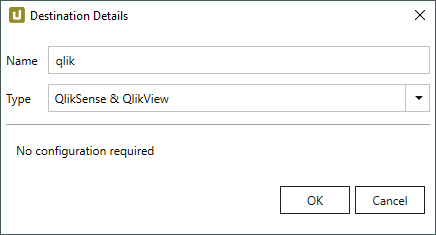
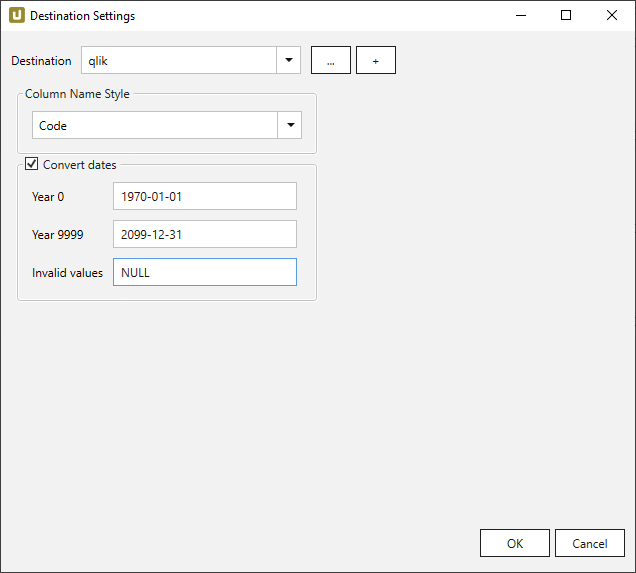
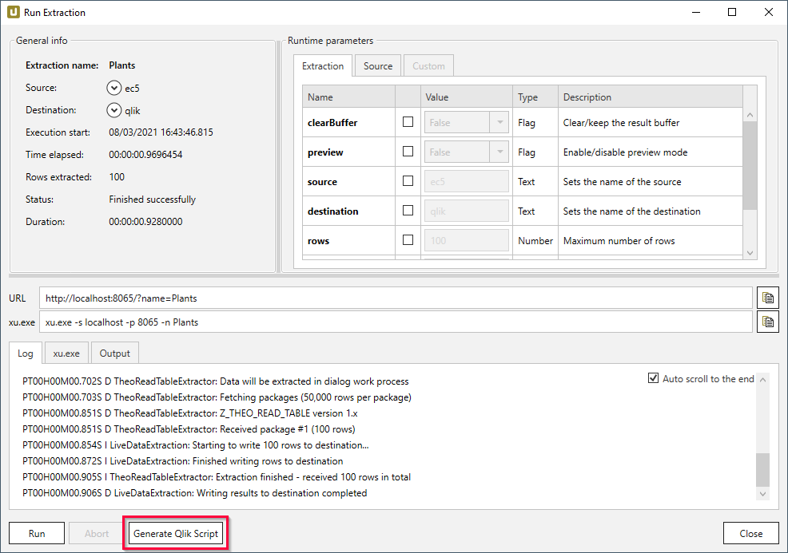
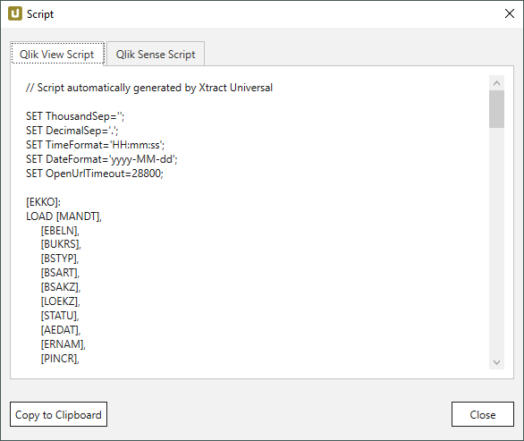
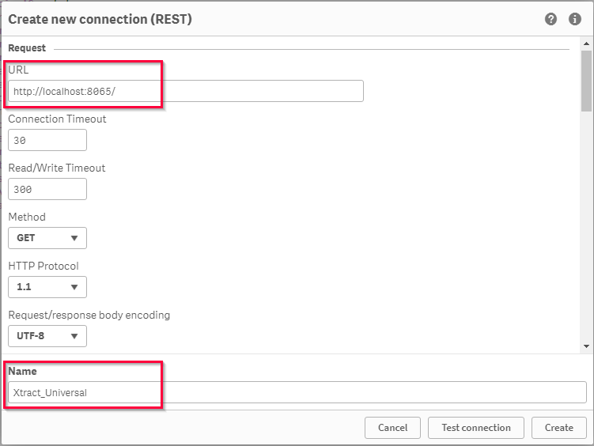
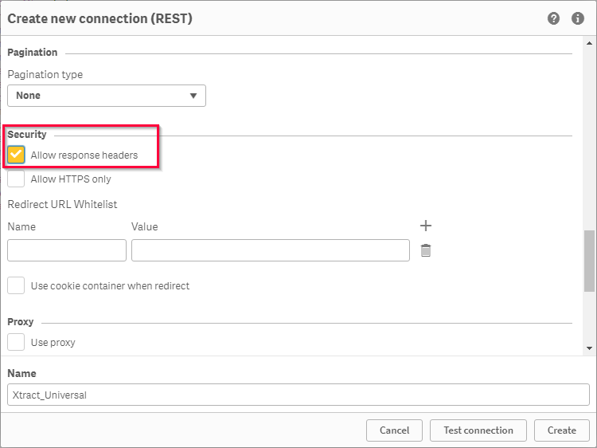
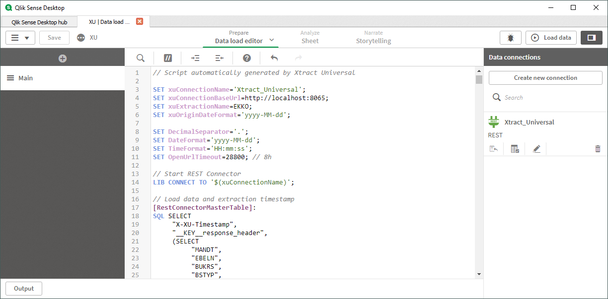
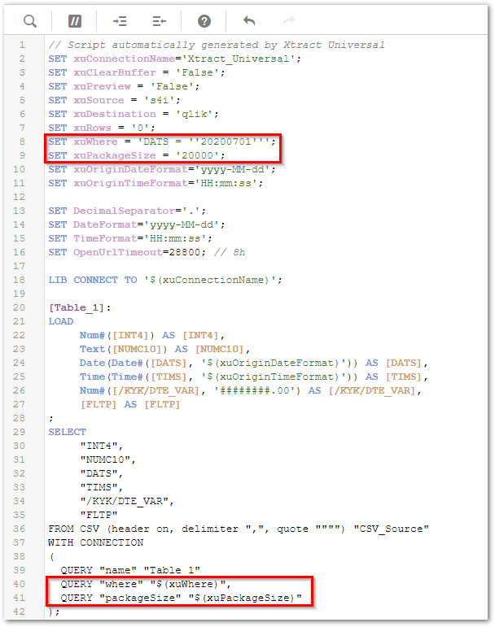

This page shows how to set up and use the {{ page.meta.title }} destination. 
The {{ page.meta.title }} destination loads data to QlikSense or QlikView.

## About

The {{ page.meta.title }} destination [generates a data load script](#generate-a-data-load-script), that needs to be inserted into the data load editor of your Qlik application. 
Depending on whether you run a QlikSense of QlikView application, Xtract Univeral creates a different data load script.

Running the Qlik application triggers the respective Xtract Universal extraction via the data load script. 
Xtract Universal sends the extracted SAP data through an HTTP-CSV stream directly to your Qlik application.


To use the {{ page.meta.title }} destination, no further settings are necessary.

{:class="img-responsive"}



{:class="img-responsive"}





## Generate a Data Load Script

Follow the steps below to generate a data load script in Xtract Universal.
The data load script is required to run extractions in your Qlik application.

1. In the main window of the Designer, select an extraction from the list of extractions.
2. Make sure the extraction has the {{ page.meta.title }} destination [assigned](#assign-the-qliksense-qlikview-destination-to-an-extraction) to it.
3. Click **[:designer-run:Run]**. The window "Run Extraction" opens. 
{:class="img-responsive"}
4. Optional (when using QlikSense): In the *Parameters* section, mark the check boxes for the parameters that you want to add as SET variables in the QlikSense script.
5. Click **[Generate Qlik Script]** to generate a data load script. The window "Script" opens.
6. Select the *QlikView Script* or *QlikSense Script* tab.
7. Click **[Copy to Clipboard]** to copy the script.
{:class="img-responsive"}

When using QlikView, paste the copied script into the QlikView data load editor. For QlikSense, see [Settings in QlikSense](#settings-in-qlik-sense).

!!! note
	The "SET methods" cannot be edited in the "Script" window. Edit the SET methods in the Qlik data load editor. 

### Run Extractions from QlikSense
	
Before copying the Qlik script [generated by Xtract Universal](#generate-a-data-load-script) to QlikSense, perform the following steps in QlikSense:

1. Create a new data connection of type REST.  

	!!! note
		In QlikSense the default value for the *Timeout* is 30 seconds. 
		Increase the timeout to a sufficiently high value if the time till the first data package arrives from SAP is higher than 30 seconds. 
		The maximum input value is 10.000 seconds.

2. Enter the URL of the Xtract Universal Server and port into the URL text field. In the depicted example, the Xtract Universal server runs on `http://localhost:8065/`. 
{:class="img-responsive"}
3. Enter *Xtract_Universal* into the name text field.
4. Activate the security option **Allow response headers**. This option ensures that error messages from Xtract Universal are passed to QlikSense. 
{:class="img-responsive"}
5. Paste the QlikSense script from Xtract Universal into the QlikSense Data load editor. 
{:class="img-responsive"}

!!! warning
	**Response headers are denied by the current connection. Please edit your connection in order to enable response headers loading.** 
	When this error message is displayed in the REST connection, activate the option "Allow response headers" in the *Security* settings of the connector.

### About the QlikSense Data Load Script

Xtract Universal creates a QlikSense script with the following properties:

- The script uses QlikSense [interpretation functions](https://help.qlik.com/en-US/sense/June2020/Subsystems/Hub/Content/Sense_Hub/Scripting/InterpretationFunctions/interpretation-functions.htm) *Num#*, *Text*, *Date* and *Time*. 
For fields, where an adequate data type can't be determined, no interpretation function is used.
- The field description and the SAP origin of the field are assigned as tags to all fields.
- All date fields with `$date` are explicitly tagged. This function assures that fields containing a [date before January 1, 1980](https://help.qlik.com/en-US/sense/April2020/Subsystems/Hub/Content/Sense_Hub/Scripting/date-time-interpretation.htm) are recognized as date fields in QlikSense.
- The usage of Xtract Universal [Extraction Parameters](../parameters/extraction-parameters.md) is supported. 
To make parameters available in the QlikSense script, activate the parameters in the ["Run Extraction" window](../execute-and-automate/run-an-extraction.md/#run-extractions-in-the-designer) of Xtract Universal. 
{:class="img-responsive"}

!!! note
	Do not change the assigned value of variables *xuOriginDateFormat* and *xuOriginTimeFormat*.
	The chosen format enables Xtract Universal to send the data of date and time fields to QlikSense. Changing the format stops the QlikSense script from running.

