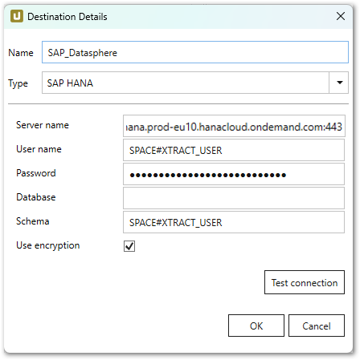

This page shows how to set up and use the {{ page.meta.title }} destination. 
The {{ page.meta.title }} destination loads data to an SAP HANA database or to SAP Datasphere.
When loading data to SAP Datasphere, SAP Datasphere's underlying HANA database is used as a destination. 

## Requirements

To establish a connection to an SAP HANA database or SAP Datasphere, the *SAP HANA Data Provider for Microsoft ADO.NET* version **2.17.22** is required. 
The data provider is part of the SAP HANA Client setup.


The destination details can be defined for an SAP HANA database or for an SAP Datasphere connection.

For information on SAP Datasphere connection parameters, refer to the following SAP resources:
- [SAP Help: Create a Database User](https://help.sap.com/docs/SAP_DATASPHERE/be5967d099974c69b77f4549425ca4c0/798e3fd6707940c3bd2219b2d1ebaac2.html?locale=en-US)
- [SAP Help: Obtaining Your OPEN SQL Schema Connection Information](https://help.sap.com/docs/SAP_DATASPHERE/be5967d099974c69b77f4549425ca4c0/b78ad208f8c4494489aabf97284679b6.html?locale=en-US#obtaining-[…]nformation).

{:class="img-responsive" width="48%"} &nbsp;
{:class="img-responsive" width="48%"}

#### Server Name
Enter the address of the server (including the port number). Note that there are different port numbers for SAP HANA and SAP Datasphere.

#### User Name
Enter the SAP HANA/SAP Datasphere user name. 

#### Password
Enter the user password.

#### Database
Enter the name of the database.
 
#### Schema
Enter the name of the database schema.

#### Use encryption
Activates connection encryption. This option is required when connecting to SAP Datasphere.

#### Test Connection
Check the database connection.  



{:class="img-responsive"}













 

 

 

****

## Related Links

- [SAP Help: SAP HANA Data Provider](https://help.sap.com/viewer/0eec0d68141541d1b07893a39944924e/2.0.00/en-US/469dee9e6d611014af70d4e9a9cd6b0a.html)
- [SAP HANA Client Setup](https://blogs.sap.com/2017/12/14/sap-hana-2.0-client-installation-and-update-by-the-sap-hana-academy/)
- [Integrating Data and Managing Spaces in SAP Datasphere](https://help.sap.com/docs/SAP_DATASPHERE/be5967d099974c69b77f4549425ca4c0/798e3fd6707940c3bd2219b2d1ebaac2.html)
- [Connect to Your Open SQL Schema](https://help.sap.com/docs/SAP_DATASPHERE/be5967d099974c69b77f4549425ca4c0/b78ad208f8c4494489aabf97284679b6.html#obtaining-your-open-sql-schema-connection-information)
- [Obtaining Your OPEN SQL Schema Connection Information](https://help.sap.com/docs/SAP_DATASPHERE/be5967d099974c69b77f4549425ca4c0/b78ad208f8c4494489aabf97284679b6.html#obtaining-your-open-sql-schema-connection-information)