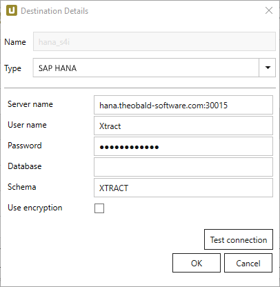
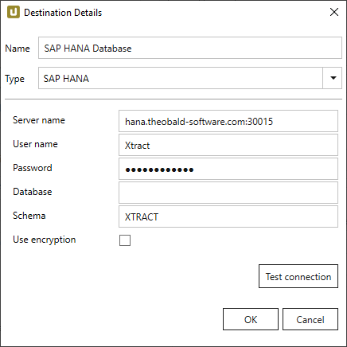
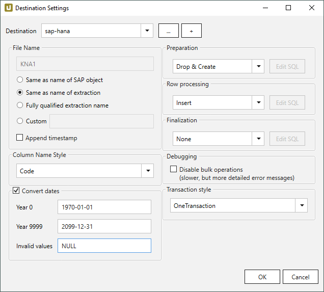

This page shows how to set up and use the {{ page.meta.title }} destination. 
The {{ page.meta.title }} destination loads data to an SAP HANA database or to an SAP Data Warehouse Cloud.

## Requirements

To establish a connection to the HANA database or SAP Data Warehouse Cloud, the *SAP HANA Data Provider for Microsoft ADO.NET* version **2.17.22** is required
The data provider is part of the SAP HANA Client setup.


The destination settings can be defined for the HANA database or SAP Data Warehouse Cloud (DWC) connection:

=== "SAP HANA Database"
	{:class="img-responsive"}
=== "SAP HANA Data Warehouse Cloud"
	{:class="img-responsive"}

#### Server Name
Enter the address of the server (including the port number). Note the different port numbers for HANA and DWC (see screenshots).

#### User Name
Enter the SAP HANA/DWC user name. 

#### Password
Enter the user password.

#### Database
Enter the name of the database.
 
#### Schema
Enter the name of the database schema.

#### Use encryption
Activates connection encryption. This is required when connecting to SAP DWC.

#### Test Connection
Check the database connection.  



{:class="img-responsive"}













 

 

 

****

## Related Links

- [SAP Documentation: SAP HANA Data Provider](https://help.sap.com/viewer/0eec0d68141541d1b07893a39944924e/2.0.00/en-US/469dee9e6d611014af70d4e9a9cd6b0a.html)
- [SAP HANA Client Setup](https://blogs.sap.com/2017/12/14/sap-hana-2.0-client-installation-and-update-by-the-sap-hana-academy/)
