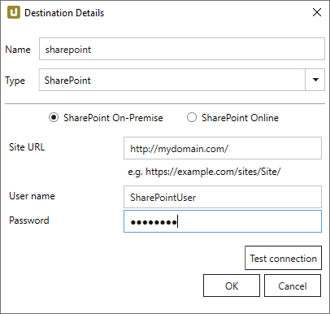

This page shows how to set up and use the {{ page.meta.title }} destination. 
The {{ page.meta.title }} destination loads data into a custom list on a SharePoint server.

## Requirements

To extract data into a SharePoint Custom list, you need either your own SharePoint server or access to a SharePoint Online system as part of Office365.

If your SharePoint server isn't configured for remote access already, go to **Central Administration -> Application Management -> Configure alternate access mappings** and add an appropriate mapping for the zone "Internet".



{:class="img-responsive"}

#### SharePoint on-premises or SharePoint Online
Select the type of SharePoint environment you are going to export to.

#### Site URL
Enter the URL of your SharePoint server here (optionally including sub-directories if you want to export into a specific site on the server). 
Make sure you only enter the base path, omit page information a browser might show you in the address line like `_layouts/15/start.aspx#/` or similar.

#### User
Enter your SharePoint user name.

#### Password
Enter the password for your SharePoint user account.

#### Test connection
Check the database connection. 



{:class="img-responsive"}





### Mode

| Option | Description |
|---------|--------------|
| *Drop, Create & Insert* | Creates a new list on the SharePoint system, deleting any previous list with the same name. |
| *Create If Not Exists & Merge* |  Merges data with an existing list or creates a new list, if none with the specified name is found. |
| *Truncate & Insert* | Creates a new list on the SharePoint system, deleting any previous list with the same name. |
| *Merge only** | Merges rows, without deleting rows or the list itself. |

#### Max. threads
Sets the number of threads for communication with the SharePoint server. 
It is recommended to use the default value *2*.

!!! note
	Increasing the thread number may increase the upload speed, depending on the server and network setup. 
	Setting the value to *1* slows down the speed significantly, which may help with a heavy load of the SharePoint server or when connection problems occur.
