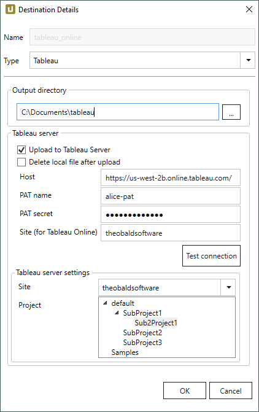
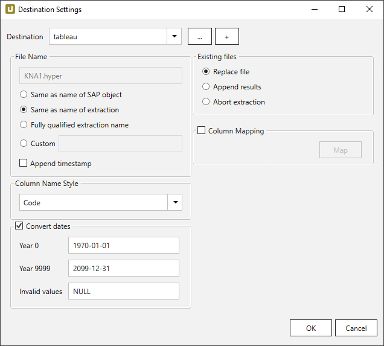

This page shows how to set up and use the {{ page.meta.title }} destination. 
The {{ page.meta.title }} destination loads data into Tableau Analytics Platform. 

The Tableau destination enables you to save data extracted from SAP as Hyper files.
It is also possible to upload the Hyper file to Tableau Server or Tableau Online.

## Requirements

- Tableau Export Library
- Visual C++ 2015 Runtime

[:material-download-circle: Download the Tableau Export Library and Visual C++ 2015 Runtime](https://s3.eu-central-1.amazonaws.com/cdn-files.theobald-software.com/download/XtractUniversal/tableau.zip){ .md-button .md-button--primary }

If no Visual C++ 2015 Runtime is installed on your machine, run the vc_redist.x64.exe to install the Visual C++ 2015 Runtime. 
Copy the `tableau` folder into your Xtract Universal directory so that the following folder structure is created:
`{{ installationDir }}\tableau\hyper`.



{:class="img-responsive"}

### Output directory
Enter the path to a folder on the Xtract Universal Server where the generated Tableau files are stored.

!!! note
	Make sure that the directory exists.

### Tableau server

#### Upload to Tableau Server
Option to upload the extracted file (as a data source) to Tableau Server or Tableau Cloud.

#### Delete local file after upload
Option to remove the local file after a successful upload.

#### Host
Enter the IP address or domain name of the remote server, starting with `http://` or `https://`.

#### PAT name
Enter the name of your [Personal Access Token (PAT)](https://help.tableau.com/current/api/rest_api/en-us/REST/rest_api_concepts_auth.htm#make-a-sign-in-request-with-a-personal-access-token). 
To extract data to Tableau Server the site role "Server Administrator" is required. 

#### PAT secret
Enter a valid token secret that corresponds to your token name.

#### Site (for Tableau Cloud)
Enter the ID of the site for publishing your data source. 
This field is mandatory and cannot be left blank.  
Get the correct site URL from [Tableau Cloud](https://online.tableau.com/#/site/Site/workbooks).

#### [Test Connection]
Check the database connection. 

### Tableau server settings

#### Site
A drop-down list of the sites stored on the connected on-prem server. Selecting a site is mandatory for uploading files. 

#### Project
Select the project in which the extracted data is published. 



{:class="img-responsive"}











!!! note 
	Columns that are not mapped are filled with `NULL` values.

*****
## Related Links
- [Webinar: Visualize your SAP data in Tableau](https://www.youtube.com/watch?v=X6T3NfVDhJE)
- [Knowledge Base Article: Link a BEx query with a Hierarchy in Tableau](../../knowledge-base/link-bex-query-with-hierarchy.md)
