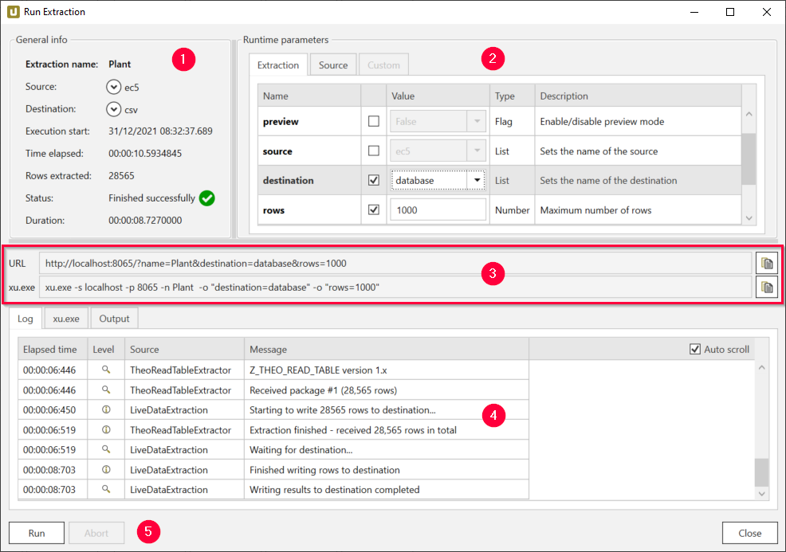
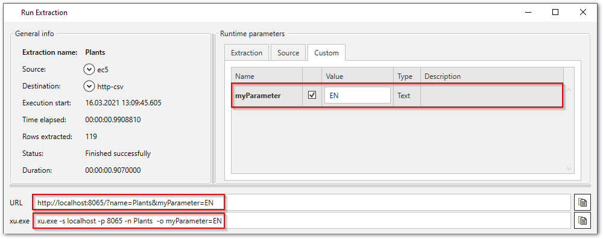
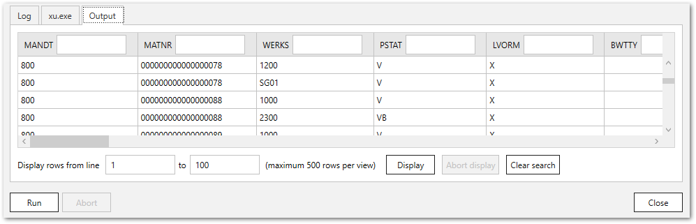

{{ productName }} Designer offers a test run option for extractions.  
You can define runtime parameters and other options to run an extraction directly from the {{ productName }} Designer.

## Run Extractions in the Designer

1. In the main window of the Designer, select an extraction and click **[:designer-run:Run]** :number-1:. The window "Run Extraction" opens. 
{:class="img-responsive"}
2. If needed, define [extraction parameters](../parameters/extraction-parameters.md):
	- Select the checkbox of the parameter you want to override :number-2:. The parameter is automatically added to the extraction URL and the xu-exe string. :number-3:
	- Enter a value for the parameter.
3. Click **[Run]** to execute the extraction. 

The status in the subsection [General Info](#general-info) indicates if the extraction finished successfully and if the extracted data was written to the destination.

## Run Extraction Window

The "Run extraction" window consists the following subsections:
- [General Info](#general-info) :number-1:
- [Runtime parameters](#runtime-parameters) :number-2:
- [URL and commandline](#url-and-commandline) :number-3:
- [Logs and Output](#logs-and-output) :number-4:
- [Buttons](#buttons) :number-5:  

{:class="img-responsive"}

!!! tip
	You can open the "Run extraction" window by right-clicking an extraction or use the main menu bar to open the "Run Extraction" window.

### General Info

| Info Object | Description
| ------------ | ------------ |
| Extraction name  | Name of the extraction |
| Source | Information about the source settings chosen for that extraction (Name, Host, Client, User Name, Instance No., Language) |
| Destination | Name of the destination (Name, Type, Pull destination info)|
| Execution start | Start date and time stamp of extraction run |
| Time elapsed | Elapsed time of the extraction run |
| Rows extracted| Number of extracted rows |
| Status | Extraction status |
| Duration | Extraction duration |

### Runtime Parameters

The three tabs "Extraction", "Source" and "Custom" contain extraction parameter to dynamize extractions.
When editing extraction parameters, the [URL and commandline](#url-and-commandline) of the extraction also change.

For more information, see [Extraction Parameters](../parameters/extraction-parameters.md).

{:class="img-responsive"}

### URL and Commandline
The strings displayed in **URL** and **xu.exe** are generated and update automatically when changing [extraction parameters](../parameters/extraction-parameters.md).
Use the strings to run the extraction outside of the {{ productName }} Designer.

#### URL
The extraction URL can be used in different integration scenarios and use cases. Examples: 
- Use the extraction URL when it is not possible to use the command line tool xu.exe, e.g. in cloud based environments.
- Use the extraction URL when the extraction is set to a [Pull Destination](../destinations/index.md).
- Use the extraction URL to run the extraction in a web browser, e.g., for testing purposes. 

Copy the URL with ++ctrl+c++ or use the **[:material-content-copy:]** button on the right.
	
!!! tip 
	You can run an extraction in the browser without opening the "Run Extraction" window by right-clicking an extraction and selecting the option **Run in browser**.
	
#### xu.exe 
This command allows running an extraction with the command line tool [xu.exe](call-via-commandline.md), that is installed with {{ productName }}.
The tool is located in the installation directory of {{ productName }}, e.g., `{{ installationDir }}\xu.exe`.

Copy the expression with ++ctrl+c++ or use the **[:material-content-copy:]** button on the right. 

It is recommended to use the command line tool with [Push Destinations](../destinations/index.md).
It can be called from a [Windows script](../../knowledge-base/call-extraction-via-script.md) or any [scheduler](call-via-scheduler.md), that can invoke Windows commandline calls.  
In the most simple case, the Windows task scheduler can be used for calling and scheduling extractions using xu.exe. 

By default the following parameters are generated for any extraction:
- "-s" (Server for extraction)
- "-p" (Listening port of the {{ productName }} Server)
- "-n" (Name of the extraction)

### Logs and Output
When an extraction is executed, information about the extraction is displayed in the following section.

{:class="img-responsive"}

#### Log 
In the *Log* tab the extraction log is displayed in real time.
Activate the checkbox **Auto scroll to the end** to automatically scroll down to the last protocol.  

#### xu.exe 
In the *xu.exe* tab the log of the command line tool is displayed. 
 
#### Output 

In the *Output* tab the results of the extraction are displayed.
This option is only available for the following destinations: 
- HTTP-CSV 
- HTTP-JSON 
- Alteryx
- Microsoft SQL Server
- Power BI Report Server (SQL Server Reporting Services) 
- QlikSense&QlikView

**Display rows from line** 
The extraction results are displayed to a maximum amount of 500 rows.
The number of rows to be displayed can be changed using the **Display rows from line** boxes.

**[Display]** 
To filter the results, enter filter values above the columns of the results and click **[Display]**.

**[Clear search]** 
To undo any data filtering, click **[Clear search]**, followed by **[Display]**.

### Buttons

**[Run]** 
Runs the extraction.

**[Abort]** 
Aborts the extraction.

**[Close]** 
Closes the "Run Extraction" window.

!!! note 
	If the option *Request SAP credentials from caller when running extractions* is active in the extraction's [source settings](../sap-connection/settings.md/#authentication), you are prompted to enter your SAP credentials when running an extraction.
	For this option, extractions must be called via [HTTPS - unrestricted](../server/server-settings.md#web-server).