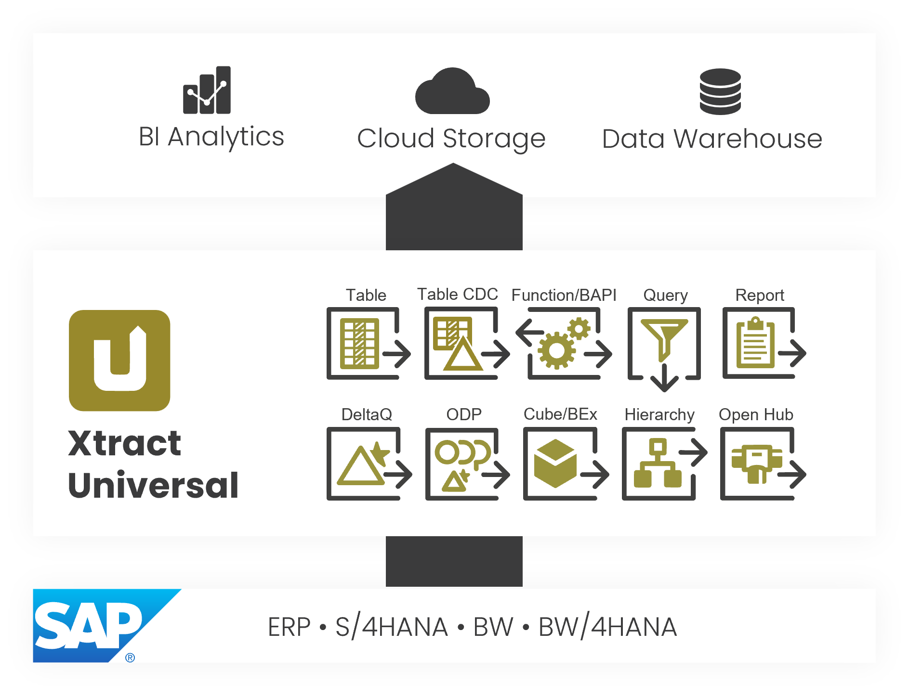
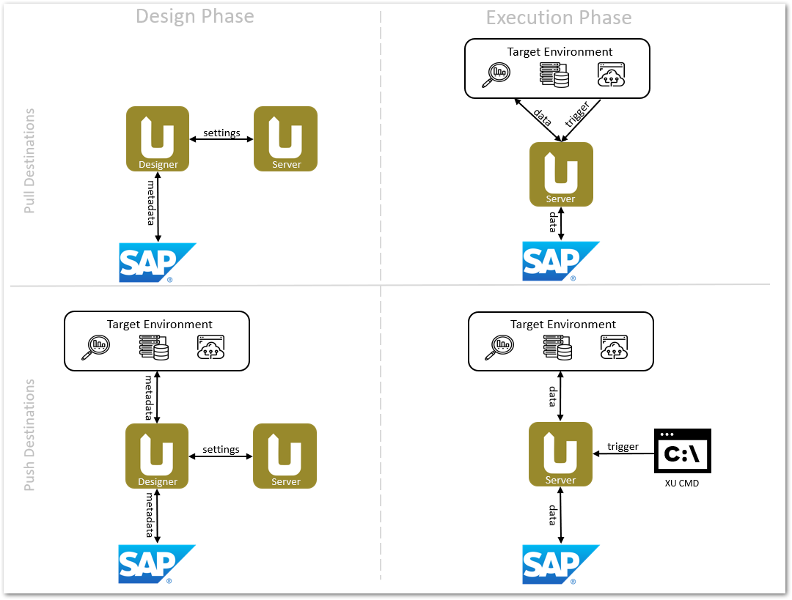

{ .lg .middle width="30px"} This section contains user documentation for {{ productName }}.  

Find more information on how to use and navigate through the user documentation in the section ["About this Documentation"](about-this-documentation.md). 

### About {{ productName }}

Xtract Universal is an SAP Connector for data extraction from SAP to various target environments. 
The extracted data can than be further processed e.g., in the context of business intelligence, data integration and data analytics.

{:class="img-responsive"}

<!---

  
  
<h4>Extractions</h4>

The main entities in Xtract Universal are called "extractions". 
An extraction is a combination of the following elements: 
<ul>
<li style="padding-left: 10px;"> A defined "extraction type" (e.g., SAP Table)</li>
<li style="padding-left: 10px;"> A connection to a "source" system (e.g., SAP S/4HANA)</li>
<li style="padding-left: 10px; list-style-position: outside;"> A connection to a "destination" / target environment (e.g., SQL server) </li>
</ul>

Depending on the target environment, extractions can be triggered either by the [XU command line tool - xu.exe / xu.elf](#link) or by the consuming destination. 
For more information, see [Pull and Push Destinations](#link).

your comment goes here
-->

### About Extractions

{ class="img-responsive" width="450px" align=right  }

The main entities in {{ productName }} are called "{{ extractions }}". 
An {{ extraction }} is a combination of the following components:

- A defined [{{ component }}](#extraction-types), e.g., {{ table }}, {{ query }}, {{ report }}, etc.
- A connection to a [source](setup/requirements.md#supported-sap-systems-and-releases) system, e.g., SAP S/4HANA, SAP BW, etc.
- A connection to a [destination](destinations/index.md) / target environment, e.g., SQL Server, Azure, etc. 

The graphic on the right depicts a practical example of an extraction and its components.

For more information on how to create and maintain extractions in the Xtract Universal Designer, see [create extractions](../getting-started.md/#create-an-extraction).

### Software Architecture 

{{ productName }} consists of two components:

- A [Designer](designer.md) to design and configure {{ extractions }}. 
When designing {{ extractions }} in the Designer, the user can create and modify extractions, sources, destinations and alter the server settings.
- A [Server](server/index.md) to execute {{ extractions }}. 
During the execution phase, the user can execute the {{ extractions }} that were designed in the Designer. 
The execution of the {{ extractions }} takes place on the server.

{:class="img-responsive"}

Depending on the target environment, an extraction can be executed by the [Xtract Universal command line tool - xu.exe / xu.elf](execute-and-automate/call-via-commandline.md) or by the consuming destination, see [Pull and Push Destinations](destinations/index.md).

### {{ Components }}

{{ productName }} offers the following {{ components }} to cover a wide range of data extraction scenarios.



