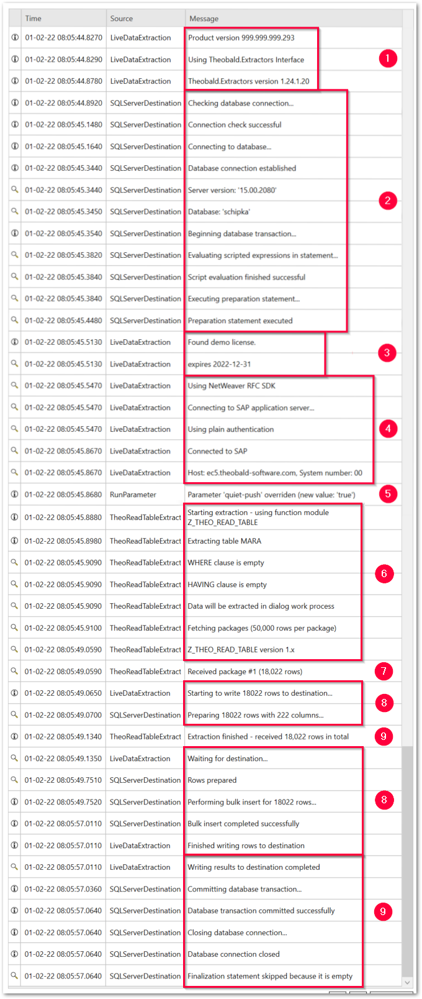

{{ productName }} logs all steps performed on a system in log files.  
This page shows how to access server and extraction logs in the Designer.
Logs can also be queried using the {{ productName }} [Web API](../web-api.md).

### Log Levels







### Read Extraction Logs

Read the logs written in understandable language to better understand the procedures of {{ productName }}. 
Ihe depicted example log belongs to an extraction that writes data into an SQL destination:

{ width="49%" align=right }

:number-1: General technical information is displayed.

:number-2: The [SQL destination](destinations/microsoft-sql-server.md) is prepared for receiving data.

:number-3: The license check is performed including entity check and other relevant information.

:number-4: Connection to SAP is established.

:number-5: [Runtime parameters](parameters/index.md) are logged.

:number-6: Data from SAP is requested.

:number-7: Package no. 1 is received from SAP.

:number-8: Package no. 1 is written to the SQL server.

:number-9: Extraction is completed.

