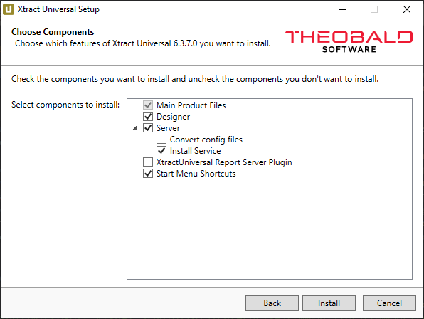

This page shows how and where to install {{ productName }}. 

### Prerequisites

Administrator permissions are required to install {{ productName }}.

### Setup

`{{ setup }}Setup.exe` is an industry standard setup. 
Execute the `{{ setup }}Setup.exe` file and follow the instructions of the setup program.

When starting the installation program, optional components can be selected during the setup. 

{:class="img-responsive"}

|Component | Description |
|:----|:---|
|Main Product Files | All required files to use {{ productName }}. |
|Designer |  Installs the Designer application, uncheck this option if you want to use {{ productName }} without a graphical interface. |
|Server |  Installs the {{ productName }} Server |
| :material-subdirectory-arrow-right: Convert config files | Converts extractions, sources, destinations, etc. from previous version format to new format. Crucial when installing major releases and upgrading from e.g., version 3.x to 4.x.|
|:material-subdirectory-arrow-right: Install Service| Installs the server component as a windows service that runs under a [virtual service account](https://learn.microsoft.com/en-us/windows-server/identity/ad-ds/manage/understand-service-accounts#virtual-accounts) with the least required privileges, see [Server](../server/index.md). |
|XtractUniversal Report Server Plugin |Plugin required by the [Power BI Report Server](../destinations/server-report-services.md) destination.|
|Start Menu Shortcuts |Component that adds shortcuts to the start menu.|

!!! note
    Make sure to mark the option “Server > Install Service” during the Installation, as installing a server without the service is only used for development purposes.

For information on how to install a license, see [Licensing](license.md#install-the-xtract-universal-license).

!!! warning
    **Errors due to different version numbers.**  
    Differences in version numbers of Designer and Server may lead to errors. 
    Make sure that Designer and Server have identical version numbers.

### Installation Directory Files

The list below shows several most important files that are placed into the default directory `{{ installationDir }}` after installation:

|Filename | Description |
|:----|:---|
| ABAP directory | Directory with SAP function modules. Read the readme.txt within the directory for more information. See also [SAP Customization](../setup-in-sap/index.md).|
| Alteryx directory| Directory with a plugin setup for the [Alteryx destination](../destinations/alteryx.md#requirements).|
| logs directory| Directory with server and extraction etc. logs, see [Logs](../logs.md). |
| config directory | Directory containing all SAP connections, extractions, destinations and other settings. See also [Backup and Migration](migration.md).|
| powerbi directory| Directory containing files related to [Power BI Connector destination](../destinations/Power-BI-Connector.md).|
| private directory | Directory containing keys for encrypted SAP passwords. This directory contains sensitive information and must be to be secured accordingly. |
| result-cache directory | Directory with extraction cache files, only applicable for [Pull Destinations](../destinations/index.md).|
| xu.exe | Command line tool used for executing extractions, see [Schedule an Extraction](../execute-and-automate/call-via-scheduler.md). |
| xu-config.exe | Command line tool used for creating extractions, see [Create Extractions without the Xtract Universal Designer GUI](../../knowledge-base/config-command-line-tool.md). |
| XtractCleanup.exe | Application that deletes all cached results and log files, depending on the [Web Server settings](../server/server-settings.md#web-server) of Xtract Universal.|
| XtractDesigner.exe | [Xtract Universal Designer](../designer.md) application to create, test and monitor extractions.|
| ConfigConverter.exe| Application that converts extractions, sources, destinations, etc. from previous version format to new format. Crucial when installing major releases and upgrading from e.g., version 3.x to 4.x. |
| uninstall.exe| Tool for uninstalling and removing Xtract Universal with all its components from your machine. |
| XtractUniversalSetup.exe| Setup of the currently installed version, see [Migration to a Different Machine](migration.md#migration-to-a-different-machine).|
| XtractUniversal Report Server Plugin | Plugin required by the [Power BI Report Server](../destinations/server-report-services.md) destination.|
| Eula_XtractUniversal.rtf | Document containing the license agreement for the use of the software Xtract Universal.|
| XtractUniversalLicense.json |  License file with information about the server, the component and runtime. |

!!! note
    The Xtract Universal Server can be started as a console program for test purposes.
    For more details on starting Xtract Universal Server as a console program, see [Knowledge Base Article: Target Principal Field](../../knowledge-base/target-principal-TPN.md).

	

	

### Installation of the Standalone Designer

[My Theobald Software - Portal for Customers and Partners](https://my.theobald-software.com/) offers a download option for a standalone version of the Xtract Universal Designer.
The standalone Designer can be used to connect to a central Xtract Universal repository without any software installation.

#### Prerequisites

The [Xtract Universal Server](../server/index.md) has to be installed on a central server instance e.g., a company-wide application server.
As a result, access to a common Xtract Universal repository, e.g., `{{ installationDir }}\config` is possible and can be used by several Xtract Universal users.

#### How to Use the Standalone-Designer

After the standalone Designer is downloaded, unpack the files from the `.zip` folder to any directory.
The folder contains two executable files:

- `XtractDesigner.exe` starts the Designer
- `xu.exe` is the command line tool used for executing extractions, see [Call via Commandline](../execute-and-automate/call-via-commandline.md)

Use the `XtractDesigner.exe` file to start the Designer. 
Before you connect to a central Xtract Universal Server, make sure you have access rights to the server and repository, see [Access Management](../access-restrictions/index.md).

!!! note 
	When updating the software, you have to manually download the latest version of the standalone Designer from [My Theobald Software - Portal for Customers and Partners](https://my.theobald-software.com/) and replace the old files.

!!! note
	The standalone Designer might be classified as 'dangerous' by antivirus software. Make sure the Designer is not blocked by antivirus software.

*****
#### Related Links
- [Start the Designer](../designer.md)
- [Server Settings](../server/server-settings.md)
- [Access Management](../access-restrictions/index.md)
