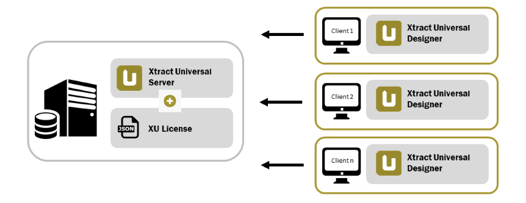

### About the Licensing Concept of {{ productName }}

{{ productName }} is licensed per Windows server. The license is bound to your company and a specific server name.
If you run the {{ productName }} Designer and the {{ productName }} Server on different machines, it is only necessary to replace the license on the server.

A trial license is automatically installed with the installation of {{ productName }}. 
A regular license is provided in the [customer portal - My Theobald Software](https://my.theobald-software.com/) after purchasing the product. 

{:class="img-responsive"}

The license defines the following properties:

- The name of the server that runs the Xtract Universal Server.
- The destinations to which you can extract data to.
- The number of extractions you can define.

These properties are checked when the XtractUniversal Server runs an extraction.

!!! note
	The number of defined extractions and other license information is displayed in the status bar at the bottom of the Designer.

!!! tip "Recommendation" 
	According to our experience, medium-sized businesses use less than 100 extractions.



