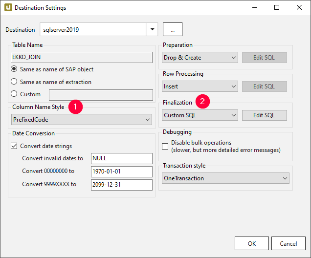
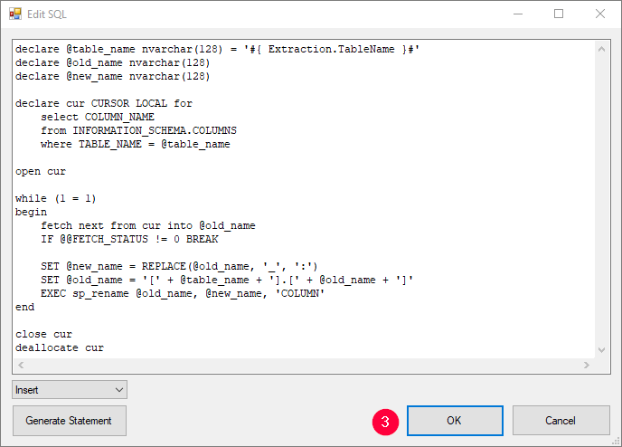
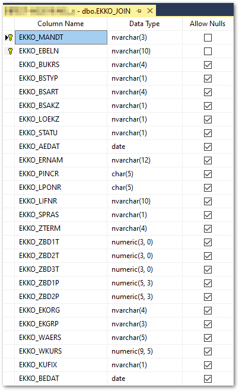
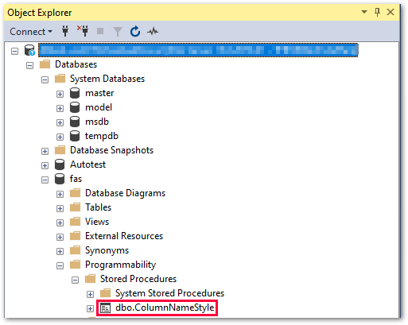
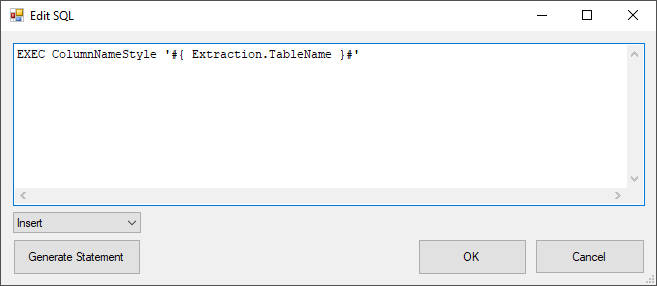

The following section describes a common business scenario to rename column name styles within the Microsoft SQL-Server environment.
The given example shows how to use Custom SQL in the *Finalization* step of the database transaction within the {{ productName }} destination settings.

### About Column Name Styles

{{ productName }} offers 4 different [Column Name Styles](../documentation/destinations/microsoft-sql-server.md#column-name-style) for naming the SAP table columns in databases:

- Code - `[FieldName]`
- Prefixed Code - `[TabName]~[FieldName]`
- CodeAndText - `[FieldName]_[FieldDescription]`
- TextAndCode - `[FieldDescription]_[FieldName]`

The depicted example uses the Column Name Style 'Prefixed Code', which connects each table field in the format *[TabName][ColumnName]* with the SAP standard separator '~'. 
This naming of table columns is mainly used for table joins, because identical column identifiers exist in the different tables. 
A typical example is the table join of 'EKKO' (Purchasing Document Header) and 'EKPO' (Purchasing Document Item). 
Both tables have the following identical column descriptions: 
- 'MANDT'
- 'EBELN'

When selecting the standard Column Name Style 'Code' in the [destination settings](../documentation/destinations/microsoft-sql-server.md/#destination-settings), the following error occurs on the SQL side when selecting these fields:

```
> System.Data.SqlClient.SqlException (0x80131904): Column names in each table must be unique. Column name 'MANDT' in table 'EKKO_JOIN' is specified more than once.
```

### Adjust Standard Separator using Custom SQL

Follow the steps below to adjust SAP standard separator from '~' to '_':
1. Adjust the Column Name Style e.g. 'PrefixedCode' :number-1:.<br>
{:class="img-responsive"} 
2. Insert the generic SQL Code below into the *Finalization* :number-2: step using **[Edit SQL]**.<br>

	```sql
	declare @table_name nvarchar(128) = '#{ Extraction.TableName }#'
	declare @old_name nvarchar(128)
	declare @new_name nvarchar(128)

	declare cur CURSOR LOCAL for
		select COLUMN_NAME
		from INFORMATION_SCHEMA.COLUMNS
		where TABLE_NAME = @table_name

	open cur

	while (1 = 1)
	begin
		fetch next from cur into @old_name
		IF @@FETCH_STATUS != 0 BREAK

		SET @new_name = REPLACE(@old_name, '~', '_')
		SET @old_name = '[' + @table_name + '].[' + @old_name + ']'
		EXEC sp_rename @old_name, @new_name, 'COLUMN'
	end

	close cur
	deallocate cur
	```

3. Click **[OK]** to confirm your input :number-3:.<br>
{:class="img-responsive"} 
4. Run the extraction. 
5. Check the Column Name Style changes and results in SQL Server Management Studio (SSMS).<br>
{:class="img-responsive"} 


### Create Stored Procedure (sp) using SSMS

Create a stored procedure that contains above mentioned T-SQL code for renaming column name styles and call this stored procedure in the *Finalization* step of the destination settings. 
This approach allows to easily change the renaming logic within the DB or SQL server instance.
You only have to adapt the stored procedure instead of each *Finalization* step.

Follow the steps below to adjust the SAP standard separator from '~' to '_':
1. Create T-SQL Stored Procedure using SQL Server Management Studio. 
For more information, see [Microsoft Documentation: Create a stored procedure](https://docs.microsoft.com/en-us/sql/relational-databases/stored-procedures/create-a-stored-procedure?view=sql-server-ver15).
2. Assign a name for the Stored Procedure e.g., ColumnNameStyle.<br>
{:class="img-responsive"}
3. Insert the SQL-Code below and **[Execute]** the statement to save the process.<br>

	```sql
	CREATE PROCEDURE ColumnNameStyle 
		@table_name nvarchar(128)
	AS 

	BEGIN

	declare @old_name nvarchar(128)
	declare @new_name nvarchar(128)
	declare cur CURSOR LOCAL for
		
		select COLUMN_NAME
			from INFORMATION_SCHEMA.COLUMNS
			where TABLE_NAME = @table_name

	open cur
	while (1 = 1)
	begin

		fetch next from cur into @old_name
		IF @@FETCH_STATUS != 0 BREAK
		SET @new_name = REPLACE(@old_name, '~', '_')
		SET @old_name = '[' + @table_name + '].[' + @old_name + ']'
		EXEC sp_rename @old_name, @new_name, 'COLUMN'

	end
	close cur
	deallocate cur

	END
	``` 

4. Open the destination settings in Xtract Universal and select a Column Name Style, e.g., 'PrefixedCode' :number-1:.<br>
{:class="img-responsive"}
5. Insert following SQL Code into the *Finalization* :number-2: step using **[Edit SQL]**.

	```
	EXEC ColumnNameStyle '#{ Extraction.TableName }#'
	```

6. Click **[OK]** to confirm your input.<br>
{:class="img-responsive"}
7. Execute the selected extraction and check the Column Name Style changes and results in SSMS.


