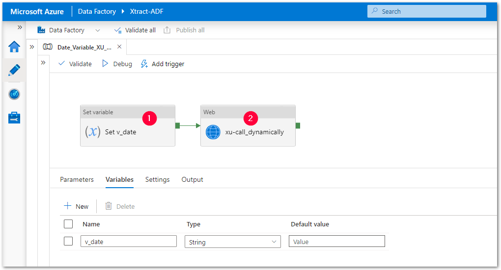
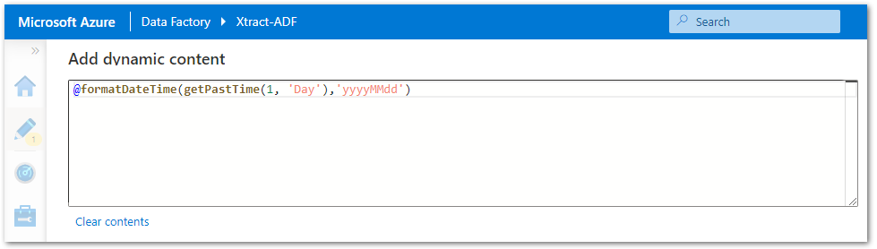
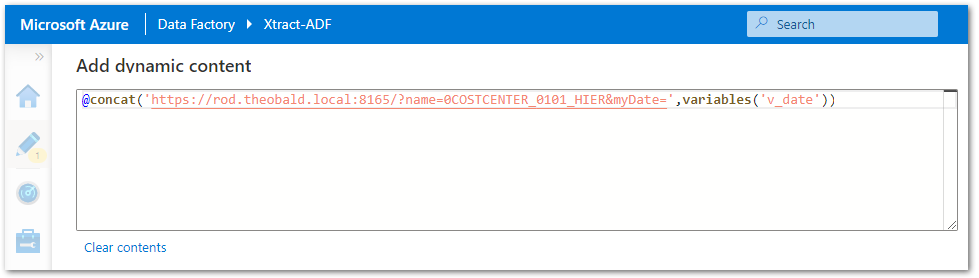

The following article shows how to call {{ productName }} extractions dynamically from Azure Data Factory (ADF) using user-defined variables.
The depicted example runs extractions daily to write data added or updated on the day before to the destination.

### Call Dynamic Extractions with Variables

The depicted example calls an extraction with a date parameter in ADF.
The date parameter is set dynamically using a user-defined variable. 

1. Create an extraction in {{ productName }} that uses runtime parameters. 
The depicted example uses an extraction called *0COSTCENTER_0101_HIER* with a date parameter called *myDate*. 
2. Create a pipeline in ADF that stores yesterday's date in a variable :number-1:. 
{:class="img-responsive"}
3. Format the date to the internal SAP date format (YYYYMMDD). 
The type and format of the input variable must match the type and format of the actual parameter in {{ productName }}.
{:class="img-responsive"}
4. Add a web activity that calls extractions :number-2:.
The URL used to call static extractions has the following format:  `[Protocol]://[HOST or IP address]:[Port]/?name=[Name of the Extraction]`
5. To set runtime parameters of an extraction, add the corresponding variables to the extraction URL using the *@concat* command. 
The concatenated string has the following format: 
`@concat('[Protocol]://[HOST or IP address]:[Port]/?name=[Name of the Extraction]&[Name of the Parameter in XU]=',variables('[Name of the Variable in ADF'))` 
{:class="img-responsive"}
6. Run the pipeline and check the result.

!!! tip
    You can copy the URL of an extraction from the Run window in {{ productName }}, see [Documentation: Run an Extraction](../documentation/execute-and-automate/run-an-extraction.md/#run-extraction-window).

******

#### Related Links
- [Run an ADF pipeline when an SAP extraction file is successfully uploaded to Azure storage](run-an-ADF-pipeline-when-sap-extraction-file-is-successfully-uploaded-to-Azure-storage.md)
- [Integration in Azure Data Factory using Webservices](adf-integration-using-webservices.md)
- [Integration in Azure Data Factory using Command Line](adf-integration-using-command-line.md)
- [Documentation: Web API](../web-api.md)
